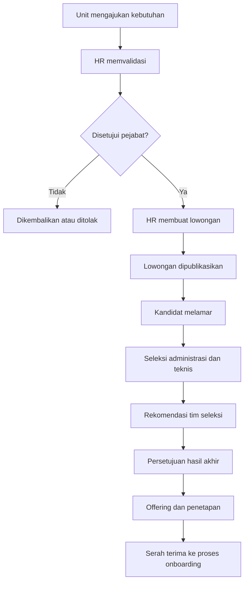
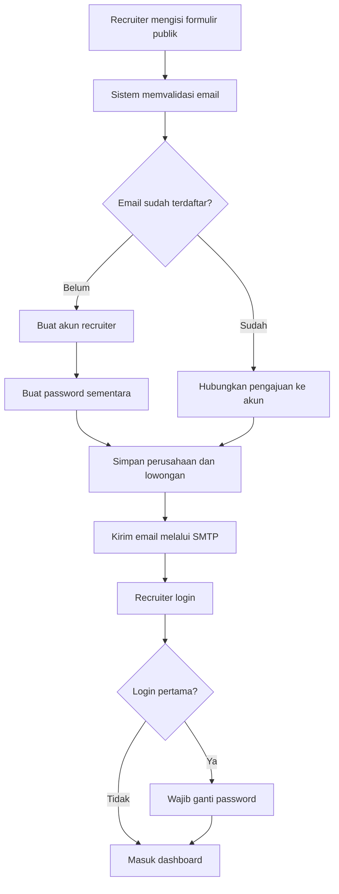

# BUSINESS REQUIREMENTS DOCUMENT (BRD)

## Portal Karir Kampus

**Versi:** 1.0  
**Tanggal:** 22 Agustus 2026  
**Status:** Draft Baseline  
**Pemilik Bisnis:** Perguruan Tinggi  
**Unit Utama:** Career Center dan HR/SDM  

---

## 1. Informasi Dokumen

### 1.1 Tujuan Dokumen

Dokumen ini mendefinisikan kebutuhan bisnis Portal Karir Kampus sebagai kanal resmi untuk:

1. membuka lowongan pegawai kampus kepada kandidat eksternal maupun alumni;
2. memfasilitasi perusahaan mitra dalam mempublikasikan lowongan bagi alumni, lulusan baru, dan—apabila diizinkan—mahasiswa tingkat akhir;
3. mengelola proses lamaran dan status seleksi secara terpusat;
4. menyediakan data penyerapan alumni, aktivitas mitra, dan efektivitas rekrutmen untuk Career Center, HR/SDM, dan pimpinan.

Dokumen ini menjadi dasar persetujuan kebutuhan bisnis sebelum perancangan teknis, pengembangan, pengujian, dan implementasi sistem.

### 1.2 Latar Belakang

Perguruan tinggi belum memiliki portal karier terpusat yang dapat digunakan untuk dua kebutuhan berbeda tetapi saling berkaitan:

1. **Karier di Kampus**, yaitu publikasi dan pengelolaan lowongan dosen, tenaga kependidikan, tenaga kontrak, staf administrasi, serta posisi lainnya di lingkungan kampus.
2. **Karier untuk Alumni**, yaitu publikasi lowongan kerja dan magang dari perusahaan yang telah terverifikasi atau menjalin kemitraan dengan kampus.

Informasi lowongan saat ini berpotensi tersebar melalui media sosial, grup percakapan, formulir umum, surat elektronik, atau dokumen terpisah. Kondisi tersebut menimbulkan risiko:

- tidak adanya satu sumber informasi resmi;
- sulit memastikan legalitas perusahaan dan validitas lowongan;
- data pelamar tersebar dan sulit ditelusuri;
- kandidat tidak mengetahui status lamarannya;
- perusahaan harus berulang kali mengirim data kepada Career Center;
- Career Center kesulitan mengukur penyerapan alumni;
- HR/SDM tidak memiliki applicant tracking yang terdokumentasi;
- pimpinan tidak memperoleh laporan rekrutmen dan kemitraan secara konsisten.

### 1.3 Referensi Benchmark

Konsep bisnis mengadopsi praktik umum dari:

- Handshake: akun perusahaan, moderasi lowongan oleh institusi, dan pengelolaan pelamar;
- Symplicity CSM: relasi pemberi kerja, lowongan, kegiatan karier, dan pelaporan outcome;
- ITB Career Center: pemisahan layanan kandidat dan employer service;
- ECC: publikasi lowongan, in-campus recruitment, dan layanan rekrutmen mitra;
- UIII Careers: publikasi lowongan pegawai kampus kepada masyarakat umum;
- BINUS Career: portal karier resmi universitas untuk komunitas kampus.

---

## 2. Ringkasan Solusi Bisnis

Portal Karir Kampus akan menggunakan konsep **satu portal, dua jalur bisnis, dan satu basis data kandidat**.

### 2.1 Jalur Karier di Kampus

Lowongan diterbitkan oleh HR/SDM setelah kebutuhan pegawai diajukan oleh unit dan memperoleh persetujuan sesuai kewenangan. HR/SDM menjadi pemilik proses seleksi, sedangkan unit pengaju, tim seleksi, dan pimpinan terlibat berdasarkan tahapan yang ditetapkan.

### 2.2 Jalur Karier untuk Alumni

Perusahaan mendaftarkan profil dan lowongan melalui formulir publik. Ketika pengajuan pertama dikirim, sistem otomatis membuat akun recruiter berdasarkan alamat email PIC. Career Center memverifikasi perusahaan dan memoderasi lowongan sebelum dipublikasikan. Perusahaan menjadi pemilik proses seleksi kandidat, sedangkan Career Center memantau progres dan outcome.

### 2.3 Prinsip Pengelolaan Akun Recruiter

Perusahaan tidak diwajibkan membuat akun sebelum mengajukan lowongan pertama. Sistem akan:

1. menerima formulir profil perusahaan, PIC, dan lowongan;
2. memeriksa keberadaan email PIC;
3. membuat akun recruiter apabila email belum terdaftar;
4. membuat password sementara yang acak dan berlaku terbatas;
5. mengirim tanda terima, informasi login, dan tombol masuk melalui SMTP;
6. mewajibkan recruiter mengganti password saat login pertama;
7. mengarahkan recruiter ke dashboard untuk memantau, memperbaiki, dan mengelola lowongan.

---

## 3. Tujuan Bisnis

| ID | Tujuan bisnis |
|---|---|
| OBJ-01 | Menyediakan kanal resmi dan terpercaya untuk seluruh publikasi lowongan terkait kampus. |
| OBJ-02 | Memudahkan kandidat eksternal dan alumni menemukan serta melamar pekerjaan. |
| OBJ-03 | Memudahkan perusahaan mengajukan lowongan tanpa hambatan registrasi awal yang panjang. |
| OBJ-04 | Memastikan perusahaan dan lowongan diverifikasi sebelum dipublikasikan. |
| OBJ-05 | Menyediakan proses rekrutmen pegawai kampus yang terdokumentasi dan dapat diaudit. |
| OBJ-06 | Menyediakan pemantauan status lamaran sampai hasil akhir. |
| OBJ-07 | Menghasilkan data penyerapan alumni dan efektivitas kemitraan pemberi kerja. |
| OBJ-08 | Mengurangi pengelolaan manual melalui email, spreadsheet, dan formulir terpisah. |

## 4. Indikator Keberhasilan

| ID | Indikator |
|---|---|
| KPI-01 | Persentase lowongan kampus dan mitra yang dipublikasikan melalui portal resmi. |
| KPI-02 | Jumlah perusahaan terverifikasi dan mitra aktif. |
| KPI-03 | Waktu rata-rata verifikasi perusahaan dan moderasi lowongan. |
| KPI-04 | Jumlah alumni yang aktif, melamar, dipanggil seleksi, dan diterima. |
| KPI-05 | Persentase perusahaan yang melaporkan hasil akhir rekrutmen. |
| KPI-06 | Waktu rata-rata pemenuhan posisi pegawai kampus. |
| KPI-07 | Persentase kandidat yang dapat melihat status lamarannya. |
| KPI-08 | Penurunan penggunaan formulir dan spreadsheet terpisah. |

---

## 5. Ruang Lingkup

### 5.1 Dalam Ruang Lingkup MVP

1. Portal publik lowongan.
2. Kategori Karier di Kampus dan Karier untuk Alumni.
3. Registrasi dan login kandidat.
4. Verifikasi alumni melalui SSO, NIM, atau data alumni kampus.
5. Profil kandidat dan CV digital.
6. Pengunggahan dokumen lamaran.
7. Pengajuan kebutuhan pegawai oleh unit kampus.
8. Persetujuan kebutuhan pegawai.
9. Pembuatan dan publikasi lowongan pegawai kampus oleh HR/SDM.
10. Formulir publik pendaftaran perusahaan dan lowongan.
11. Pembuatan otomatis akun recruiter.
12. Password sementara dan wajib ganti password pada login pertama.
13. Notifikasi SMTP.
14. Verifikasi perusahaan oleh Career Center.
15. Moderasi dan revisi lowongan mitra.
16. Pengelolaan kemitraan dasar.
17. Pengaturan target audiens dan visibilitas lowongan.
18. Lamaran langsung di dalam portal.
19. Dukungan tautan lamaran eksternal untuk perusahaan yang memiliki ATS.
20. Applicant Tracking System ringan.
21. Penjadwalan tes dan wawancara.
22. Status hasil seleksi sampai diterima, ditolak, atau mengundurkan diri.
23. Dashboard Career Center, HR/SDM, recruiter, kandidat, dan pimpinan.
24. Laporan dan ekspor data.
25. Role, permission, consent, dan audit log.

### 5.2 Di Luar Ruang Lingkup MVP

1. Payroll dan penggajian pegawai.
2. Presensi dan manajemen kinerja pegawai.
3. Pembuatan kontrak kerja secara penuh.
4. Onboarding pegawai secara end-to-end.
5. Psikotes terintegrasi.
6. Video interview bawaan.
7. Career counseling lengkap.
8. Career fair dan ticketing acara.
9. Rekomendasi pekerjaan berbasis AI.
10. Integrasi dua arah dengan seluruh ATS perusahaan.
11. Tracer study lengkap; MVP hanya menyediakan data outcome rekrutmen.

---

## 6. Pemangku Kepentingan dan Aktor

| Aktor | Kepentingan dan tanggung jawab |
|---|---|
| Pengunjung publik | Melihat lowongan publik, informasi perusahaan, dan panduan. |
| Kandidat eksternal | Membuat akun dan melamar lowongan yang terbuka untuk umum. |
| Mahasiswa tingkat akhir | Mengakses lowongan atau magang apabila diizinkan kampus. |
| Alumni | Mengakses lowongan alumni, melengkapi profil, melamar, dan melaporkan outcome. |
| Recruiter perusahaan | Mengajukan lowongan, memperbaiki data, mengelola pelamar, dan melaporkan hasil. |
| Admin perusahaan | Mengelola profil perusahaan dan anggota recruiter. |
| Career Center | Memverifikasi perusahaan, memoderasi lowongan, mengelola kemitraan, dan memantau penyerapan alumni. |
| Unit pengaju kampus | Mengajukan kebutuhan pegawai dan terlibat dalam seleksi. |
| HR/SDM | Mengelola rekrutmen pegawai kampus dan applicant tracking. |
| Tim seleksi | Menilai kandidat sesuai tahapan yang ditugaskan. |
| Pimpinan/pejabat persetujuan | Menyetujui kebutuhan, formasi, atau hasil akhir sesuai kewenangan. |
| Super Admin | Mengelola konfigurasi, role, master data, integrasi, audit, dan keamanan. |
| Auditor/pimpinan baca-saja | Mengakses laporan dan riwayat proses tanpa mengubah data. |

---

## 7. Proses Bisnis Utama

### 7.1 Proses Rekrutmen Pegawai Kampus

#### Tahapan

1. Unit mengajukan kebutuhan posisi dan formasi.
2. HR/SDM memvalidasi kebutuhan, struktur organisasi, kualifikasi, dan rencana seleksi.
3. Pejabat berwenang menyetujui, mengembalikan, atau menolak pengajuan.
4. HR/SDM menyusun dan mempublikasikan lowongan.
5. Kandidat melamar melalui portal.
6. HR/SDM dan tim seleksi memproses kandidat melalui tahapan yang dikonfigurasi.
7. Pejabat berwenang menetapkan kandidat terpilih.
8. HR/SDM mengirim offering dan menutup lowongan.
9. Data kandidat diteruskan ke proses onboarding atau HRIS di luar ruang lingkup MVP.

### 7.2 Proses Pendaftaran Perusahaan dan Lowongan Pertama

#### Tahapan

1. Recruiter mengisi data PIC, perusahaan, legalitas, dan lowongan.
2. Sistem memeriksa email secara case-insensitive.
3. Jika email belum terdaftar, sistem membuat akun recruiter dan password sementara acak.
4. Jika email sudah terdaftar pada perusahaan yang sama, pengajuan ditautkan ke akun tersebut tanpa membuat password baru.
5. Jika email terhubung dengan perusahaan berbeda, pengajuan ditahan untuk pemeriksaan Career Center.
6. Sistem menyimpan lowongan dengan status menunggu verifikasi.
7. Sistem mengirim email tanda terima dan akses login.
8. Recruiter wajib mengganti password sementara saat login pertama.
9. Recruiter memantau status dan memperbaiki data melalui dashboard.

### 7.3 Proses Verifikasi Perusahaan dan Moderasi Lowongan

1. Career Center memeriksa identitas PIC dan legalitas perusahaan.
2. Career Center menetapkan status perusahaan.
3. Career Center memeriksa kejelasan posisi, syarat, lokasi, masa berlaku, kontak resmi, dan potensi penipuan.
4. Lowongan dapat disetujui, dikembalikan untuk revisi, atau ditolak.
5. Recruiter menerima notifikasi atas setiap keputusan.
6. Lowongan yang disetujui diterbitkan sesuai tanggal publikasi dan target audiens.

### 7.4 Proses Lamaran dan Seleksi Lowongan Mitra

1. Kandidat menemukan lowongan.
2. Sistem memeriksa hak akses berdasarkan visibilitas lowongan.
3. Kandidat melengkapi profil dan dokumen wajib.
4. Kandidat memberikan persetujuan untuk membagikan data kepada perusahaan.
5. Kandidat mengirim lamaran.
6. Recruiter meninjau dan memperbarui status kandidat.
7. Recruiter menjadwalkan tes atau wawancara.
8. Recruiter menetapkan hasil akhir.
9. Career Center memantau outcome tanpa mengambil alih keputusan perusahaan.

---

## 8. Kebutuhan Bisnis

### 8.1 Portal dan Identitas Pengguna

| ID | Kebutuhan |
|---|---|
| BR-001 | Sistem harus menyediakan portal publik yang dapat diakses tanpa login. |
| BR-002 | Sistem harus membedakan lowongan pegawai kampus dan lowongan mitra. |
| BR-003 | Sistem harus menyediakan akun kandidat, recruiter, Career Center, HR/SDM, unit, pimpinan, dan Super Admin. |
| BR-004 | Alumni harus dapat diverifikasi menggunakan sumber data resmi kampus. |
| BR-005 | Satu alamat email tidak boleh membuat akun pengguna duplikat. |

### 8.2 Perusahaan dan Recruiter

| ID | Kebutuhan |
|---|---|
| BR-010 | Perusahaan harus dapat mengajukan lowongan pertama tanpa registrasi akun terpisah. |
| BR-011 | Sistem harus membuat akun recruiter secara otomatis dari email PIC apabila belum terdaftar. |
| BR-012 | Sistem harus mengirim tanda terima dan informasi login melalui SMTP. |
| BR-013 | Password awal harus berupa password sementara acak, satu kali pakai, dan memiliki masa kedaluwarsa. |
| BR-014 | Recruiter harus mengganti password pada login pertama sebelum mengakses dashboard. |
| BR-015 | Akun yang sudah terdaftar tidak boleh menerima password sementara baru saat mengajukan lowongan berikutnya. |
| BR-016 | Career Center harus dapat memverifikasi, menolak, menangguhkan, atau mengaktifkan perusahaan. |
| BR-017 | Perusahaan harus dapat memiliki lebih dari satu recruiter dengan kewenangan yang ditentukan. |

### 8.3 Lowongan

| ID | Kebutuhan |
|---|---|
| BR-020 | HR/SDM dan recruiter harus dapat membuat lowongan sesuai kewenangannya. |
| BR-021 | Lowongan mitra harus melalui moderasi sebelum tayang. |
| BR-022 | Lowongan pegawai kampus hanya dapat tayang setelah kebutuhan memperoleh persetujuan yang diwajibkan. |
| BR-023 | Career Center harus dapat memberikan catatan revisi kepada recruiter. |
| BR-024 | Recruiter harus dapat memperbaiki pengajuan tanpa mengisi ulang seluruh data. |
| BR-025 | Sistem harus mendukung visibilitas Publik, Alumni, Mahasiswa Tingkat Akhir dan Alumni, serta Internal. |
| BR-026 | Sistem harus mendukung lamaran di dalam portal dan tautan ATS eksternal. |
| BR-027 | Lowongan harus memiliki tanggal buka dan tutup. |
| BR-028 | Sistem harus menutup lowongan secara otomatis ketika melewati batas waktu. |

### 8.4 Kandidat dan Lamaran

| ID | Kebutuhan |
|---|---|
| BR-030 | Kandidat harus dapat menggunakan satu profil untuk beberapa lamaran. |
| BR-031 | Kandidat harus dapat mengunggah dokumen umum dan dokumen khusus lowongan. |
| BR-032 | Kandidat harus memberikan consent sebelum data dibagikan kepada pemilik lowongan. |
| BR-033 | Sistem harus mencegah lamaran duplikat pada lowongan yang sama, kecuali dibuka kembali oleh admin. |
| BR-034 | Kandidat harus dapat melihat status lamarannya. |
| BR-035 | Kandidat harus dapat mengundurkan diri sesuai aturan tahapan seleksi. |

### 8.5 Seleksi

| ID | Kebutuhan |
|---|---|
| BR-040 | Tahapan seleksi harus dapat dikonfigurasi per lowongan. |
| BR-041 | Pemilik lowongan harus dapat memindahkan kandidat antartahap. |
| BR-042 | Sistem harus menyimpan riwayat perubahan status kandidat. |
| BR-043 | Sistem harus mendukung jadwal tes dan wawancara. |
| BR-044 | Sistem harus mendukung hasil Diterima, Ditolak, dan Mengundurkan Diri. |
| BR-045 | Recruiter mitra harus melaporkan outcome akhir kandidat. |

### 8.6 Notifikasi

| ID | Kebutuhan |
|---|---|
| BR-050 | Sistem harus mengirim email tanda terima pengajuan lowongan. |
| BR-051 | Sistem harus mengirim akses login kepada recruiter baru. |
| BR-052 | Sistem harus mengirim notifikasi perubahan status perusahaan dan lowongan. |
| BR-053 | Sistem harus mengirim notifikasi lamaran kepada kandidat dan pemilik lowongan. |
| BR-054 | Sistem harus mengirim notifikasi jadwal dan hasil seleksi. |
| BR-055 | Kegagalan SMTP tidak boleh menghilangkan data transaksi utama. |

### 8.7 Laporan dan Audit

| ID | Kebutuhan |
|---|---|
| BR-060 | Career Center harus memiliki laporan perusahaan, lowongan, pelamar alumni, dan outcome. |
| BR-061 | HR/SDM harus memiliki laporan kebutuhan pegawai, pelamar, progres seleksi, dan time-to-fill. |
| BR-062 | Pimpinan harus memperoleh ringkasan rekrutmen dan penyerapan alumni. |
| BR-063 | Sistem harus menyediakan ekspor data sesuai kewenangan. |
| BR-064 | Aktivitas sensitif harus tercatat dalam audit log. |

---

## 9. Aturan Bisnis

| ID | Aturan |
|---|---|
| RULE-001 | Email pengguna dibandingkan secara case-insensitive dan harus unik. |
| RULE-002 | Password sementara tidak boleh menggunakan tanggal lahir, nomor telepon, nama perusahaan, atau pola yang mudah ditebak. |
| RULE-003 | Password sementara hanya berlaku untuk login pertama dan kedaluwarsa paling lama 24 jam. |
| RULE-004 | Recruiter tidak dapat mengakses fungsi utama sebelum mengganti password sementara. |
| RULE-005 | Pengajuan tetap tersimpan apabila email SMTP gagal, tetapi status pengiriman harus ditandai gagal dan dapat dikirim ulang. |
| RULE-006 | Perusahaan baru tidak dapat mempublikasikan lowongan sendiri sebelum diverifikasi. |
| RULE-007 | Setiap lowongan mitra harus disetujui Career Center sebelum tayang. |
| RULE-008 | Lowongan tidak boleh memungut biaya kepada kandidat. |
| RULE-009 | Label Mitra Kampus hanya diberikan jika dokumen kemitraan aktif. |
| RULE-010 | Lowongan mitra dapat menggunakan in-portal apply atau external apply. |
| RULE-011 | Outcome lamaran melalui external apply tidak dapat dianggap lengkap sebelum dikonfirmasi perusahaan atau kandidat. |
| RULE-012 | Lowongan pegawai kampus wajib menggunakan lamaran di dalam portal untuk menjaga dokumentasi dan audit. |
| RULE-013 | Pemilik lowongan hanya dapat melihat kandidat yang melamar pada lowongan yang dikelolanya. |
| RULE-014 | Career Center dapat memantau lowongan mitra tetapi tidak menetapkan kandidat diterima atas nama perusahaan. |
| RULE-015 | Perubahan tanggal atau substansi penting lowongan yang sudah tayang dapat memerlukan moderasi ulang. |
| RULE-016 | Penghapusan data kandidat mengikuti kebijakan retensi dan ketentuan perlindungan data yang berlaku. |

---

## 10. Status Bisnis

### 10.1 Status Akun Recruiter

`Menunggu Verifikasi Email → Wajib Ganti Password → Aktif → Ditangguhkan/Dinonaktifkan`

### 10.2 Status Perusahaan

`Draft → Menunggu Verifikasi → Perlu Perbaikan → Terverifikasi → Ditangguhkan/Ditolak`

Status tambahan `Mitra Kampus` diberikan sebagai atribut kemitraan, bukan pengganti status verifikasi.

### 10.3 Status Lowongan

`Draft → Diajukan → Menunggu Pemeriksaan → Perlu Revisi → Disetujui → Terjadwal/Tayang → Ditutup/Kedaluwarsa`

Cabang penolakan: `Menunggu Pemeriksaan → Ditolak`.

### 10.4 Status Lamaran

`Lamaran Masuk → Ditinjau → Shortlisted → Tes → Wawancara → Offering → Diterima`

Cabang akhir lainnya: `Ditolak`, `Mengundurkan Diri`, atau `Tidak Hadir`.

---

## 11. Kebutuhan Data Tingkat Tinggi

Data utama yang dikelola:

1. identitas dan akun pengguna;
2. profil kandidat dan status alumni;
3. pendidikan, pengalaman, keterampilan, dan CV;
4. profil dan legalitas perusahaan;
5. data recruiter dan keanggotaan perusahaan;
6. data kemitraan dan masa berlaku;
7. kebutuhan pegawai kampus dan persetujuannya;
8. lowongan, kualifikasi, target audiens, dan dokumen;
9. lamaran, dokumen yang dibagikan, dan consent;
10. tahapan seleksi, jadwal, penilaian, dan hasil;
11. notifikasi dan status pengiriman email;
12. audit log dan riwayat perubahan.

---

## 12. Kebutuhan Laporan

### 12.1 Career Center

- perusahaan terdaftar, terverifikasi, ditolak, dan ditangguhkan;
- mitra aktif dan kemitraan yang akan berakhir;
- lowongan per perusahaan, program studi, lokasi, dan jenis pekerjaan;
- jumlah alumni melihat, melamar, diproses, dan diterima;
- perusahaan paling aktif;
- lowongan tanpa outcome;
- penempatan alumni berdasarkan program studi dan tahun lulus.

### 12.2 HR/SDM

- kebutuhan pegawai per unit;
- pengajuan yang menunggu persetujuan;
- lowongan aktif dan jumlah pelamar;
- funnel seleksi per posisi;
- time-to-review dan time-to-fill;
- kandidat diterima, menolak offering, dan mengundurkan diri.

### 12.3 Pimpinan

- ringkasan lowongan pegawai kampus;
- pemenuhan kebutuhan pegawai;
- pertumbuhan perusahaan mitra;
- tingkat partisipasi dan penyerapan alumni;
- tren outcome berdasarkan periode.

---

## 13. Kebutuhan Nonfungsional Tingkat Bisnis

1. Portal harus responsif pada desktop dan perangkat bergerak.
2. Sistem harus menjaga kerahasiaan data kandidat dan perusahaan.
3. Hak akses harus mengikuti prinsip least privilege.
4. Aktivitas sensitif harus dapat diaudit.
5. Data transaksi tidak boleh hilang karena kegagalan pengiriman email.
6. Portal publik harus tetap dapat menampilkan lowongan saat beban akses meningkat secara wajar.
7. Sistem harus menyediakan proses reset password yang aman.
8. Sistem harus menyediakan mekanisme pelaporan lowongan bermasalah.
9. Dokumen kandidat hanya boleh diakses pihak yang berwenang dan untuk tujuan rekrutmen terkait.
10. Sistem harus mendukung kebijakan retensi dan penghapusan data.

---

## 14. Risiko dan Mitigasi

| Risiko | Mitigasi |
|---|---|
| Perusahaan atau lowongan palsu | Verifikasi legalitas, email resmi, moderasi, audit, dan tombol laporkan. |
| Password sementara disalahgunakan | Password acak, satu kali pakai, kedaluwarsa 24 jam, wajib ganti password, dan pembatasan percobaan login. |
| SMTP gagal | Transactional outbox, retry terkontrol, status pengiriman, dan tombol kirim ulang. |
| Akun recruiter duplikat | Normalisasi dan unique constraint email. |
| Recruiter memakai email perusahaan berbeda | Tahan pengajuan untuk verifikasi manual. |
| Perusahaan tidak memperbarui outcome | Pengingat otomatis dan pembatasan pengajuan baru bila outcome lama belum dilengkapi, sesuai kebijakan kampus. |
| Data kandidat diakses tidak sah | Role-based access, consent, audit log, dan pembatasan unduhan. |
| Proses seleksi kampus tidak konsisten | Template tahapan seleksi dan approval configurable. |
| Kandidat menerima informasi palsu | Seluruh notifikasi resmi berasal dari domain SMTP kampus dan memuat nomor pengajuan. |

---

## 15. Asumsi dan Batasan

1. Kampus menyediakan domain, identitas merek, dan akun SMTP yang aktif.
2. Kampus menetapkan Career Center dan HR/SDM sebagai pemilik proses masing-masing.
3. Kampus menyediakan sumber data alumni untuk kebutuhan verifikasi.
4. Perusahaan bertanggung jawab atas kebenaran informasi lowongan dan hasil seleksi.
5. Sistem tidak menjamin outcome lamaran yang diproses sepenuhnya pada ATS eksternal tanpa integrasi.
6. Password sementara dikirim melalui email karena menjadi kebutuhan bisnis, tetapi harus acak, satu kali pakai, dan kedaluwarsa.
7. Ketentuan persetujuan kebutuhan pegawai dapat berbeda berdasarkan jenis posisi dan akan dikonfigurasi pada sistem.

---

## 16. Kriteria Penerimaan Bisnis

1. Recruiter dapat mengajukan perusahaan dan lowongan pertama dari halaman publik tanpa registrasi terpisah.
2. Sistem membuat tepat satu akun untuk email recruiter baru.
3. Recruiter menerima email tanda terima, email login, dan tombol masuk.
4. Password sementara tidak dapat digunakan untuk kedua kalinya setelah password diganti.
5. Recruiter yang belum mengganti password tidak dapat mengakses dashboard utama.
6. Career Center dapat memverifikasi perusahaan dan memberikan catatan revisi lowongan.
7. Lowongan mitra tidak tampil sebelum disetujui.
8. HR/SDM dapat mengelola lowongan pegawai kampus dan pelamar secara terpisah dari lowongan mitra.
9. Kandidat dapat melihat status lamaran yang diproses di dalam portal.
10. Recruiter hanya dapat melihat kandidat pada lowongan perusahaannya.
11. Career Center dan pimpinan dapat memperoleh laporan outcome alumni.
12. Kegagalan SMTP tidak membatalkan atau menghapus pengajuan lowongan.

---

## 17. Persetujuan Dokumen

| Peran | Nama | Keputusan | Tanggal |
|---|---|---|---|
| Pemilik Bisnis Career Center |  |  |  |
| Pemilik Bisnis HR/SDM |  |  |  |
| Perwakilan Pimpinan |  |  |  |
| Product Owner |  |  |  |
| Tim Teknologi Informasi |  |  |  |

---

## 18. Glosarium

| Istilah | Definisi |
|---|---|
| ATS | Applicant Tracking System, sistem pengelolaan pelamar dan tahapan seleksi. |
| Career Center | Unit kampus yang mengelola layanan karier, hubungan perusahaan, dan outcome alumni. |
| HR/SDM | Unit yang mengelola kebutuhan dan rekrutmen pegawai kampus. |
| Recruiter | Pengguna perwakilan perusahaan yang mengelola lowongan dan pelamar. |
| SMTP | Protokol/layanan yang digunakan sistem untuk mengirim email. |
| Temporary password | Password acak dengan masa berlaku terbatas dan wajib diganti pada login pertama. |
| Outcome | Hasil akhir proses lamaran, misalnya diterima, ditolak, atau mengundurkan diri. |
| External apply | Lamaran yang dilanjutkan ke situs atau ATS milik perusahaan. |

