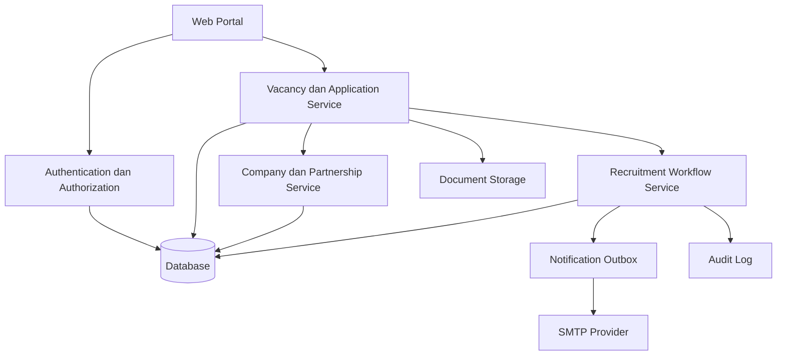
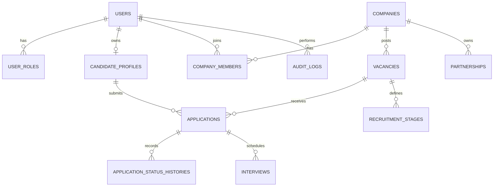

# FUNCTIONAL SPECIFICATION DOCUMENT (FSD)

## Portal Karir Kampus

**Versi:** 1.0  
**Tanggal:** 22 Agustus 2026  
**Status:** Draft Baseline  
**Dokumen Acuan:** BRD Portal Karir Kampus Versi 1.0  

---

## 1. Informasi Dokumen

### 1.1 Tujuan

Dokumen ini menerjemahkan kebutuhan bisnis Portal Karir Kampus menjadi spesifikasi fungsi sistem yang dapat digunakan oleh product manager, UI/UX designer, software developer, QA, dan tim implementasi.

### 1.2 Batasan Spesifikasi

Spesifikasi ini bersifat technology-agnostic. Pemilihan framework, database, penyedia object storage, message queue, dan layanan SMTP ditetapkan pada dokumen arsitektur teknis atau keputusan pengembangan terpisah.

### 1.3 Prinsip Sistem

1. Satu akun pengguna dapat memiliki satu atau lebih role yang sah.
2. Satu email pengguna bersifat unik dan dibandingkan secara case-insensitive.
3. Portal melayani dua domain proses: rekrutmen pegawai kampus dan lowongan mitra.
4. Lowongan mitra tidak dapat tayang sebelum moderasi.
5. Data utama harus tersimpan walaupun pengiriman notifikasi gagal.
6. Password sementara harus acak, satu kali pakai, kedaluwarsa, dan wajib diganti.
7. Seluruh perubahan status penting harus memiliki actor, waktu, dan riwayat.

---

## 2. Gambaran Sistem

### 2.1 Kanal Aplikasi

| Kanal | Pengguna | Fungsi utama |
|---|---|---|
| Portal Publik | Pengunjung dan calon kandidat | Mencari lowongan, melihat profil perusahaan, mendaftar akun, mengajukan lowongan pertama. |
| Portal Kandidat | Kandidat eksternal, mahasiswa, alumni | Profil, CV, lamaran, jadwal, notifikasi, dan status seleksi. |
| Portal Recruiter | Admin perusahaan dan recruiter | Profil perusahaan, lowongan, pelamar, seleksi, dan outcome. |
| Back Office Career Center | Staf dan kepala Career Center | Verifikasi perusahaan, moderasi lowongan, kemitraan, laporan alumni. |
| Back Office HR/SDM | HR, unit, tim seleksi, pimpinan | Kebutuhan pegawai, approval, lowongan kampus, seleksi, dan offering. |
| Super Admin | Administrator platform | Role, master data, konfigurasi, SMTP, audit, dan integrasi. |

### 2.2 Komponen Logis

---

## 3. Role dan Hak Akses

### 3.1 Daftar Role

| Kode | Role |
|---|---|
| PUBLIC | Pengunjung publik |
| CANDIDATE_EXTERNAL | Kandidat eksternal |
| CANDIDATE_STUDENT | Mahasiswa tingkat akhir |
| CANDIDATE_ALUMNI | Alumni terverifikasi |
| COMPANY_ADMIN | Admin perusahaan |
| COMPANY_RECRUITER | Recruiter perusahaan |
| CAREER_CENTER_STAFF | Staf Career Center |
| CAREER_CENTER_MANAGER | Kepala Career Center |
| REQUESTING_UNIT | Unit pengaju kebutuhan pegawai |
| HR_STAFF | Staf HR/SDM |
| HR_MANAGER | Kepala HR/SDM |
| SELECTOR | Tim seleksi/pewawancara |
| APPROVER | Pimpinan/pejabat persetujuan |
| AUDITOR | Akses baca laporan dan audit |
| SUPER_ADMIN | Administrator sistem |

### 3.2 Matriks Akses Ringkas

| Fungsi | Kandidat | Recruiter | Career Center | HR/SDM | Unit/Selector | Approver | Super Admin |
|---|---:|---:|---:|---:|---:|---:|---:|
| Melihat lowongan sesuai visibilitas | Ya | Ya | Ya | Ya | Ya | Ya | Ya |
| Melamar lowongan | Ya | Tidak | Tidak | Tidak | Tidak | Tidak | Tidak |
| Mengajukan lowongan mitra | Tidak | Ya | Atas nama mitra | Tidak | Tidak | Tidak | Ya |
| Memoderasi lowongan mitra | Tidak | Tidak | Ya | Tidak | Tidak | Tidak | Ya |
| Mengelola kandidat lowongan mitra | Milik sendiri | Milik perusahaan | Pantau | Tidak | Tidak | Tidak | Darurat/audit |
| Mengajukan kebutuhan pegawai | Tidak | Tidak | Tidak | Ya | Ya | Tidak | Ya |
| Membuat lowongan pegawai kampus | Tidak | Tidak | Tidak | Ya | Tidak | Tidak | Ya |
| Menilai kandidat pegawai kampus | Tidak | Tidak | Tidak | Ya | Sesuai penugasan | Sesuai penugasan | Darurat/audit |
| Menyetujui kebutuhan/hasil | Tidak | Tidak | Tidak | Sesuai otorisasi | Tidak | Ya | Tidak secara bisnis |
| Mengelola master dan role | Tidak | Tidak | Tidak | Tidak | Tidak | Tidak | Ya |

---

## 4. Modul dan Navigasi

### 4.1 Portal Publik

- Beranda;
- Karier di Kampus;
- Karier untuk Alumni;
- Perusahaan Mitra;
- Kegiatan Karier;
- Panduan;
- Daftarkan Lowongan;
- Masuk/Daftar;
- Laporkan Lowongan.

### 4.2 Portal Kandidat

- Dashboard;
- Profil Saya;
- CV dan Dokumen;
- Cari Lowongan;
- Lamaran Saya;
- Jadwal Seleksi;
- Notifikasi;
- Pengaturan Akun.

### 4.3 Portal Recruiter

- Dashboard;
- Profil Perusahaan;
- Status Verifikasi;
- Dokumen Legalitas;
- Kemitraan;
- Lowongan;
- Pelamar;
- Jadwal Seleksi;
- Outcome Rekrutmen;
- Anggota Perusahaan;
- Notifikasi;
- Pengaturan Akun.

### 4.4 Back Office Career Center

- Dashboard;
- Verifikasi Perusahaan;
- Moderasi Lowongan;
- Data Perusahaan;
- Kemitraan;
- Alumni dan Outcome;
- Laporan;
- Template Email;
- Pengaturan Moderasi.

### 4.5 Back Office HR/SDM

- Dashboard;
- Kebutuhan Pegawai;
- Persetujuan;
- Lowongan Kampus;
- Pelamar;
- Tim Seleksi;
- Jadwal;
- Penilaian dan Hasil;
- Offering;
- Laporan.

### 4.6 Super Admin

- Pengguna dan Role;
- Master Data;
- Unit Organisasi;
- Program Studi;
- Jenis Lowongan;
- Template Workflow;
- Konfigurasi SMTP;
- Template Notifikasi;
- Integrasi;
- Audit Log;
- Retensi Data;
- Pengaturan Sistem.

---

## 5. Spesifikasi Fungsional

## 5.1 Autentikasi dan Akun

### FR-AUTH-001 — Normalisasi Email

- Sistem menghapus spasi sebelum dan sesudah email.
- Sistem mengubah email menjadi bentuk lowercase untuk pencarian dan unique constraint.
- Sistem tetap dapat menyimpan bentuk tampilan asli apabila diperlukan.
- Email yang sama dengan perbedaan huruf besar/kecil dianggap satu akun.

### FR-AUTH-002 — Pembuatan Akun Recruiter Otomatis

**Trigger:** formulir pendaftaran perusahaan dan lowongan pertama berhasil divalidasi.

**Alur utama:**

1. Sistem mencari pengguna berdasarkan normalized email.
2. Jika tidak ditemukan, sistem membuat user dengan role `COMPANY_ADMIN` atau `COMPANY_RECRUITER` sesuai konfigurasi.
3. Sistem membuat password sementara menggunakan cryptographically secure random generator.
4. Password disimpan hanya dalam bentuk hash.
5. Sistem mencatat `must_change_password = true`.
6. Sistem mencatat waktu kedaluwarsa password sementara, default 24 jam.
7. Sistem menautkan pengguna ke perusahaan melalui `company_members`.
8. Sistem membuat record notifikasi pada email outbox.

**Post-condition:** akun dan pengajuan tersimpan dalam satu transaksi bisnis; kegagalan SMTP tidak membatalkan pembuatan pengajuan.

### FR-AUTH-003 — Email Sudah Terdaftar

| Kondisi | Respons sistem |
|---|---|
| Email terkait perusahaan yang sama | Tautkan pengajuan ke akun; jangan membuat password baru. |
| Email terkait perusahaan berbeda | Simpan pengajuan dengan flag `COMPANY_ASSOCIATION_REVIEW_REQUIRED`. |
| Email kandidat tanpa role recruiter | Minta pengguna login dan melakukan verifikasi penambahan role. |
| Akun dinonaktifkan | Tahan pengajuan dan tampilkan instruksi menghubungi admin. |

Sistem tidak boleh menampilkan detail sensitif akun atau perusahaan lain pada halaman publik.

### FR-AUTH-004 — Login Pertama dan Wajib Ganti Password

1. Recruiter login menggunakan email dan password sementara.
2. Jika kredensial valid dan belum kedaluwarsa, sistem membuat sesi terbatas.
3. Apabila `must_change_password = true`, seluruh halaman selain Ubah Password, Logout, dan Bantuan harus diblokir.
4. Recruiter memasukkan password sementara, password baru, dan konfirmasi password.
5. Sistem memvalidasi kebijakan password.
6. Sistem menyimpan hash password baru.
7. Sistem menghapus atau menonaktifkan credential sementara.
8. Sistem mengubah `must_change_password = false`.
9. Sistem mencatat waktu perubahan dan audit log.
10. Sistem mengarahkan pengguna ke dashboard recruiter.

### FR-AUTH-005 — Kebijakan Password

- minimal 8 karakter;
- mengandung huruf besar, huruf kecil, dan angka;
- password baru tidak boleh sama dengan password sementara;
- password baru tidak boleh sama dengan email;
- password sementara berlaku satu kali dan paling lama 24 jam;
- percobaan login dibatasi dan dapat menghasilkan lock sementara;
- password tidak pernah dicatat pada log aplikasi atau audit log.

### FR-AUTH-006 — Kirim Ulang Akses

- Recruiter dapat meminta akses baru jika password sementara kedaluwarsa.
- Token atau password sementara lama langsung dinonaktifkan.
- Sistem membuat credential sementara baru dan mencatat audit.
- Endpoint dilindungi rate limit dan selalu memberikan respons generik untuk mencegah account enumeration.

### FR-AUTH-007 — Lupa Password

- Pengguna meminta reset melalui email.
- Sistem mengirim tautan reset satu kali pakai dengan masa berlaku terbatas.
- Setelah reset berhasil, semua token reset lama dinonaktifkan.
- Sistem dapat mencabut sesi lain sesuai kebijakan keamanan.

## 5.2 Formulir Publik Pendaftaran Lowongan

### FR-SUB-001 — Struktur Formulir

Formulir menggunakan beberapa langkah agar mudah diisi:

1. **PIC dan Akun**;
2. **Profil Perusahaan**;
3. **Legalitas dan Verifikasi**;
4. **Detail Lowongan**;
5. **Target Kandidat dan Metode Lamaran**;
6. **Pratinjau dan Persetujuan**.

### FR-SUB-002 — Field PIC dan Akun

| Field | Tipe | Wajib | Validasi |
|---|---|---:|---|
| Nama PIC | Text | Ya | 2–150 karakter |
| Jabatan PIC | Text | Ya | Maksimal 150 karakter |
| Email PIC | Email | Ya | Format valid dan dinormalisasi |
| Nomor WhatsApp | Text | Ya | Format nomor yang diizinkan |
| Persetujuan komunikasi | Checkbox | Ya | Harus dicentang |

### FR-SUB-003 — Field Perusahaan

| Field | Tipe | Wajib | Validasi |
|---|---|---:|---|
| Nama perusahaan | Text | Ya | 2–200 karakter |
| Bentuk badan/jenis organisasi | Select | Ya | Master data |
| NIB/nomor legalitas | Text | Kondisional | Sesuai kebijakan verifikasi |
| Industri | Select | Ya | Master industri |
| Website | URL | Kondisional | URL valid |
| Email resmi perusahaan | Email | Ya | Format valid |
| Telepon | Text | Tidak | Format valid |
| Alamat | Textarea | Ya | Maksimal sesuai konfigurasi |
| Provinsi/kota | Select | Ya | Master wilayah |
| Logo | File | Tidak | Gambar, ukuran dibatasi |
| Dokumen legalitas | File | Ya | PDF/gambar; ukuran dan MIME dibatasi |

### FR-SUB-004 — Field Lowongan

| Field | Tipe | Wajib |
|---|---|---:|
| Judul posisi | Text | Ya |
| Deskripsi pekerjaan | Rich text terbatas | Ya |
| Kualifikasi | Rich text terbatas | Ya |
| Jenis pekerjaan | Select | Ya |
| Lokasi/remote/hybrid | Select dan text | Ya |
| Jumlah kebutuhan | Integer | Ya |
| Pendidikan minimal | Select | Ya |
| Program studi yang diterima | Multi-select | Tidak |
| Pengalaman | Select/text | Tidak |
| Keterampilan | Multi-value | Tidak |
| Rentang gaji | Numeric range | Kondisional |
| Tanggal buka | Date/time | Ya |
| Tanggal tutup | Date/time | Ya |
| Target audiens | Select | Ya |
| Metode lamaran | In portal/External ATS | Ya |
| URL ATS eksternal | URL | Wajib jika external apply |
| Dokumen kandidat wajib | Multi-select | Tidak |
| Pertanyaan penyaringan | Repeater | Tidak |

### FR-SUB-005 — Submit Transaksional

Saat pengguna menekan **Kirim Lowongan**:

1. sistem memvalidasi seluruh field;
2. sistem melakukan pemeriksaan dasar duplikasi perusahaan dan lowongan;
3. sistem membuat atau menghubungkan akun recruiter;
4. sistem membuat/memperbarui profil perusahaan;
5. sistem menyimpan dokumen legalitas;
6. sistem membuat lowongan berstatus `PENDING_REVIEW` atau `PENDING_EMAIL_VERIFICATION`;
7. sistem membuat nomor pengajuan unik;
8. sistem membuat email outbox;
9. sistem menampilkan halaman berhasil dengan nomor pengajuan dan email tujuan.

Jika terjadi kegagalan sebelum transaksi database selesai, seluruh perubahan dalam transaksi harus dibatalkan. Jika pengiriman SMTP gagal setelah transaksi selesai, pengajuan tetap berhasil dan email berstatus gagal untuk diproses ulang.

### FR-SUB-006 — Halaman Berhasil

Halaman berhasil menampilkan:

- pesan bahwa data telah diterima;
- nomor pengajuan;
- nama perusahaan;
- judul posisi;
- status awal;
- email tujuan;
- informasi agar memeriksa inbox dan spam;
- tombol **Masuk ke Portal Recruiter**;
- tombol **Kirim Ulang Akses** apabila email belum diterima setelah periode tertentu.

## 5.3 Perusahaan dan Kemitraan

### FR-COMP-001 — Deduplication

Sistem menandai potensi duplikasi berdasarkan kombinasi:

- normalized company name;
- NIB/nomor legalitas;
- domain website;
- domain email resmi;
- nomor telepon.

Penggabungan perusahaan hanya dapat dilakukan pengguna berwenang dan harus tercatat pada audit log.

### FR-COMP-002 — Verifikasi Perusahaan

Career Center dapat:

- melihat profil dan dokumen;
- meminta perbaikan;
- menetapkan terverifikasi;
- menolak;
- menangguhkan;
- mengaktifkan kembali;
- menambahkan catatan internal;
- menetapkan risk flag.

### FR-COMP-003 — Status Perusahaan

| Status | Makna |
|---|---|
| DRAFT | Data belum lengkap. |
| PENDING_VERIFICATION | Menunggu pemeriksaan Career Center. |
| REVISION_REQUIRED | Perusahaan harus memperbaiki data. |
| VERIFIED | Perusahaan telah diverifikasi. |
| REJECTED | Verifikasi ditolak. |
| SUSPENDED | Akses publikasi sementara dihentikan. |

### FR-COMP-004 — Kemitraan

Career Center dapat mencatat:

- nomor dokumen kerja sama;
- jenis kemitraan;
- tanggal mulai dan berakhir;
- PIC kampus dan perusahaan;
- dokumen kemitraan;
- status aktif/kedaluwarsa;
- catatan dan ruang lingkup.

Badge `Mitra Kampus` hanya tampil jika kemitraan aktif.

### FR-COMP-005 — Anggota Perusahaan

Company Admin dapat mengundang recruiter melalui email. Recruiter hanya dapat mengakses lowongan perusahaan tempat ia menjadi anggota aktif. Penghapusan anggota tidak menghapus riwayat aktivitasnya.

## 5.4 Pengelolaan Lowongan

### FR-VAC-001 — Jenis Lowongan

- `CAMPUS_EMPLOYMENT`: lowongan pegawai kampus;
- `PARTNER_EMPLOYMENT`: lowongan perusahaan mitra;
- `INTERNSHIP`: magang;
- tipe tambahan dapat dikelola melalui master data tanpa mengubah domain pemilik proses.

### FR-VAC-002 — Visibilitas

| Visibilitas | Pengguna yang dapat melihat/melamar |
|---|---|
| PUBLIC | Kandidat eksternal, mahasiswa, dan alumni. |
| ALUMNI_ONLY | Alumni terverifikasi. |
| FINAL_YEAR_AND_ALUMNI | Mahasiswa tingkat akhir terverifikasi dan alumni. |
| INTERNAL | Pengguna internal yang memenuhi role/kriteria. |

### FR-VAC-003 — Status Lowongan

| Status | Aksi yang diperbolehkan |
|---|---|
| DRAFT | Edit dan hapus oleh pembuat. |
| PENDING_EMAIL_VERIFICATION | Menunggu verifikasi akses recruiter. |
| PENDING_REVIEW | Menunggu moderasi. |
| REVISION_REQUIRED | Edit oleh recruiter lalu kirim ulang. |
| APPROVED | Disetujui tetapi belum masuk tanggal tayang. |
| SCHEDULED | Terjadwal otomatis. |
| PUBLISHED | Tampil sesuai visibilitas. |
| REJECTED | Tidak tayang; alasan tersedia. |
| CLOSED | Ditutup manual. |
| EXPIRED | Ditutup otomatis karena melewati tanggal. |
| SUSPENDED | Diturunkan sementara karena pelanggaran atau pemeriksaan. |

### FR-VAC-004 — Moderasi

Career Center dapat memilih keputusan:

- setujui;
- minta revisi;
- tolak;
- suspend lowongan yang sudah tayang.

Keputusan revisi/penolakan wajib memiliki kategori alasan dan catatan yang dapat dilihat recruiter. Catatan internal tidak boleh terlihat oleh recruiter.

### FR-VAC-005 — Perubahan Lowongan Tayang

Perubahan judul, perusahaan, target audiens, metode lamaran, deskripsi utama, tanggal, atau persyaratan penting dapat mengembalikan lowongan ke moderasi. Sistem menyimpan versi sebelum dan sesudah perubahan.

### FR-VAC-006 — Penutupan Otomatis

Scheduler menandai lowongan `EXPIRED` setelah `close_at`. Lowongan tidak menerima lamaran baru, tetapi data pelamar tetap dapat diakses sesuai kewenangan dan retensi.

## 5.5 Rekrutmen Pegawai Kampus

### FR-HR-001 — Pengajuan Kebutuhan Pegawai

Field minimal:

- unit pengaju;
- nama posisi;
- jumlah formasi;
- status kepegawaian;
- alasan kebutuhan;
- kualifikasi;
- target mulai bekerja;
- sumber anggaran atau konfirmasi ketersediaan anggaran jika diwajibkan;
- lampiran;
- rantai persetujuan.

### FR-HR-002 — Approval Kebutuhan

- workflow approval dapat berbeda berdasarkan jenis posisi/unit;
- approver dapat menyetujui, mengembalikan, atau menolak;
- pengembalian dan penolakan wajib memiliki alasan;
- seluruh keputusan dicatat pada riwayat;
- hanya pengajuan disetujui yang dapat dikonversi menjadi lowongan kampus.

### FR-HR-003 — Konversi Menjadi Lowongan

HR/SDM dapat membuat lowongan dari pengajuan disetujui. Data posisi, unit, formasi, dan kualifikasi awal disalin dan dapat dilengkapi tanpa mengubah catatan pengajuan asli.

### FR-HR-004 — Tim Seleksi

HR/SDM menetapkan anggota tim dan tahap yang dapat diakses. Selector hanya melihat kandidat dan data yang diperlukan untuk tahap penugasannya.

### FR-HR-005 — Penetapan Hasil

Hasil akhir dapat memerlukan approval. Setelah disetujui, HR/SDM dapat mencatat offering, tanggal respons, kandidat menerima/menolak, dan tanggal rencana mulai. Integrasi onboarding/HRIS merupakan proses lanjutan.

## 5.6 Kandidat dan Profil

### FR-CAN-001 — Jenis Kandidat

- eksternal;
- mahasiswa tingkat akhir terverifikasi;
- alumni terverifikasi.

Status dapat berubah, misalnya mahasiswa menjadi alumni, tanpa membuat akun baru.

### FR-CAN-002 — Profil Kandidat

Profil minimal mencakup:

- identitas dasar;
- informasi kontak;
- domisili;
- pendidikan;
- pengalaman;
- organisasi;
- sertifikasi;
- keterampilan;
- preferensi kerja;
- tautan portofolio;
- CV utama.

Data sensitif hanya diminta bila diperlukan dan memiliki dasar penggunaan yang jelas.

### FR-CAN-003 — Verifikasi Alumni

Sistem dapat memverifikasi alumni melalui SSO, sinkronisasi master alumni, atau kombinasi NIM dan data pembanding. Konflik data diarahkan ke verifikasi manual.

### FR-CAN-004 — Dokumen

- Kandidat dapat menyimpan dokumen umum.
- Sistem memeriksa tipe MIME dan ukuran file.
- Dokumen tidak menjadi publik.
- Kandidat memilih atau menyetujui dokumen yang dibagikan untuk setiap lamaran.
- Pemilik lowongan hanya dapat mengakses dokumen kandidat yang melamar.

## 5.7 Lamaran dan Applicant Tracking

### FR-APP-001 — In-Portal Apply

Sebelum submit, sistem memeriksa:

- lowongan berstatus tayang;
- tanggal pendaftaran aktif;
- kandidat memenuhi visibilitas;
- profil/dokumen wajib lengkap;
- belum ada lamaran aktif pada lowongan yang sama;
- consent telah diberikan.

Sistem membuat nomor lamaran, snapshot data relevan, riwayat status awal, dan email tanda terima.

### FR-APP-002 — External Apply

- Sistem menampilkan pemberitahuan bahwa pengguna akan diarahkan ke situs perusahaan.
- Sistem mencatat klik keluar apabila kandidat login dan memberikan persetujuan tracking.
- Status awal dicatat sebagai `EXTERNAL_APPLY_STARTED`.
- Sistem tidak mengklaim lamaran berhasil tanpa konfirmasi ATS/perusahaan/kandidat.
- Career Center dapat meminta konfirmasi outcome kemudian.

### FR-APP-003 — Status Lamaran

Status standar:

`APPLIED`, `UNDER_REVIEW`, `SHORTLISTED`, `ASSESSMENT`, `INTERVIEW`, `OFFERED`, `HIRED`, `REJECTED`, `WITHDRAWN`, `NO_SHOW`.

Setiap perubahan menyimpan:

- status sebelumnya;
- status baru;
- actor;
- timestamp;
- alasan atau catatan;
- visibility catatan: internal atau kandidat.

### FR-APP-004 — Tahapan Configurable

Pemilik lowongan dapat menggunakan template atau menyusun tahapan. Status akhir standar tidak boleh dihapus. Perubahan workflow setelah terdapat pelamar harus divalidasi agar kandidat tidak kehilangan tahap.

### FR-APP-005 — Bulk Action

Pengguna berwenang dapat:

- memindahkan beberapa kandidat ke tahap yang sama;
- mengirim pesan;
- menjadwalkan seleksi;
- menolak dengan alasan;
- mengekspor data sesuai kewenangan.

Setiap bulk action dicatat pada audit log.

### FR-APP-006 — Pengunduran Diri

Kandidat dapat mengundurkan diri selama belum berstatus `HIRED`, sesuai kebijakan. Sistem meminta alasan opsional dan memberi tahu pemilik lowongan.

## 5.8 Jadwal, Penilaian, dan Offering

### FR-SEL-001 — Jadwal

Jadwal memuat jenis kegiatan, tanggal/waktu, zona waktu, lokasi/tautan, PIC, peserta, instruksi, dan lampiran. Perubahan jadwal mengirim notifikasi kepada kandidat terkait.

### FR-SEL-002 — Penilaian

Untuk rekrutmen kampus, HR/SDM dapat membuat form penilaian per tahap dengan kriteria, bobot, skor, komentar, dan rekomendasi. Akses hasil dibatasi sesuai role.

### FR-SEL-003 — Offering

Sistem mencatat tanggal offering, batas respons, status respons, catatan, dan—jika diizinkan—dokumen offering. Penandatanganan kontrak digital tidak termasuk MVP.

## 5.9 Notifikasi dan SMTP

### FR-NOTIF-001 — Transactional Outbox

Seluruh email transaksional dibuat sebagai record outbox dalam transaksi yang sama dengan kejadian bisnis. Worker mengirim email secara asynchronous.

Status outbox:

`PENDING → PROCESSING → SENT` atau `FAILED → RETRY_SCHEDULED → SENT/DEAD_LETTER`.

### FR-NOTIF-002 — Template Email Akun Recruiter Baru

**Subjek:** `Pendaftaran Lowongan Telah Diterima – [Nama Portal]`

Isi wajib:

- nama PIC;
- nomor pengajuan;
- nama perusahaan;
- judul posisi;
- status pengajuan;
- email login;
- password sementara;
- masa berlaku password;
- peringatan wajib ganti password;
- tombol **Masuk ke Portal Recruiter**;
- kontak bantuan;
- peringatan bahwa proses resmi tidak memungut biaya.

Catatan keamanan: password sementara hanya tersedia pada saat dibuat dan tidak dapat dibaca kembali dari database. Pengiriman ulang harus menghasilkan credential sementara baru.

### FR-NOTIF-003 — Template Email Akun yang Sudah Ada

Email tidak boleh memuat password. Isi email mencakup tanda terima, nomor pengajuan, status, dan tombol **Masuk ke Dashboard**. Jika pengguna lupa password, gunakan alur reset password.

### FR-NOTIF-004 — Daftar Trigger Email

| Trigger | Penerima |
|---|---|
| Pengajuan lowongan diterima | Recruiter |
| Akun recruiter baru dibuat | Recruiter |
| Perusahaan perlu perbaikan/disetujui/ditolak | Recruiter terkait |
| Lowongan perlu revisi/disetujui/ditolak/tayang/ditutup | Recruiter terkait |
| Lamaran berhasil | Kandidat dan recruiter/HR sesuai preferensi |
| Status seleksi berubah | Kandidat sesuai aturan notifikasi |
| Jadwal dibuat/diubah/dibatalkan | Kandidat dan petugas terkait |
| Offering diterbitkan | Kandidat |
| Outcome belum dilengkapi | Recruiter |
| Kemitraan akan berakhir | Career Center dan PIC perusahaan |

### FR-NOTIF-005 — Retry SMTP

- retry menggunakan backoff terkontrol;
- jumlah percobaan maksimum configurable;
- error teknis disimpan tanpa menyimpan password atau data sensitif pada log;
- admin dapat melakukan resend;
- setelah batas retry, pesan masuk `DEAD_LETTER` dan memunculkan alert admin.

### FR-NOTIF-006 — Konfigurasi SMTP

Super Admin dapat mengelola:

- host;
- port;
- mode enkripsi;
- username;
- secret/password secara terenkripsi;
- from name;
- from address;
- reply-to;
- timeout;
- retry policy;
- test email.

Secret tidak pernah ditampilkan kembali dalam bentuk asli setelah disimpan.

## 5.10 Dashboard dan Laporan

### FR-REP-001 — Dashboard Recruiter

- status verifikasi perusahaan;
- lowongan berdasarkan status;
- jumlah pelamar per lowongan;
- kandidat per tahap;
- jadwal mendatang;
- permintaan revisi;
- outcome yang belum dilengkapi.

### FR-REP-002 — Dashboard Career Center

- antrean verifikasi perusahaan;
- antrean moderasi lowongan;
- perusahaan terverifikasi dan mitra aktif;
- lowongan aktif;
- alumni yang melamar dan diterima;
- lowongan tanpa outcome;
- kemitraan akan berakhir.

### FR-REP-003 — Dashboard HR/SDM

- kebutuhan pegawai per status;
- lowongan kampus aktif;
- pelamar dan funnel seleksi;
- jadwal seleksi;
- kandidat offering dan hired;
- time-to-fill.

### FR-REP-004 — Ekspor

Ekspor CSV/XLSX disesuaikan role dan filter aktif. Ekspor data kandidat harus dicatat pada audit log dan hanya memuat data yang diperlukan.

## 5.11 Audit dan Consent

### FR-AUD-001 — Audit Event

Audit minimal untuk:

- login berhasil/gagal dan lock account;
- pembuatan akun otomatis;
- perubahan role;
- perubahan status perusahaan;
- keputusan moderasi lowongan;
- perubahan data lowongan tayang;
- akses/unduh dokumen kandidat;
- perubahan status kandidat;
- approval kebutuhan dan hasil;
- perubahan konfigurasi SMTP;
- ekspor data;
- suspend/restore akun atau perusahaan.

Audit menyimpan actor, waktu, jenis aksi, objek, ID objek, IP/perangkat jika diizinkan, serta ringkasan perubahan tanpa password atau secret.

### FR-AUD-002 — Consent Kandidat

Sistem menyimpan versi teks consent, waktu persetujuan, tujuan penggunaan, lowongan/perusahaan penerima, dan status pencabutan apabila berlaku.

---

## 6. Model Data Konseptual

### 6.1 Entitas Utama

| Entitas | Fungsi |
|---|---|
| users | Identitas login global. |
| roles dan user_roles | Role dan assignment pengguna. |
| password_credentials | Hash, temporary flag, expiry, dan riwayat credential. |
| candidate_profiles | Profil kandidat. |
| alumni_verifications | Bukti/status verifikasi alumni. |
| candidate_documents | Metadata dokumen kandidat. |
| companies | Profil perusahaan. |
| company_documents | Dokumen legalitas. |
| company_members | Hubungan user dan perusahaan beserta role. |
| partnerships | Data kemitraan kampus-perusahaan. |
| workforce_requests | Pengajuan kebutuhan pegawai kampus. |
| approval_flows dan approval_actions | Rantai dan keputusan approval. |
| vacancies | Data lowongan. |
| vacancy_versions | Riwayat perubahan lowongan. |
| vacancy_requirements | Kualifikasi dan persyaratan. |
| vacancy_documents | Dokumen pendukung lowongan. |
| applications | Lamaran kandidat. |
| application_documents | Snapshot/referensi dokumen yang dibagikan. |
| application_status_histories | Riwayat status lamaran. |
| recruitment_stages | Tahapan seleksi per lowongan. |
| interviews | Jadwal seleksi/wawancara. |
| evaluations | Form dan hasil penilaian. |
| offers | Data offering. |
| consents | Persetujuan penggunaan dan pembagian data. |
| notifications | Notifikasi in-app. |
| email_outbox | Antrean dan status email. |
| audit_logs | Jejak aktivitas. |

### 6.2 Relasi Ringkas

### 6.3 Field Kritis User dan Credential

| Field | Keterangan |
|---|---|
| users.id | Primary key. |
| users.email | Email tampilan. |
| users.email_normalized | Lowercase, unique index. |
| users.email_verified_at | Waktu verifikasi. |
| users.status | Pending, active, suspended, disabled. |
| users.must_change_password | Boolean wajib ganti password. |
| password_credentials.password_hash | Hash credential. |
| password_credentials.is_temporary | Penanda sementara. |
| password_credentials.expires_at | Kedaluwarsa credential sementara. |
| password_credentials.used_at | Waktu credential sementara digunakan. |
| password_credentials.revoked_at | Waktu credential dicabut. |

---

## 7. Endpoint/Service Contract Konseptual

Nama endpoint dapat disesuaikan dengan standar teknis implementasi.

### 7.1 Public dan Authentication

| Method | Endpoint | Fungsi |
|---|---|---|
| GET | `/public/vacancies` | Daftar lowongan publik. |
| GET | `/public/vacancies/{slug}` | Detail lowongan. |
| POST | `/public/vacancy-submissions` | Pengajuan perusahaan dan lowongan pertama. |
| POST | `/auth/login` | Login. |
| POST | `/auth/first-login/change-password` | Wajib ganti password. |
| POST | `/auth/resend-initial-access` | Kirim ulang akses sementara. |
| POST | `/auth/forgot-password` | Meminta reset password. |
| POST | `/auth/reset-password` | Menetapkan password baru. |

### 7.2 Company dan Vacancy

| Method | Endpoint | Fungsi |
|---|---|---|
| GET/PATCH | `/companies/{id}` | Baca/perbarui perusahaan. |
| POST | `/companies/{id}/members` | Undang recruiter. |
| POST | `/companies/{id}/documents` | Unggah legalitas. |
| POST | `/companies/{id}/vacancies` | Buat lowongan. |
| PATCH | `/vacancies/{id}` | Edit lowongan. |
| POST | `/vacancies/{id}/submit` | Ajukan moderasi. |
| POST | `/vacancies/{id}/review` | Keputusan Career Center. |
| POST | `/vacancies/{id}/publish` | Publikasi sesuai kewenangan. |
| POST | `/vacancies/{id}/close` | Tutup lowongan. |

### 7.3 Application dan Selection

| Method | Endpoint | Fungsi |
|---|---|---|
| POST | `/vacancies/{id}/applications` | Kirim lamaran. |
| GET | `/vacancies/{id}/applications` | Daftar pelamar sesuai akses. |
| POST | `/applications/{id}/transition` | Perubahan tahap/status. |
| POST | `/applications/{id}/withdraw` | Pengunduran diri kandidat. |
| POST | `/applications/{id}/interviews` | Jadwalkan seleksi. |
| POST | `/applications/{id}/evaluations` | Simpan penilaian. |
| POST | `/applications/{id}/offers` | Buat offering. |

### 7.4 Persyaratan Umum API

- autentikasi dan authorization pada setiap endpoint privat;
- validasi object ownership;
- idempotency key untuk submit penting;
- pagination dan filter pada daftar;
- error response terstandar;
- correlation ID untuk tracing;
- rate limit pada endpoint publik dan autentikasi;
- upload menggunakan validasi MIME, ukuran, dan malware scanning jika tersedia.

---

## 8. Status dan Transisi

### 8.1 Akun Recruiter

| Dari | Aksi | Ke | Aktor |
|---|---|---|---|
| Tidak ada | Submit lowongan pertama | PENDING_EMAIL_VERIFICATION | Sistem |
| PENDING_EMAIL_VERIFICATION | Login password sementara | FORCE_PASSWORD_CHANGE | Recruiter |
| FORCE_PASSWORD_CHANGE | Password baru valid | ACTIVE | Recruiter/Sistem |
| ACTIVE | Suspend | SUSPENDED | Admin berwenang |
| SUSPENDED | Aktifkan kembali | ACTIVE | Admin berwenang |
| ACTIVE/SUSPENDED | Nonaktifkan | DISABLED | Admin berwenang |

### 8.2 Lowongan

| Dari | Aksi | Ke |
|---|---|---|
| DRAFT | Submit | PENDING_REVIEW |
| PENDING_REVIEW | Minta revisi | REVISION_REQUIRED |
| REVISION_REQUIRED | Submit ulang | PENDING_REVIEW |
| PENDING_REVIEW | Setujui | APPROVED/SCHEDULED/PUBLISHED |
| PENDING_REVIEW | Tolak | REJECTED |
| APPROVED/SCHEDULED | Mencapai tanggal buka | PUBLISHED |
| PUBLISHED | Tutup manual | CLOSED |
| PUBLISHED | Melewati tanggal tutup | EXPIRED |
| PUBLISHED | Suspend | SUSPENDED |
| SUSPENDED | Pulihkan dan valid | PUBLISHED/CLOSED |

### 8.3 Lamaran

Perpindahan status harus mengikuti workflow lowongan. Perpindahan langsung ke `HIRED` atau `REJECTED` hanya boleh dilakukan role berwenang dan wajib tercatat. Status akhir tidak boleh diubah tanpa mekanisme koreksi resmi dan audit.

---

## 9. Validasi dan Penanganan Kesalahan

### 9.1 Validasi Utama

1. Email harus valid dan unik setelah normalisasi.
2. Tanggal tutup harus setelah tanggal buka.
3. URL ATS wajib menggunakan protokol yang diizinkan.
4. Dokumen wajib harus lengkap sebelum submit.
5. Pengguna harus memiliki hubungan aktif dengan perusahaan.
6. Lowongan harus berada pada status yang memperbolehkan aksi.
7. Kandidat harus memenuhi aturan visibilitas.
8. Lamaran duplikat harus ditolak secara idempotent.
9. Actor tidak boleh menyetujui langkah yang dilarang oleh separation of duties jika kebijakan mengaturnya.

### 9.2 Kode Kesalahan Fungsional Contoh

| Kode | Pesan pengguna |
|---|---|
| EMAIL_ALREADY_REGISTERED | Email sudah terdaftar. Silakan masuk untuk melanjutkan. |
| COMPANY_ASSOCIATION_REVIEW_REQUIRED | Pengajuan diterima dan memerlukan verifikasi hubungan perusahaan. |
| TEMP_PASSWORD_EXPIRED | Password sementara telah kedaluwarsa. Silakan kirim ulang akses. |
| FORCE_PASSWORD_CHANGE | Anda wajib membuat password baru sebelum melanjutkan. |
| VACANCY_NOT_OPEN | Lowongan belum dibuka atau sudah ditutup. |
| APPLICATION_ALREADY_EXISTS | Anda sudah melamar pada lowongan ini. |
| DOCUMENT_REQUIRED | Lengkapi dokumen wajib sebelum mengirim lamaran. |
| FORBIDDEN_COMPANY_ACCESS | Anda tidak memiliki akses ke perusahaan atau lowongan ini. |
| INVALID_STATUS_TRANSITION | Perubahan status tidak diperbolehkan. |
| EMAIL_DELIVERY_PENDING | Data berhasil diterima, tetapi email masih dalam antrean pengiriman. |

### 9.3 Prinsip Pesan Kesalahan

- tidak membocorkan keberadaan atau detail akun pihak lain;
- mudah dipahami pengguna;
- menyediakan tindakan lanjutan;
- memiliki correlation ID untuk bantuan teknis;
- detail teknis hanya dicatat pada log internal.

---

## 10. Kebutuhan Nonfungsional

### 10.1 Keamanan

- TLS pada seluruh koneksi;
- password di-hash menggunakan algoritma adaptif yang aman;
- session cookie aman atau token sesuai standar implementasi;
- rate limiting dan temporary lock pada login;
- CSRF protection jika menggunakan cookie session;
- validasi input dan output encoding;
- file privat dengan signed access sementara;
- antivirus/malware scanning apabila tersedia;
- RBAC dan object-level authorization;
- secret SMTP dienkripsi;
- audit akses dan unduh dokumen;
- tidak mencatat password, token, atau secret pada log.

### 10.2 Kinerja

- halaman daftar lowongan menggunakan pagination;
- pencarian dan filter menggunakan indeks yang sesuai;
- pengiriman email berjalan asynchronous;
- file tidak disimpan langsung sebagai blob database kecuali diputuskan lain;
- target waktu respons endpoint umum ditetapkan pada SLA teknis.

### 10.3 Keandalan

- transaksi database untuk submit pengajuan;
- idempotency untuk mencegah submit ganda;
- retry SMTP melalui outbox;
- backup database dan dokumen;
- scheduler memiliki locking agar penutupan lowongan tidak diproses ganda;
- monitoring antrean email dan job terjadwal.

### 10.4 Privasi

- consent tercatat dan dapat diaudit;
- data kandidat dibatasi pada pemilik lowongan terkait;
- data sensitif diminimalkan;
- retensi dan penghapusan mengikuti kebijakan kampus dan ketentuan yang berlaku;
- dokumen tidak dapat diindeks mesin pencari;
- ekspor dan unduhan dicatat.

### 10.5 Aksesibilitas dan Responsivitas

- antarmuka responsif pada mobile dan desktop;
- form memiliki label, pesan kesalahan, dan urutan fokus yang jelas;
- tombol dan status tidak bergantung pada warna saja;
- email memiliki versi HTML dan plain text;
- halaman publik mengikuti praktik aksesibilitas web yang wajar.

---

## 11. Skenario Uji Penerimaan Utama

### UAT-001 — Pengajuan Recruiter Baru

**Given** email belum terdaftar  
**When** recruiter mengirim formulir perusahaan dan lowongan valid  
**Then** sistem membuat perusahaan/pengajuan, membuat satu akun recruiter, membuat password sementara, mencatat email outbox, dan menampilkan nomor pengajuan.

### UAT-002 — Login Pertama

**Given** recruiter memiliki password sementara aktif  
**When** recruiter login  
**Then** sistem hanya mengizinkan halaman ganti password dan memblokir dashboard sampai password baru berhasil disimpan.

### UAT-003 — Password Sementara Kedaluwarsa

**Given** masa berlaku telah lewat  
**When** recruiter login  
**Then** sistem menolak credential sementara dan menyediakan alur kirim ulang akses.

### UAT-004 — Email Recruiter Sudah Ada

**Given** email telah terkait dengan perusahaan yang sama  
**When** formulir publik dikirim kembali  
**Then** sistem tidak membuat akun atau password baru dan mengarahkan recruiter menggunakan akun yang sudah ada.

### UAT-005 — Kegagalan SMTP

**Given** data formulir valid tetapi SMTP gagal  
**When** submit diproses  
**Then** pengajuan tetap tersimpan, email berstatus gagal/akan dicoba ulang, dan halaman berhasil tidak menyatakan bahwa email pasti telah diterima.

### UAT-006 — Moderasi Lowongan

**Given** lowongan menunggu pemeriksaan  
**When** Career Center meminta revisi  
**Then** recruiter memperoleh catatan, dapat mengedit, dan mengirim ulang tanpa membuat lowongan baru.

### UAT-007 — Proteksi Publikasi

**Given** lowongan mitra belum disetujui  
**When** publik membuka daftar lowongan  
**Then** lowongan tersebut tidak tampil.

### UAT-008 — Lamaran Alumni

**Given** lowongan khusus alumni sedang tayang dan alumni terverifikasi  
**When** alumni melengkapi dokumen dan consent  
**Then** lamaran tersimpan dan terlihat oleh recruiter perusahaan terkait.

### UAT-009 — Kandidat Eksternal pada Lowongan Alumni

**Given** kandidat eksternal membuka lowongan `ALUMNI_ONLY`  
**When** kandidat mencoba melamar  
**Then** sistem menolak dan menjelaskan bahwa lowongan hanya untuk alumni terverifikasi.

### UAT-010 — Isolasi Data Perusahaan

**Given** recruiter Perusahaan A  
**When** mencoba membuka pelamar Perusahaan B  
**Then** sistem menolak akses dan mencatat percobaan sesuai kebijakan audit.

### UAT-011 — Rekrutmen Pegawai Kampus

**Given** kebutuhan pegawai belum disetujui  
**When** HR mencoba mempublikasikan lowongan terkait  
**Then** sistem menolak publikasi.

### UAT-012 — Outcome dan Laporan

**Given** recruiter menetapkan alumni sebagai `HIRED`  
**When** laporan Career Center diperbarui  
**Then** outcome tersebut tercatat pada metrik penyerapan alumni tanpa mengubah data master akademik.

---

## 12. Traceability BRD ke FSD

| BRD | Implementasi FSD utama |
|---|---|
| BR-001–BR-005 | Portal Publik, Role, FR-AUTH, FR-CAN |
| BR-010–BR-017 | FR-AUTH-002 s.d. FR-AUTH-007, FR-SUB, FR-COMP |
| BR-020–BR-028 | FR-VAC dan FR-HR |
| BR-030–BR-035 | FR-CAN dan FR-APP |
| BR-040–BR-045 | FR-APP dan FR-SEL |
| BR-050–BR-055 | FR-NOTIF |
| BR-060–BR-064 | FR-REP dan FR-AUD |

---

## 13. Dependensi Implementasi

1. Domain/subdomain Portal Karir.
2. Akun SMTP resmi kampus.
3. Identitas visual dan template email.
4. Sumber data alumni/mahasiswa untuk verifikasi.
5. Struktur unit organisasi dan pejabat approval.
6. Kebijakan verifikasi perusahaan dan moderasi lowongan.
7. Kebijakan retensi dokumen kandidat.
8. Object storage privat untuk dokumen.
9. Scheduler/queue worker untuk notifikasi dan otomatisasi status.
10. Mekanisme backup, monitoring, dan audit.

---

## 14. Open Questions

1. Apakah mahasiswa tingkat akhir masuk MVP atau hanya alumni?
2. Apakah alumni menggunakan SSO kampus atau akun email pribadi yang diverifikasi?
3. Dokumen legalitas apa yang wajib untuk perusahaan Indonesia dan organisasi nonperusahaan?
4. Apakah perusahaan nonmitra boleh memasang lowongan setelah verifikasi?
5. Siapa rantai persetujuan kebutuhan pegawai berdasarkan jenis posisi?
6. Apakah rentang gaji wajib, opsional, atau tidak ditampilkan?
7. Berapa masa retensi lamaran dan dokumen kandidat?
8. Apakah outcome yang belum dilengkapi akan membatasi publikasi lowongan baru?
9. Apakah sistem akan menggunakan satu domain portal atau subdomain terpisah untuk recruiter?
10. Apakah notifikasi WhatsApp akan masuk fase lanjutan?

---

## 15. Definition of Done Fungsional

Satu fungsi dianggap selesai apabila:

1. kebutuhan dan acceptance criteria telah disetujui;
2. UI state normal, kosong, loading, error, dan forbidden tersedia;
3. validasi client dan server tersedia;
4. authorization diuji;
5. audit event yang diwajibkan tercatat;
6. email/notifikasi terkait diuji;
7. unit test dan integration test kritis lulus;
8. UAT role terkait lulus;
9. dokumentasi konfigurasi dan operasional diperbarui;
10. tidak terdapat defect kritis atau tinggi yang belum dimitigasi.

