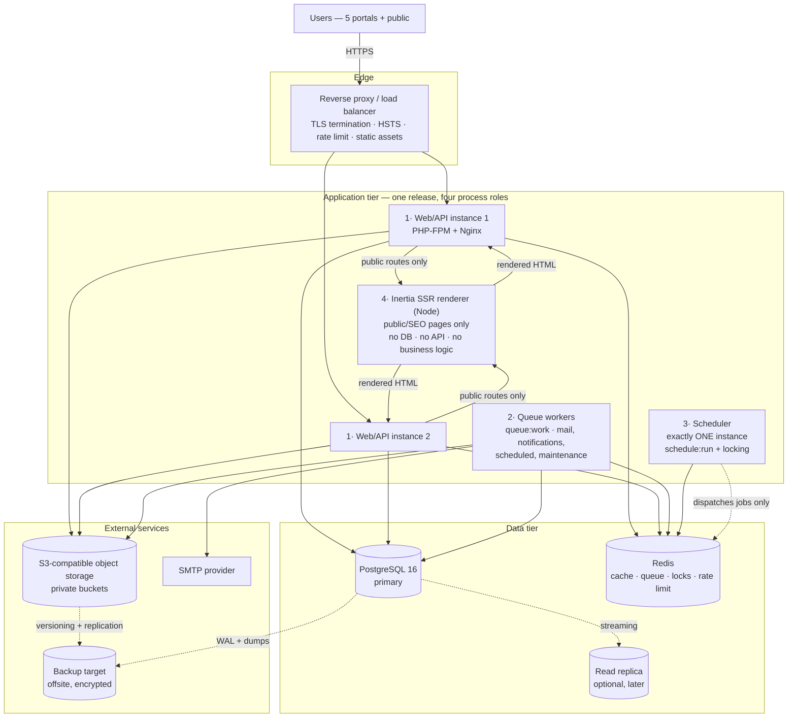
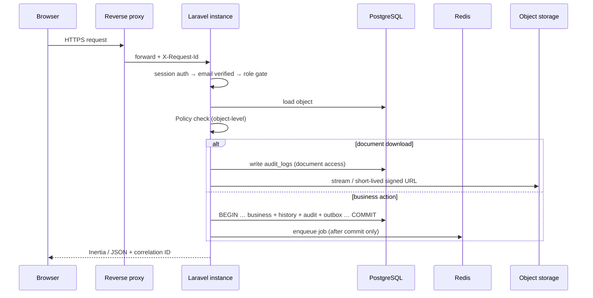

# Deployment Architecture — Portal Karir Kampus

**Status:** Proposed — awaiting approval
**Date:** 24 August 2026 · **Amended 24 August 2026** (ADR-017 — Inertia SSR runtime process)
**Scope:** Environments, runtime topology, backup and recovery, and observability. No infrastructure code, cloud script, or provider configuration is created by this document.

---

## 1. Environments

| Environment | Purpose | Data | Notes |
| --- | --- | --- | --- |
| **local** | Developer workstation | Seeded synthetic data only | Docker Compose. `local` storage disk, log mail driver or a mail-catcher — **never a real SMTP relay** |
| **development** | Shared integration | Synthetic | Deployed from the main branch. Mirrors production services at small size |
| **staging** | Release validation and UAT (FSD §11) | Synthetic or fully anonymized | **Production-shaped**: same PostgreSQL major version, same queue driver, same S3-compatible storage, TLS. A staging environment that differs structurally cannot validate a release |
| **production** | Live | Real | Secrets from the platform secret manager only |

### Configuration boundaries

| | local | development | staging | production |
| --- | --- | --- | --- | --- |
| Debug mode | On | Off | Off | **Off** |
| Mail | Log / catcher | Catcher | Real relay, restricted recipients | Real provider |
| Storage | Local disk | S3-compatible | S3-compatible | S3-compatible |
| Queue | Redis or sync | Redis | Redis | Redis |
| Search-engine indexing | Blocked | Blocked | **Blocked** | Public pages only |
| Secrets | `.env`, untracked | Injected | Secret manager | Secret manager |

### Upload and storage baseline for candidate documents

Frozen with the candidate document upload policy, 25 August 2026 (`API_CONTRACT.md` Part X item 9).

| Control | Required value | Authority |
| --- | --- | --- |
| **Business file limit** | **10 MiB — exactly 10,485,760 bytes**, one global limit for every candidate document | **Application validation is authoritative** |
| PHP `upload_max_filesize` | **≥ 12 MiB** | Transport ceiling only |
| PHP `post_max_size` | **≥ 13 MiB** | Transport ceiling only |
| Reverse-proxy request body | **≥ 12 MiB** | Transport ceiling only |
| Upload rate limit | **20 upload requests per hour per authenticated candidate**, keyed on the user identifier or another deterministic non-sensitive key — never a raw email | `API_CONTRACT.md` Part I §11.8 |
| Storage quota | **DEFERRED** — none at MVP | — |

**No transport ceiling is ever the business limit.** Where a platform exposes different controls (an ingress annotation, a WAF body limit, a serverless payload cap), the equivalent value must still sit **above** 10 MiB for the same reason.

**`FILESYSTEM_DISK=s3`** — or an equivalently configured S3-compatible **private** store — **must be asserted by deployment configuration before candidate document upload is considered production-ready.** The framework default is the `local` disk; a production deployment that inherits it would place candidate documents on instance-local storage, outside object versioning and the backup guarantees in §4. Local private storage remains correct for development and test.

**No production secret ever enters the repository.** `.env.example` carries variable names and placeholders only, and is created once the variables are actually defined. The root `.gitignore` already excludes `.env`, `.env.*`, `*.pem`, `*.key`, and `secrets/`.

Staging must block indexing at the edge — a staging deployment indexed by a search engine leaks vacancy and company data and competes with production in results.

---

## 2. Production Topology

Deliberately conventional. No microservices: no scale pressure, no team-topology argument, and the frozen invariants span entities that must stay in one transactional boundary.

### Process roles

All four roles ship in **one release**. The three Laravel roles run the same application image with different entrypoints — there is no separate worker codebase (`SYSTEM_ARCHITECTURE.md` §1). The SSR renderer runs the Node SSR bundle produced by the same Vite build, in the same release.

| # | Role | Scaling | Constraint |
| --- | --- | --- | --- |
| 1 | **Web/API** | Horizontal, stateless | Sessions in PostgreSQL, so any instance serves any request. No local file state |
| 2 | **Queue workers** | Horizontal, per queue | `mail` and `notifications` scale first. Workers restart on deploy to pick up new code |
| 3 | **Scheduler** | **Exactly one instance** | Two would double-publish vacancies. `withoutOverlapping()` on the Redis lock store is defence in depth, not the primary control |
| 4 | **Inertia SSR renderer** | Horizontal, small | Node process rendering public routes only. **No database connection, no API surface, no business logic, no independent release** |

### The Inertia SSR renderer (ADR-017)

**It is not a microservice.** It ships in the same release as the application, is versioned with it, and is never deployed independently. It executes the same compiled Vue components the browser would, one request earlier. See `TECHNICAL_DECISIONS.md` ADR-017 for why this does not reintroduce the separated SPA + API architecture rejected in ADR-001.

**Failure behaviour — degradation, not outage.** If the renderer is unavailable, Inertia falls back to client-side rendering. The application keeps working and authenticated portals are entirely unaffected, but public pages lose their server-rendered HTML and **search indexing silently degrades**. There is no user-visible error and no HTTP failure, so this must be monitored explicitly rather than discovered through ranking loss.

**Health and restart requirements:**

| Requirement | Detail |
| --- | --- |
| Supervised | Automatic restart on crash, like any other process role |
| Health check | Exposes a liveness endpoint; failure removes the instance from rotation for public routes |
| **Restart on every deploy** | Mandatory — the renderer holds the compiled SSR bundle in memory. A stale renderer would serve the previous release's markup alongside the new application |
| Version lockstep | The SSR bundle is built and versioned with the application; a mismatch is a deployment defect |
| Resource profile | Memory-bound Node process, sized for public traffic only, independently of PHP worker sizing |

### Deployment sequence

Migrations run once per release, before new application instances take traffic. **The SSR renderer restarts with every release.** Rolling deploys require **backward-compatible migrations** — expand, deploy, contract — because old and new code briefly run against one schema. Queue workers are restarted after deploy so no worker executes new job classes against old code. Zero-downtime is a goal, not a requirement, for MVP; a short maintenance window is acceptable for a destructive migration and is preferable to a risky online change.

---

## 3. Request and Job Flows

---

## 4. Backup and Recovery

Recruitment history, consent, offers, verification decisions, moderation decisions, and audit logs are **evidence**. Default retention is indefinite (FR-AUD-002), so backup design protects a growing, non-expiring dataset.

| Asset | Approach |
| --- | --- |
| **PostgreSQL** | Continuous WAL archiving for point-in-time recovery, plus periodic full base backups. Encrypted in transit and at rest, stored offsite/off-account |
| **Object storage** | Provider durability plus **object versioning**, so an overwrite or accidental delete is recoverable. Cross-region or cross-site replication where the deployment allows |
| **Redis** | **Not backed up.** It holds cache, locks, and in-flight queue state — all reconstructible. Queue loss is mitigated by the outbox: `PENDING` and `FAILED_RETRYABLE` rows survive in PostgreSQL and the scheduler re-drives them. **This is the reason the outbox is the authority and the queue is not** |
| **Secrets** | Held and backed up by the secret manager, never in a database dump |
| **SMTP credential encryption key** | Held in the secret manager and **backed up separately from the database**. A database restore without the corresponding key leaves `smtp_configurations.encrypted_password` undecryptable — the credential must then be re-entered by a Super Admin. That is an acceptable recovery path, but it must be written into the runbook (ADR-015, INV-035) |
| **Configuration** | In version control; environment values reproducible from `.env.example` plus the secret store |

### Recovery expectations

| Item | Expectation |
| --- | --- |
| RPO / RTO | To be set with the business. WAL archiving makes a small RPO achievable; state the target explicitly rather than assuming it |
| **Restore testing** | **A backup that has never been restored is not a backup.** Periodic restore drills into an isolated environment, verifying row counts, referential integrity, and that append-only history is intact |
| Storage/database consistency | A restore that rewinds the database without rewinding object storage leaves `application_documents` rows pointing at objects that may have moved on. Object versioning plus never hard-deleting referenced documents (INV-032) keeps this recoverable — verify it during drills |
| History preservation | No backup, retention, or lifecycle rule may expire recruitment history, consent, offers, verification/moderation reviews, or audit logs. **Object-storage lifecycle deletion rules must not be applied to document buckets** |
| Anonymization | An authorized retention action is a forward operation, recorded with `anonymized_at`. Restoring an older backup can resurrect anonymized data — retention runs must be logged so they can be re-applied after a restore |

---

## 5. Observability

Self-hostable, no paid vendor required. A paid error tracker is optional, not architectural.

### Logging

Structured JSON to stdout, collected by the platform. Every line carries the **correlation ID** — generated or accepted from `X-Request-Id` by middleware, propagated into queued jobs, and stored in `audit_logs.correlation_id`, so a user support request ties a UI error to its server logs, its jobs, and its audit trail (FSD §9.3).

Log levels used honestly: `error` for genuine failures, `warning` for degraded-but-handled, `info` for business milestones. A log that is 90% noise is not monitored.

**Never logged:** passwords, tokens of any kind, SMTP credentials, API secrets, session identifiers, file contents.

### What must be monitored

| Signal | Why it matters | Alert |
| --- | --- | --- |
| **`email_outbox` DEAD_LETTER count** | A candidate or recruiter did not receive a required notification. This is a **business** failure, not just an operational one | Yes — any new dead letter |
| `email_outbox` PENDING age | Delivery stalled — a stopped worker, or a provider outage | Yes — threshold on oldest pending |
| **`failed_jobs` growth** | Retries exhausted | Yes |
| Queue depth and wait time per queue | Workers undersized or stuck | Yes — `mail` and `notifications` first |
| **Scheduler last-run timestamp** | A silent scheduler means vacancies never publish or expire — a failure with **no error to observe** | Yes — a heartbeat, since absence is the symptom |
| **Inertia SSR renderer health and fallback rate** | A dead renderer degrades public pages to client-side rendering with **no user-visible error and no HTTP failure** — search indexing quietly stops working. Monitor process liveness *and* the rate of SSR fallbacks | Yes — on process down, and on any sustained fallback rate |
| **SMTP configuration test result** | `smtp_configurations.last_test_result = FAILURE`, or a credential change followed by delivery failures, indicates misconfiguration. Alert on the symptom; **never log the credential** | Yes |
| HTTP 5xx rate and latency | Application health | Yes |
| Authentication failures and lockouts | Credential stuffing | Yes — on anomalous rate |
| Authorization denials (403) | Sustained denials may indicate probing or a broken Policy | Trend, investigate on spike |
| Database connections, slow queries, replication lag | Saturation and regression | Yes |
| Redis memory and evictions | **Evictions on the queue database would drop jobs** — queue and cache are on separate logical databases for this reason | Yes |
| Disk, storage growth, backup success | Capacity and recoverability | Yes — backup failure is critical |
| TLS certificate expiry | Total outage if missed | Yes — well ahead |

### Health checks

| Endpoint | Checks | Used by |
| --- | --- | --- |
| `/health/live` | Process responds | Restart supervision |
| `/health/ready` | PostgreSQL, Redis, and object storage reachable | Load balancer — an instance that cannot reach its database must leave rotation |

Health endpoints are unauthenticated but disclose nothing beyond pass/fail per dependency.

### Tooling

| Need | Recommendation |
| --- | --- |
| Queue visibility, failed jobs, throughput | **Laravel Horizon** — first-party, free, purpose-built for Redis queues. Access restricted to Super Admin in non-local environments |
| Local debugging | **Laravel Telescope**, local and development only. Never enabled in production — it records request payloads |
| Metrics and dashboards | Platform-native metrics, or a self-hosted Prometheus/Grafana pair |
| Error aggregation | Optional. Logs plus alerting suffice for MVP; a hosted tracker is a convenience, not a requirement |
| Uptime | External check against `/health/ready` from outside the network |

---

## 6. Reverse Proxy and TLS

| Concern | Setting |
| --- | --- |
| TLS | Modern cipher suites, automated certificate renewal, HTTP→HTTPS redirect, HSTS |
| Request limits | Upload ceiling at the proxy configured **above** the application's business limit, never equal to or below it, so an oversized upload reaches the application and receives the frozen `413 PAYLOAD_TOO_LARGE` envelope instead of a bare proxy error. **Baseline for the 10 MiB candidate-document limit: proxy request-body ceiling ≥ 12 MiB.** The proxy value is a transport guard, **never** the business limit |
| Rate limiting | Coarse limits at the edge; precise per-actor limits in the application via the Redis limiter |
| Static assets | Compiled Vite bundle served by the proxy with long-lived cache headers and content hashing |
| Security headers | HSTS, `X-Content-Type-Options: nosniff`, `X-Frame-Options: DENY`, Referrer-Policy, and CSP — see `SECURITY_ARCHITECTURE.md` §3 |
| **Document routes** | Never served directly by the proxy from storage. Always through the application, so the Policy check and audit write happen |
| Domain layout | Same-origin path-scoped portals by default. **Open question 4 (recruiter domain/subdomain) is not decided here** — it must be settled before production DNS and TLS are provisioned |

---

## 7. Local Development

Docker Compose bringing up PHP, PostgreSQL, Redis, an S3-compatible store (MinIO), a mail catcher, and the Inertia SSR renderer — **the same component set as production, at small size.** SSR must run locally too, or SSR-unsafe component code (direct `window`/`document` access during render) is not discovered until staging. Developers should not discover PostgreSQL-specific or storage-specific behaviour for the first time in staging.

Definitions belong in `infra/docker/`; deployment manifests in `infra/deployment/`; `.env.example` in `infra/env/` once variables are defined. All three directories currently hold placeholder READMEs and are populated after this architecture is approved.

**SQLite must not be used for local development or tests.** The schema depends on partial unique indexes and CHECK constraints that SQLite does not share, so an SQLite run would silently skip the guarantees that matter most (`LARAVEL_ARCHITECTURE.md` §8).
