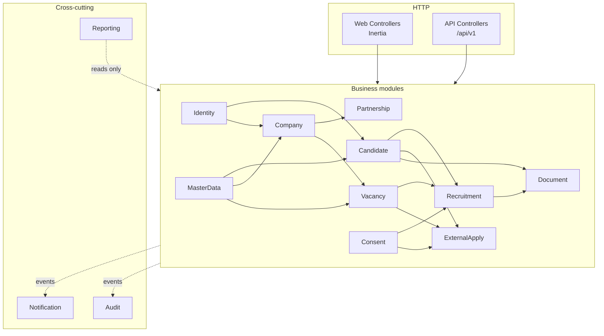

# Laravel Application Architecture — Portal Karir Kampus

**Status:** Proposed — awaiting approval
**Date:** 24 August 2026 · **Amended 24 August 2026** (ADR-015, ADR-016, ADR-017) · Logical model revision **1.1-C2**
**Scope:** Internal structure of the Laravel application, its module boundaries, layer responsibilities, transaction placement, API boundary, frontend integration, and testing architecture. **No file is created by this document.**

---

## 1. Shape: Pragmatic Modular Monolith

One Laravel application, internally organized by business domain rather than by technical file type.

Two failure modes are being avoided deliberately:

- **Fat controllers** — business rules scattered across HTTP handlers, unreachable from queue jobs and console commands, and untestable without a request.
- **Speculative enterprise layering** — repositories over Eloquent, a service layer that only forwards calls, DTOs for every payload, hexagonal ports for a system with one database and no second adapter. That structure costs real velocity and buys nothing this project needs.

The middle path: **thin controllers, validated input, and one Action per business operation** — where an Action is the only place a business rule lives, callable identically from a web controller, an API controller, a job, a console command, or a test.

```
apps/api/
├── app/
│   ├── Domains/                  ← business modules (see §2)
│   │   └── <Module>/
│   │       ├── Actions/          ← business operations, transaction owners
│   │       ├── Models/           ← Eloquent models
│   │       ├── Policies/         ← object-level authorization
│   │       ├── Events/           ← domain events
│   │       ├── Listeners/
│   │       ├── Jobs/             ← async work for this module
│   │       ├── Data/             ← DTOs / value objects, only where they earn their place
│   │       ├── Queries/          ← read-side query classes
│   │       ├── Rules/            ← reusable validation rules
│   │       └── Exceptions/       ← domain exceptions carrying FSD §9.2 error codes
│   ├── Http/
│   │   ├── Controllers/Web/      ← Inertia responses
│   │   ├── Controllers/Api/V1/   ← JSON responses
│   │   ├── Requests/             ← Form Requests
│   │   ├── Resources/            ← API serialization
│   │   └── Middleware/
│   ├── Support/                  ← cross-cutting: correlation ID, state machine, outbox writer
│   └── Providers/
├── routes/{web,api,console}.php
├── database/{migrations,factories,seeders}/
├── tests/{Unit,Feature,Architecture}/
└── resources/views/app.blade.php ← single Inertia root view
```

Modules are a **namespace and ownership boundary, not a network boundary.** Cross-module calls are direct PHP calls. Extraction to services is not a goal.

---

## 2. Module Boundaries

The brief proposed fifteen modules. Reviewed against the frozen ERD, **four should be merged and one added.**

### Recommended modules

| # | Module | Owns | Note |
| --- | --- | --- | --- |
| 1 | **Identity** | `users`, `password_credentials`, `email_verification_tokens`, `password_reset_tokens`, `roles`, `user_roles` | Authentication and role assignment history (INV-025) |
| 2 | **Candidate** | `candidate_profiles`, `candidate_verifications`, `candidate_educations`, `candidate_work_experiences`, `candidate_skills`, `candidate_organizations`, `candidate_certifications`, `candidate_links`, `candidate_saved_vacancies` | Owns the eligibility service reading `candidate_verifications` (INV-028) |
| 3 | **Company** | `companies`, `company_members`, `company_documents`, `company_verification_reviews` | Owns the VERIFIED gate (INV-002) and active-membership resolution |
| 4 | **Partnership** | `partnerships` | Kept separate deliberately — INV-003 and INV-020 depend on partnership never becoming a company status. A separate module makes that boundary visible in code |
| 5 | **Vacancy** | `vacancies`, `vacancy_versions`, `vacancy_requirements`, `vacancy_documents`, `vacancy_screening_questions`, `vacancy_moderation_reviews`, `recruitment_stages`, `selection_stage_assignments` | `recruitment_stages` belongs here: stages are defined *by a vacancy*. `selection_stage_assignments` belongs with the stage it assigns; the Recruitment module's Policies read it |
| 6 | **Recruitment** | `applications`, `application_status_histories`, `application_documents`, `application_screening_answers`, `selection_schedules`, `selection_schedule_histories`, `evaluations`, `evaluation_items`, `offers`, `recruitment_outcomes` | **Merged from the proposed Application + Recruitment + Selection + Offering** |
| 7 | **ExternalApply** | `external_apply_events` | Separate module enforcing INV-012 and INV-024 structurally |
| 8 | **Consent** | `consents` | Separate for auditability — INV-011 forbids consent degrading into an application flag |
| 9 | **Document** | No entities of its own | Cross-cutting storage service: upload, validation, snapshotting, authorized download, audit hooks |
| 10 | **Notification** | `notifications`, `email_outbox` | Both channels; see the distinction in `SYSTEM_ARCHITECTURE.md` §7 |
| 11 | **Audit** | `audit_logs` | Append-only writer plus the stable logical type-name registry (INV-033) |
| 11b | **SystemConfiguration** | `smtp_configurations` | **System configuration, not business domain.** Owns the write-only encrypted-credential contract (INV-035) and the single-active rule (INV-036). No business module may depend on it |
| 12 | **Reporting** | No entities — read-only | Query classes over other modules' tables. Writes nothing, ever |
| 13 | **MasterData** *(added)* | `organizational_units`, `study_programs`, `industries`, `organization_types`, `skills`, `geographic_areas` | The proposed list had no home for six master entities |

All **51** entities of logical model revision 1.1-C2 are owned by exactly one module. No entity is orphaned or shared.

### Why Application, Recruitment, Selection, and Offering merge

Because the invariants cut straight through those proposed boundaries:

- **INV-019** requires `applications.current_stage_id`, screening answers, schedules, and evaluations to belong to the same vacancy — one rule spanning three of the four proposed modules.
- **INV-026** requires application cache fields and history events to be written in one transaction.
- **INV-031** ties offer acceptance to application status and `hired_at` atomically.
- **INV-022** ties outcomes to applications or external events.

**A module boundary that a transaction must cross is not a boundary — it is a seam that will leak.** Offer acceptance updates an offer, the application, and history in one atomic write; splitting Offering from Application would mean either a cross-module transaction (the boundary is fictional) or a distributed one (absurd inside a monolith). Keeping the `applications` aggregate and everything transactionally bound to it in one module makes the real consistency boundary and the code boundary the same thing.

Internal sub-namespaces (`Recruitment/Actions/Selection/…`, `Recruitment/Actions/Offering/…`) preserve readability without pretending the transactional boundary is somewhere it is not.



---

## 3. Layer Responsibilities

| Layer | Does | Must not |
| --- | --- | --- |
| **Controller** | Resolve route model bindings, call `authorize()`, hand a validated Form Request to an Action, return an Inertia or JSON response | Contain business rules, open transactions, query the database directly, or catch domain exceptions to reshape them |
| **Form Request** | Shape and type validation, allow-list of accepted fields, field-presence rules including **conditional** ones (INV-029, INV-030) | Perform authorization beyond a coarse gate, or check cross-row state (that needs a lock) |
| **Action** | **The unit of business behaviour.** One public method. Owns the transaction. Enforces invariants needing cross-row reads. Writes business rows, history rows, audit rows, and outbox rows. Dispatches events after commit | Know about HTTP, sessions, or request shape. Return a view or response |
| **Policy** | Object-level authorization: does *this actor* have rights over *this object* | Contain business eligibility (`ALUMNI_ONLY` is INV-028 business logic, not access control) |
| **Model** | Relationships, casts, accessors, scopes, `$fillable` allow-lists | Contain business operations. **No model events for business logic** — an observer that fires on save is invisible at the call site and runs in contexts (seeders, imports, tests) where it is unwanted |
| **Event / Listener** | Decouple side effects — audit fan-out, notification dispatch, cache invalidation | Carry the primary business write. If it must be atomic with the change, it belongs in the Action's transaction |
| **Job** | Asynchronous work: outbox delivery, scheduled publication, exports, reminders. Idempotent, retry-safe | Assume it runs once, or hold business state the database should hold |
| **Query class** | Read-side composition for dashboards, lists, and exports; returns DTOs or arrays | Write anything |
| **Repository** | **Not used.** See below | |

### Why no Repository layer

Eloquent is already a data-access abstraction. A repository over it would add a layer that forwards calls, doubles the surface to keep in sync, forfeits eager loading and scopes at the boundary, and pays for a database-swap capability nobody plans to exercise. The genuine benefit repositories are reached for — keeping queries out of controllers — is already delivered by Actions and Query classes.

**Reconsider only if** a genuine second data source appears (an external alumni verification system under open question 1 would be an integration client, not a repository).

### Where transactions live

**In the Action. Never in a controller, model, or observer.**

```
Action::execute()
  ├─ authorize (or already authorized by the caller)
  ├─ validate cross-row state — with a row lock where a gate depends on another row
  ├─ DB::transaction(function () {
  │     write business rows
  │     append history rows          ← INV-016, INV-026
  │     write audit_logs             ← atomic with the change
  │     write email_outbox rows      ← INV-015
  │  })
  └─ after commit: dispatch queue jobs and events
```

Full boundary table in `SYSTEM_ARCHITECTURE.md` §10. Three rules restated because they are the ones most often broken:

1. **No external call inside a transaction** — no SMTP, no object-storage write, no HTTP.
2. **Dispatch after commit** — `DB::afterCommit()` or `after_commit` on the queue connection, so a worker cannot read rows that do not exist yet.
3. **Lock the aggregate root** when a decision reads another row's state — company for INV-002, vacancy for INV-024, application for INV-031 — or two concurrent requests both pass the same gate.

---

## 4. Authentication (implementation shape)

Full security treatment in `SECURITY_ARCHITECTURE.md`. Structure only, here.

| Surface | Guard | Mechanism |
| --- | --- | --- |
| Web (all five portals) | `web` | Laravel session guard, httpOnly + Secure + SameSite cookie, CSRF on every mutating request |
| `/api/v1` | `sanctum` | First-party token guard. **Reserved and designed now; no external client exists at MVP** |

Laravel's native `Auth`, `Password` broker, `RateLimiter`, and `throttle` middleware cover login, logout, and reset flows. Fortify/Breeze/Jetstream are **starter scaffolds, not architecture** — their generated flows may be used as a reference, but the token behaviour below is not negotiable.

### The framework default that must not be used

Laravel's stock email verification uses a **signed URL and stores no token**. The frozen ERD requires `email_verification_tokens` rows carrying `token_hash`, `expires_at`, `used_at`, and `revoked_at`, and `password_reset_tokens` with the same shape plus `user_id`.

**The ERD wins.** Token issuance and consumption are implemented against the frozen entities: generate a high-entropy token, store only its hash, email the raw value once, verify by hash, mark `used_at`, and revoke siblings on success (INV-021). Laravel's default `password_reset_tokens` scaffold does not match the ERD shape and must not be adopted verbatim.

This is recorded because it is the kind of divergence a later developer "corrects" back to the framework default, silently breaking the frozen model. **No temporary-password onboarding exists** — it is absent from the ERD and forbidden by FSD.

---

## 5. Authorization (implementation shape)

**RBAC and object-level ownership, together, always. Route middleware alone is never sufficient.**

Three layers, all required:

| Layer | Mechanism | Catches |
| --- | --- | --- |
| **1. Coarse gate** | Route middleware — authenticated, email-verified, holds *some* qualifying role | Wrong audience reaching the route at all |
| **2. Object authorization** | Policy, invoked per object | This actor acting on *that* object — IDOR |
| **3. Query scoping** | Ownership-scoped query classes | **Enumeration.** A Policy protects `show`; it does nothing for `index`. Every list query is scoped by ownership at the query level, never filtered after fetch |

Layer 3 is the one most often omitted and the one that leaks candidate data across companies. It applies with particular force to the Selector scope: a Policy protects `show` for one evaluation, but a selector's applicant list must be **joined through the active assignment**, or an unassigned stage's candidates appear in it.

| Actor | Ownership resolution |
| --- | --- |
| Candidate | `candidate_profiles.user_id = actor` → own profile, documents, applications, saved vacancies, external events, consents |
| Recruiter | Active `company_members` row (`revoked_at` null, INV-025 pattern) → that company's vacancies → those vacancies' applications and children |
| Career Center | Role + scope: companies and company-owned vacancies for **verification and moderation only**. FSD §3.3 — may monitor, may **not** decide candidate acceptance on a company's behalf. Enforced as separate Policy abilities, not one broad "manage" |
| Admin Kepegawaian | Role + `vacancies.ownership_type = CAMPUS`, optionally narrowed by `organizational_unit_id` |
| **Selector** | **RESOLVED (ADR-016).** Active `selection_stage_assignments` row → `recruitment_stages` → vacancy → that stage's applications, schedules, and evaluations. The SELECTOR role is a **precondition for being assigned, not a grant**; access requires an active assignment (INV-037). Scope never extends to another stage of the same vacancy or to another vacancy |
| Auditor | Read-only abilities over reporting and audit scope. No write ability exists on any Policy |
| Super Admin | `Gate::before` bypass — **every use audited**, and never applied to candidate document content without an explicit break-glass action |

**Business eligibility is not authorization.** Target-audience checks (`ALUMNI_ONLY`, `FINAL_YEAR_AND_ALUMNI`) read `candidate_verifications` per INV-028 and live in a Candidate-module eligibility service invoked by the apply Action — not in a Policy. Conflating them would make role membership look like proof of verification, which INV-028 explicitly forbids.

---

## 6. Frontend Integration

### Recommendation: Inertia.js + Vue 3 + Tailwind CSS, built by Vite

The Stitch baseline is **plain HTML with Tailwind utility classes** (CDN Tailwind, `tailwind.config` inline, Inter, Material Symbols). It carries no framework bias, so the design tokens in `design/stitch/design-system/DESIGN.md` port into a Tailwind theme config essentially unchanged, and screen markup ports into components with little translation loss.

| Option | Assessment |
| --- | --- |
| **Inertia + Vue 3 — RECOMMENDED** | Server-side routing/validation/authorization stay in Laravel; the view layer is a real component framework. No parallel API contract to maintain for the app itself. Inertia SSR covers public SEO pages. Strongest Laravel-ecosystem alignment |
| **Inertia + React** | Equally valid. Larger hiring pool; slightly heavier tooling. **The rejection is weak and the choice is cheap to reverse**, because the Stitch baseline is framework-neutral. If the team's React experience is stronger, take React — the rest of this architecture is unchanged |
| **Blade + Livewire** | Best for the public portal; a poor fit for the 4-step apply wizard and applicant pipeline boards, which want client-side state |
| **Standalone SPA + API** | Rejected — see `SYSTEM_ARCHITECTURE.md` §1 |

### Rendering strategy

| Surface | Rendering | Reason |
| --- | --- | --- |
| Public portal — beranda, vacancy list, vacancy detail | **Server-rendered via Inertia SSR** (ADR-017) — a dedicated Node renderer process in the same release | Search indexing and first-paint. Job detail pages must be crawlable |
| Candidate / Recruiter / Career Center / Kepegawaian / Super Admin | Client-rendered Inertia SPA | Authenticated, never indexed, interaction-heavy |

Authenticated routes carry `X-Robots-Tag: noindex`; private documents are never web-reachable (FSD §10.4).

**SSR constraints on component authorship.** Public-route components must be SSR-safe: no direct `window`, `document`, or browser-only API access during render, and no reliance on client-only lifecycle for content that must appear in the server-rendered HTML. The SSR bundle is a second build artefact versioned with the application and **must never be deployed independently**. If the renderer is unavailable, Inertia falls back to client-side rendering — the site keeps working and authenticated portals are unaffected, but public pages lose their indexable HTML, which is a silent degradation and must be monitored (`DEPLOYMENT_ARCHITECTURE.md` §5).

### Domain boundary

The application is **same-origin by default**: one domain, path-scoped portals, one session cookie. This avoids CORS entirely, keeps CSRF protection straightforward, and keeps the cookie tightly scoped.

**Open question 4 — the recruiter domain/subdomain — is explicitly NOT decided here.** The recommended topology supports all three shapes without restructuring:

| Shape | Consequence |
| --- | --- |
| Same domain, path prefix (`/recruiter`) | Default. No CORS, no cookie changes |
| Subdomain (`recruiter.<domain>`) | Session cookie domain widens to `.<domain>`; CSP and reverse-proxy routing adjust. No application restructuring |
| Separate domain | Requires cross-origin decisions — cookie strategy, CORS allow-list, possibly token auth for that surface. **The only shape with real architectural cost** |

This must be settled **before production DNS and TLS**, not before coding.

`packages/ui` stays empty until reuse is demonstrated by at least two portals. Extracting shared components before the second consumer exists is speculative.

---

## 7. API Boundary

### Two surfaces, one core

| | Web surface | `/api/v1` |
| --- | --- | --- |
| Consumer | The five portals | Future mobile / integration |
| Transport | Inertia | JSON:API-flavoured REST |
| Auth | Session cookie + CSRF | Bearer token (Sanctum) |
| Validation | Same Form Requests | Same Form Requests |
| Business logic | **Same Actions** | **Same Actions** |
| MVP status | Built | **Reserved and specified; thin or empty at MVP** |

Both surfaces call the same Actions. There is no second implementation of any rule — that is the entire point of putting business logic in Actions rather than controllers.

### Conceptual style

**REST, resource-oriented, with action sub-resources for state transitions** — the shape FSD §7 already uses (`POST /vacancies/{id}/submit`, `POST /applications/{id}/withdraw`). This is correct for a workflow domain: `PATCH` with a status field would let a client drive an invalid transition, whereas a named action endpoint maps to one Action, one Policy check, and one validated state change.

| Concern | Approach |
| --- | --- |
| **Versioning** | URI prefix `/api/v1`. Explicit, cache-friendly, trivially routable in Laravel |
| **Error envelope** | Single shape carrying the FSD §9.2 functional code, a user-safe message, field errors, and the correlation ID. Technical detail is internal only (FSD §9.3) |
| **Correlation ID** | Middleware accepts or generates `X-Request-Id`, propagates it into logs, jobs, and `audit_logs.correlation_id`, and returns it on every response |
| **Pagination** | Page-based with totals for administrative lists; cursor-based for large public vacancy listings. Envelope documented once |
| **Filtering / sorting** | Allow-listed parameters only — never a client-supplied column or raw expression |
| **Idempotency** | `Idempotency-Key` header on submit-class endpoints (FSD §7.6): apply, submit-verification, submit-vacancy, transition, offer response. Key + actor + endpoint stored with the first response; a replay returns the stored result instead of re-executing |
| **Rate limiting** | Named limiters per surface, stricter on auth and public actions (FSD §7.6, §10.1) |
| **State transitions** | Validated server-side, always (FSD §7.6, §10.3). The client never asserts a target state that the server does not independently verify |

**Endpoint enumeration is deliberately out of scope.** It belongs in `docs/api/API_CONTRACT.md` after this architecture is approved.

---

## 8. Testing Architecture

Framework: **Pest** (first-party-endorsed, concise) over PHPUnit — a low-stakes, reversible choice. PostgreSQL used in tests, not SQLite: the schema depends on partial indexes and CHECK constraints SQLite does not share, so an SQLite test suite would silently skip the guarantees that matter most.

| Layer | Scope | Focus |
| --- | --- | --- |
| **Unit** | Pure logic — state machines, eligibility rules, Time-to-Fill computation, value objects | No database |
| **Feature** | HTTP through to database, per Action | The main body of the suite |
| **Authorization / Policy** | Every role × every object type, positive and negative | **Includes list-scoping tests**, not just single-object Policy tests |
| **Integration** | Cross-module flows: apply → schedule → evaluate → offer → accept → outcome | End-to-end within the monolith |
| **Queue / Job** | Retry, idempotency, failure, dead-letter | Fake and real queue drivers |
| **Mail / Notification** | Outbox row written in-transaction; dispatch only after commit; SMTP failure leaves business data committed | Asserts INV-015 directly |
| **Storage** | Private-by-default, authorized download, snapshot immutability, MIME and size rejection | Fake and real disks |
| **End-to-End** | Browser-level critical journeys per portal | Small, high-value set |
| **UAT** | FSD §11 scenarios, executed by role | Traceable to UAT-001… |
| **Architecture tests** | Structural rules: controllers contain no `DB::transaction`, models contain no business operations, Reporting writes nothing, history tables have no update path | Cheap, and they stop erosion |

### Invariant test matrix — required before release

| Invariant / rule | Test type | Must prove |
| --- | --- | --- |
| Company VERIFIED gate (INV-002) | Feature + concurrency | Non-verified company cannot create a vacancy; two concurrent attempts do not both pass |
| Candidate+vacancy uniqueness (INV-007) | Feature + concurrency | Second application rejected; concurrent submits produce exactly one row |
| Reopen (INV-008, INV-026) | Feature | Reuses the same row, appends `APPLICATION_REOPENED`, `reopen_count` matches the event count |
| Withdrawal (INV-009) | Feature | Nothing deleted; history, consent, shared documents, offers all survive |
| Consent (INV-011, INV-023) | Feature | Application impossible without consent; consent and application commit atomically; receiver XOR enforced both ways |
| Document sharing (INV-010, INV-032) | Authorization + Storage | Profile access grants no document access; snapshot survives source-document change; referenced document cannot be hard-deleted |
| External Apply separation (INV-012, **INV-024**) | Feature | Click creates no application; **an application against an EXTERNAL_ATS vacancy is rejected** |
| Role/object authorization (INV-017, INV-028) | Authorization | Company A cannot reach company B's objects, including via list endpoints; role alone never proves alumni verification |
| Campus in-portal only (INV-005, INV-018) | Feature | EXTERNAL_ATS rejected for campus; ownership XOR enforced; campus vacancy cannot reach a moderation status |
| Offering acceptance (INV-031) | Feature + concurrency | One ACCEPTED offer maximum; acceptance sets application HIRED and `hired_at` atomically |
| Time-to-Fill (INV-013) | Unit + Integration | Earliest accepted offer per vacancy; undefined while `published_at` is null; **no onboarding/contract/start date is reachable** |
| **Selector stage scope (INV-037)** | Authorization + Feature | Active assignment grants access to that stage only; a revoked assignment grants nothing; role without assignment grants nothing; **an unassigned stage's candidates never appear in a selector's list query**; re-assignment after revocation works and preserves history |
| **SMTP credential confidentiality (INV-035)** | Feature + Security | Credential never returned by any read path, export, or serializer; absent from logs, exception traces, queue payloads, and `audit_logs.change_summary`; a credential change is audited as an event; **no SMTP credential ever reaches `email_outbox`** |
| **Single active SMTP configuration (INV-036)** | Feature | Activating one configuration deactivates the previous in the same transaction; two active rows impossible |
| Outcome source XOR (INV-022) | Feature | Both-present and both-absent rejected |
| Active role assignment (INV-025) | Feature | Revoke-then-reassign works; two active assignments impossible; student→alumni keeps history |
| Outcome never blocks vacancy creation (INV-014) | Regression | A company with incomplete outcomes can still create a vacancy |
| SMTP isolation (INV-015) | Mail | SMTP failure leaves business rows committed and the outbox row retryable |

Concurrency tests are called out explicitly because several invariants are gates whose correctness only shows under simultaneous requests — a sequential test passes while the constraint is missing.
