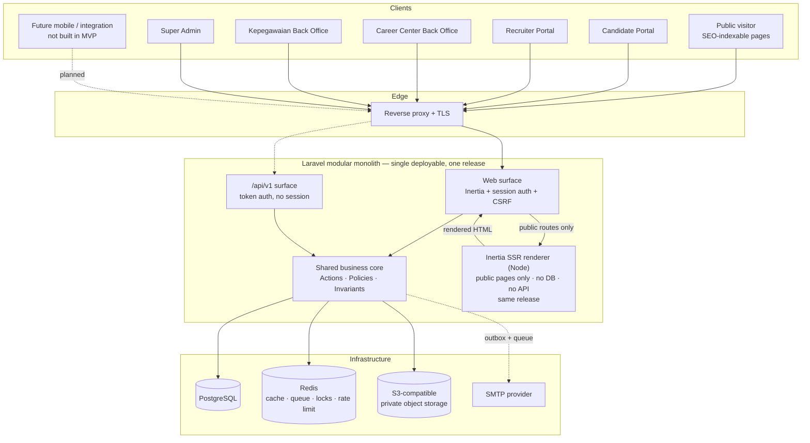
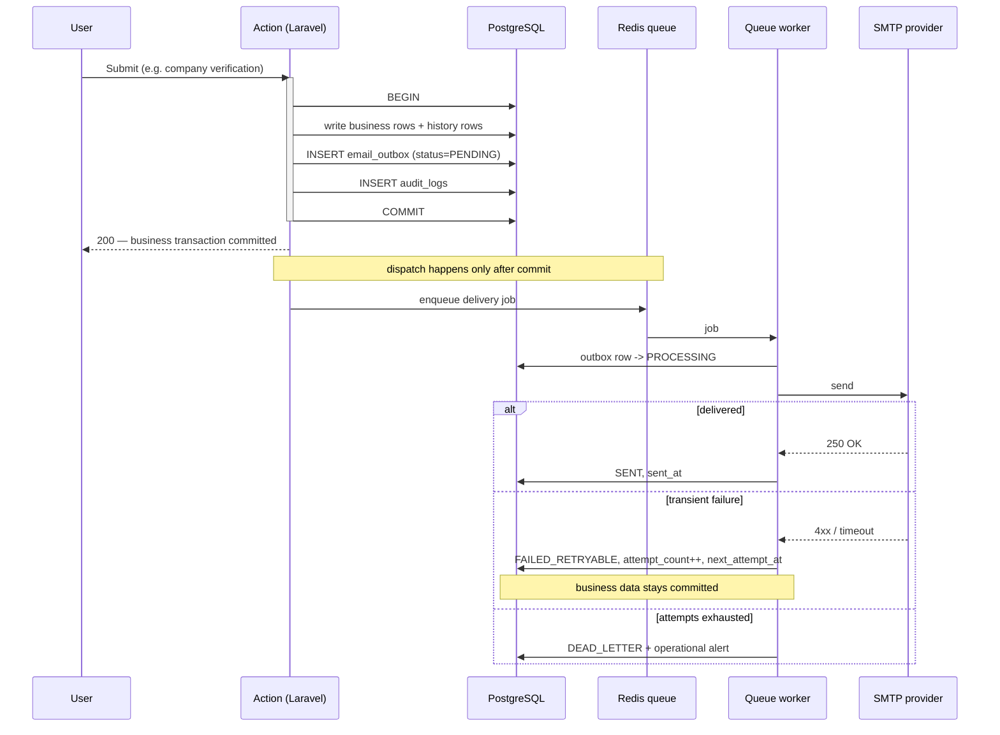
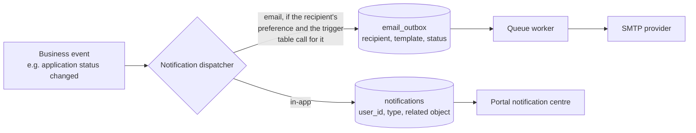
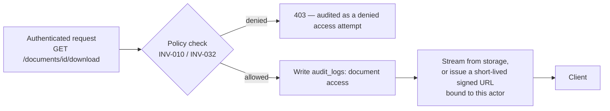

# System Architecture — Portal Karir Kampus

**Status:** Proposed — awaiting approval
**Date:** 24 August 2026
**Baselines (frozen):** BRD v1.1 · FSD v1.1 · Stitch functional baseline · Logical ERD revision **1.1-C2**
**Amended:** 24 August 2026 — approved change request: ADR-015 (runtime SMTP), ADR-016 (selector stage assignment), ADR-017 (Inertia SSR runtime)
**Backend framework:** Laravel (decided)
**Scope:** Architecture and decision documentation only. No application code, project scaffold, migration, model, or controller is created by this document.

---

## 1. Application Topology

### Recommendation

**A single Laravel modular monolith serving all five channels through Inertia.js, plus a separately versioned `/api/v1` REST surface reserved for future clients.**

One deployable application. One codebase. Two HTTP surfaces over one shared business core.

### Why this, and not the alternatives

The five channels in FSD §2.1 are **five role-scoped views of one recruitment domain**, not five systems. They share the same vacancies, the same applications, and the same invariants. A candidate's application, a recruiter's applicant list, and a Career Center moderation queue are the same rows seen through different authorization scopes. Splitting them across deployables would distribute a single consistency boundary across a network, which the ERD's cross-entity invariants (INV-019, INV-022, INV-023, INV-026, INV-031) make actively dangerous.

| Option | Assessment |
| --- | --- |
| **A. Separated SPA + Laravel API-only** | Rejected for MVP. Public vacancy pages must be server-rendered for search indexing, which forces a second Node runtime (Next/Nuxt) into production purely for SEO. It also duplicates validation and error handling across two codebases, and moves authentication to token-in-browser storage, widening the XSS blast radius versus an httpOnly session cookie. Real cost, no MVP benefit — the second client this would serve does not exist yet. |
| **B. Laravel serving pages (Blade + Livewire)** | Rejected, narrowly. Excellent for the public portal and simple CRUD, and it would work. But five authenticated back-office portals with multi-step wizards (the 4-step apply flow), moderation queues, applicant pipelines, and scheduling UIs benefit materially from a component model with client-side state. Livewire's server round-trip per interaction is a poor fit for the apply wizard and applicant board specifically. |
| **C. Inertia.js monolith — RECOMMENDED** | Server-side routing, controllers, validation, and authorization stay in Laravel; the view layer is a real component framework. No separate API is needed for the application to function, so there is no duplicated contract to keep in sync. Inertia SSR covers the public SEO pages. One deployable, one auth model, one validation path. |

**Inertia SSR is adopted explicitly (ADR-017).** Public, SEO-sensitive pages are server-rendered by a dedicated Node renderer process that belongs to the same application and release. This adds a fourth runtime process but **does not** reintroduce the separated-SPA architecture rejected above: routing, validation, and authorization remain in Laravel; there is no second API contract; authentication stays cookie/session and same-origin; there is no independently deployed frontend; and Node holds no business logic, no database connection, and no API surface. It renders the same compiled Vue components the browser would, one request earlier. The full comparison is in `TECHNICAL_DECISIONS.md` ADR-017.
| **D. Microservices** | Rejected outright. No scale, team-size, or independent-deployability argument exists at MVP, and the invariant set would have to be enforced across service boundaries. |

### Repository mapping

The existing `PROJECT_STRUCTURE.md` boundary is preserved, with one clarification this architecture must state explicitly:

| Directory | Contains | Deployable |
| --- | --- | --- |
| `apps/api` | The Laravel application: routing, Actions, Policies, Models, Jobs, both HTTP surfaces. **The single deployable.** | Yes |
| `apps/web` | Frontend source — Inertia page components, layouts, Tailwind config derived from the Stitch design tokens. Built by Vite; the compiled bundle is served by the Laravel app. | No (build input) |
| `packages/ui` | Shared presentational components extracted from `apps/web` once reuse is demonstrated, not before. | No |
| `packages/types` | Shared contract types mirroring the ERD value sets, consumed by `apps/web` and generated/checked against the API. | No |
| `apps/worker` | **No separate codebase.** Queue workers, the scheduler, and the Inertia SSR renderer run from the same application and release with different entrypoints. This directory holds worker-specific operational documentation and process definitions only. | Process only |

This respects `PROJECT_STRUCTURE.md` §22: frontend source and backend source remain in separate directories with separate responsibilities. Inertia does not put React/Vue code inside the backend — it puts a build artifact behind a Laravel route.

**`apps/worker` requires a decision to be recorded** (see `TECHNICAL_DECISIONS.md` ADR-009): the reserved directory implies a separate application, but a separate worker codebase would need its own copy of the models and invariants. Running the same application under `queue:work` is the correct Laravel pattern.

---

## 2. Database Engine

### Recommendation: PostgreSQL 16+

This is the clearest decision in the document, and it is driven by the frozen ERD rather than by preference.

The logical model contains **five conditional uniqueness rules** and **three exclusive-reference (XOR) rules** that are deliberately left without an enforcement mechanism in the logical documents, pending exactly this decision. Revision 1.1-C2 added two more conditional-uniqueness rules of the same shape, which strengthens rather than changes the reasoning below.

| Logical rule | Source | PostgreSQL | MySQL 8 |
| --- | --- | --- | --- |
| At most one **active role assignment** per `(user_id, role_id)` | INV-025 | Partial unique index `WHERE revoked_at IS NULL` — declarative, one line | No partial indexes. Requires a generated column that is NULL when revoked, relying on NULLs being distinct in a unique index. Works, but is a hack that encodes business logic in a column definition |
| At most one **active company membership** per `(company_id, user_id)` | INV-017, index table | Same pattern | Same hack, second instance |
| At most one **ACCEPTED offer** per application | INV-031 | Same pattern | Same hack, third instance |
| At most one **active selector assignment** per stage | INV-037 | Same pattern | Same hack, fourth instance |
| At most one **active SMTP configuration** | INV-036 | Same pattern | Same hack, fifth instance |
| One outcome per application / per external event, **where present** | INV-022 | Partial unique index on the nullable column | Nullable unique index works here (NULLs distinct), so this one is a genuine tie |
| **XOR** on `recruitment_outcomes` source | INV-022 | `CHECK` with full expression support | `CHECK` supported since 8.0.16 — tie, with less expressive syntax |
| **XOR** on `consents` receiving party | INV-023 | `CHECK` | Tie |
| **XOR** on `vacancies` ownership | INV-018 | `CHECK` | Tie |
| `Structured Data` fields (`snapshot`, `previous_snapshot`, `change_summary`, `payload_reference`, `options_definition`, `answer_value_reference`) | Dictionary | `jsonb` with GIN indexing and rich operators | `JSON` type, weaker indexing (functional indexes on generated columns only) |
| Reporting: funnels, Time-to-Fill, external started-vs-confirmed | FR-REP-001…004 | Window functions, CTEs, **materialized views** | Window functions and CTEs yes; **no materialized views at all** |
| Case-insensitive email identity | INV-001 | `citext` available, or the normalized column already in the model | Collation-dependent; the model's `email_normalized` column already solves it either way |
| Transactional DDL | Migration safety | Yes — a failed migration rolls back cleanly | No — a failed migration can leave a half-applied schema |
| Laravel support | — | First-class | First-class |

**Decision: PostgreSQL.** Five of the model's own invariants are declarative one-liners in PostgreSQL and workarounds in MySQL. Choosing MySQL would mean encoding five business rules into generated-column definitions where they are invisible to anyone reading the invariant document — precisely the drift the ERD review worked to eliminate.

**Tradeoff, stated honestly:** MySQL is more familiar to the average PHP/Laravel team and marginally simpler to operate on shared hosting. If the deployment target is a campus environment with existing MySQL operational expertise and no PostgreSQL experience, that is a real cost. It is outweighed here because the alternative is not "MySQL works fine" but "three invariants become implicit". If MySQL is mandated by infrastructure constraints, that must be recorded as an accepted risk with the three generated-column workarounds specified explicitly — it is not a silent substitution.

**Not decided here:** physical schema, column types, index definitions. Those belong to `DATABASE_SCHEMA.md` after this architecture is approved.

---

## 3. Database Constraint Strategy

Every invariant is assigned an enforcement class. The governing principle: **a rule that can be enforced by the database should be, and a rule that requires reading another row's state or the actor's identity cannot be.** Rules in class C are enforced twice on purpose — the database is the backstop that survives a bug in application code.

| Invariant | Rule | Class | Mechanism |
| --- | --- | --- | --- |
| INV-001 | Normalized email uniqueness | **C** | DB: unique index on `email_normalized`. App: normalize before validation; validate against the normalized column, never `email` |
| INV-007 | One application per candidate+vacancy | **C** | DB: unconditional unique index. App: friendly `APPLICATION_ALREADY_EXISTS` before the constraint fires; DB catches races |
| INV-002 | Company VERIFIED gate before vacancy creation | **B** | Reads the parent company's current state — application/service check inside the creating transaction, with a row lock on the company |
| INV-018 | Company vs campus ownership XOR | **C** | DB: `CHECK` on `ownership_type` versus the two nullable references. App: Form Request + Action guard |
| INV-018 | Campus vacancy forbidden moderation statuses | **C** | DB: `CHECK` constraining the status set by `ownership_type`. App: state-machine guard |
| INV-023 | Consent receiver XOR | **C** | DB: `CHECK` for presence/absence. App: the "must equal the vacancy's owner" half requires reading the vacancy — service-enforced |
| INV-022 | Recruitment outcome source XOR | **C** | DB: `CHECK` on `source_type` versus the two references, plus partial unique indexes. App: Action guard |
| INV-024 | IN_PORTAL-only applications | **B** | Requires reading the parent vacancy's `application_method` — service-enforced inside the submit transaction with a row lock. *(See note below)* |
| INV-005 | Campus vacancy cannot use EXTERNAL_ATS | **C** | DB: `CHECK` on the same row. App: Form Request |
| INV-025 | At most one active role assignment | **C** | DB: partial unique index `WHERE revoked_at IS NULL`. App: revoke-then-assign in one transaction |
| INV-017 | At most one active company membership | **C** | DB: partial unique index. App: same pattern |
| INV-031 | At most one ACCEPTED offer per application | **C** | DB: partial unique index `WHERE status = 'ACCEPTED'`. App: state guard on the offer response Action |
| INV-010 / INV-032 | Candidate document access | **D** | Policy-enforced. No database mechanism can express "this actor may manage the object this application belongs to". Backed by query scoping, never by Policy alone |
| INV-032 | Snapshot required at share time | **C** | DB: NOT NULL on `snapshot_name` and `snapshot_storage_reference`; FK restrict on the source document. App: snapshot captured inside the share transaction |
| INV-026 | Derived caches bound to history | **B** | Single transactional write path. No database mechanism; a trigger would hide business logic in the schema and is rejected |
| INV-019 | Application children belong to the same vacancy | **B** | Cross-row check — enforced in the Action layer on **every** write path, per the invariant's own wording |
| INV-028 | Eligibility from verification only | **B** | Eligibility service reading `candidate_verifications`. Deliberately **not** a Policy: it is business eligibility, not access control |
| INV-011 | Consent required before submit | **B** | Transactional service validation across applications, vacancies, consents |
| INV-004 | No SUBMITTED/DIAJUKAN status | **C** | DB: value set constraint. App: state machine has no such state |
| INV-006 | Four target audiences only | **C** | DB: value set constraint |
| INV-013 / INV-031 | Time-to-Fill inputs | **B** | Reporting query; no stored metric |
| INV-014 | Outcome never gates vacancy creation | **B** | Enforced by absence — no outcome check exists in the vacancy creation path. Covered by a regression test, not a constraint |
| INV-016 | Append-only history | **B + D** | No UPDATE/DELETE paths exist in the Action layer for history tables; database-level revocation of UPDATE/DELETE on those tables is available as defence in depth |
| INV-015 | SMTP failure isolation | **B** | Outbox pattern — see §6 |
| INV-033 | Stable logical type names | **B** | A single enum/map of logical type names; never a class path |
| INV-035 | SMTP credential confidentiality | **B** | Application-layer encryption with an externally-held key, a write-only field contract, and log/audit redaction. **No database mechanism can enforce "never returned"** |
| INV-036 | At most one active SMTP configuration | **C** | DB: partial unique index `WHERE is_active`. App: activation Action deactivates the previous row in the same transaction |
| INV-037 | At most one active selector assignment | **C** | DB: partial unique index `WHERE revoked_at IS NULL`. App: revoke-then-assign in one transaction |
| INV-037 | Selector scope limited to assigned stages | **D** | Policy-enforced, joined through the active assignment. **Backed by ownership-scoped list queries — a Policy alone does not protect an index endpoint** |

**Note on INV-024.** A database `CHECK` cannot reach into the parent vacancy row. Two hardening options exist and should be evaluated during schema design: (i) service-only enforcement with a row lock, or (ii) denormalizing `application_method` onto a composite foreign key so the constraint becomes local. Option (ii) would add a stored copy of a derivable value, which revision 1.1-C1 deliberately removed elsewhere — so **(i) is recommended**, with an explicit test that an application against an EXTERNAL_ATS vacancy is rejected.

**Laravel infrastructure tables** — `sessions`, `cache`, `jobs`, `job_batches`, `failed_jobs`, and any password-reset scaffolding — are **operational tables outside the 49 business entities**. Creating them is not a change to the frozen logical model and requires no ERD change request. They must never be treated as business data or referenced by business invariants.

---

## 4. Queue and Background Work

### Recommendation: Redis-backed Laravel queues

| Option | Assessment |
| --- | --- |
| **Database queue** | Simplest — no new infrastructure. Rejected for MVP because it adds polling load and lock contention to the same PostgreSQL instance that serves interactive traffic, and because Redis is needed anyway for rate limiting and scheduler locking (FSD §10.1, §10.3). |
| **Redis — RECOMMENDED** | One dependency serves queue, cache, distributed locks, and the rate limiter. Mature Laravel support, delayed dispatch, and first-party queue monitoring. |
| **Amazon SQS** | Managed and durable, but couples the queue to one cloud vendor, caps delayed delivery at 15 minutes (insufficient for scheduled vacancy publication), and adds no capability Redis lacks at this scale. |
| **Beanstalkd** | Works, but a shrinking ecosystem and no second use. |

### Queue design

| Queue | Purpose | Priority |
| --- | --- | --- |
| `mail` | Outbox delivery attempts | High — user-visible latency |
| `notifications` | In-app notification fan-out | High |
| `scheduled` | Vacancy publication, expiry, reminders | Normal |
| `maintenance` | Cleanup, retention, exports | Low |

**Retry policy.** Exponential backoff with jitter; a per-job attempt cap; `retryUntil` for time-sensitive jobs. **The queue's own retry count is not the business retry record** — for email, `email_outbox.attempt_count` and `next_attempt_at` are authoritative (INV-015), and the job is a delivery attempt executor. This distinction matters: a job that fails and is re-driven must not double-increment business state.

**Failure handling.** Exhausted jobs land in `failed_jobs` and must alert. For email specifically, exhaustion sets `email_outbox.status = DEAD_LETTER`, which is a business state an administrator can resend from (FR-NOTIF-003), not merely an operational artefact.

**Idempotency.** Every job must be safe to run twice. Workers can be killed mid-execution, and at-least-once delivery is the only guarantee available.

---

## 5. Cache

### Recommendation: Redis, one instance, separate logical databases

| Concern | Driver | Notes |
| --- | --- | --- |
| Application cache | Redis (db 0) | Master data, public vacancy listings, computed reference data |
| Queue | Redis (db 1) | Isolated so a cache flush cannot destroy queued work |
| Locks | Redis (db 2) | Scheduler `withoutOverlapping`, and locks around state transitions |
| Rate limiter | Redis (db 3) | FSD §10.1 |
| Session | **Database** | Deliberate: sessions on Redis are lost on eviction or flush, logging every user out. Session volume is low and PostgreSQL handles it comfortably. Redis sessions on a dedicated non-evicting connection are an acceptable alternative if session-table write volume becomes a problem |

**Do not cache authorization-sensitive records.** No cached copy of `user_roles`, `company_members`, `candidate_verifications`, or any Policy input, unless it is scoped to a single request. A stale membership cache is a privilege-escalation bug, and no invalidation strategy in this model is worth that risk. Per-request memoization is fine; cross-request caching of authorization state is not.

Cacheable without risk: master data (`study_programs`, `industries`, `organization_types`, `geographic_areas`, `skills`), public vacancy listings (short TTL, invalidated on publish/close/expire), and aggregate report tiles (short TTL, explicitly labelled as of a point in time).

---

## 6. Email Architecture

The transactional outbox pattern, exactly as FR-NOTIF-001 and INV-015 require.

**The business transaction never rolls back because email failed.** The outbox row is written inside the transaction; the queue job is dispatched only after commit (`DB::afterCommit()` / `after_commit` on the queue connection). A worker can therefore never pick up a job whose business rows do not yet exist.

Where delivery is still pending at response time, FSD §9.2 already provides the user-facing code `EMAIL_DELIVERY_PENDING`.

**Covered triggers** (FR-NOTIF-002): email verification · company submitted / revision / verified / rejected / suspended · vacancy submitted / revision / approved / rejected / published / closed · application received · selection status change · schedule created / changed / cancelled · offering issued · offering accepted / rejected · incomplete outcome reminder · partnership expiry.

**Email content:** HTML plus plain-text alternative (FSD §10.5).

### SMTP configuration — RESOLVED (ADR-015)

FR-NOTIF-005 requires Super Admin to manage SMTP host, port, encryption, username, secret, from, reply-to, timeout, retry policy, and to send a test email. The business has confirmed that **runtime credential management is required**, so environment-only configuration is not sufficient.

**Resolution: runtime-managed configuration with an application-encrypted secret**, held in a single logical entity `smtp_configurations` (logical model revision 1.1-C2). A separate `system_secrets` abstraction was considered and not adopted: exactly one secret in this system is runtime-managed, so a general secret store would be an indirection layer containing one row.

| Requirement | How it is met |
| --- | --- |
| Super Admin can update the credential at runtime | Administrative screen writing to `smtp_configurations` |
| Never stored plaintext | Application-level encryption **before** persistence (INV-035) |
| Key not recoverable from the database | Encryption key sourced from deployment secret configuration; database access alone does not yield the credential |
| Never returned after save | Write-only field contract — no read operation, API response, export, or serializer returns it |
| UI shows masked state only | The interface reports whether a credential is set, never its value or length |
| Changing a secret replaces it | Wholesale ciphertext replacement; no partial update, no retained previous value |
| Audit records the change, never the value | `audit_logs` records that the credential changed, by whom and when; values never enter `change_summary` |
| Not in `email_outbox` | INV-015 remains in force unchanged — **no outbox row ever holds an SMTP credential** |
| Not in logs | Excluded from application logs, exception traces, queue payloads, delivery-failure summaries, and test results |

`smtp_configurations.max_attempts` and `retry_backoff_seconds` now supply FR-NOTIF-003's configurable retry ceiling, which previously had no home. **`smtp_configurations` is system configuration, not business-domain data:** it carries no recruitment meaning, appears in no reporting derivation, and is never referenced by a business rule. Governed by INV-035 and INV-036.

---

## 7. Notification Architecture

`notifications` and `email_outbox` are **two separate records of one business event**, not two layers of one pipeline.

| | `notifications` | `email_outbox` |
| --- | --- | --- |
| Purpose | An in-app record the user reads in the portal | A delivery instruction for one outbound email |
| Addressed by | `user_id` — an account | `recipient` — an address |
| Lifecycle | Created, then `read_at` | PENDING → PROCESSING → SENT / FAILED_RETRYABLE → DEAD_LETTER |
| Authority | Neither is derived from the other | |

One event may produce both, either, or neither. An in-app notification is never "the email that has not been sent yet", and a failed email never removes the in-app notification the user has already seen.

**WhatsApp remains open (open question 5).** No provider abstraction, channel table, or delivery adapter for WhatsApp is introduced. Laravel's notification channel concept means a third channel can be added later without restructuring — that is sufficient readiness. Building a channel abstraction now, for a channel that may never be approved, would be speculative work.

---

## 8. File and Object Storage

### Recommendation: Laravel Filesystem over an S3-compatible API — private by default

| Environment | Disk |
| --- | --- |
| Local / development | `local` disk, outside the public path |
| Staging / production | S3-compatible object storage — AWS S3, or self-hosted MinIO for an on-premise campus deployment. **The API is specified; the vendor is not.** |

### Non-negotiable rules

**No candidate document is ever reachable by public URL.** Buckets are private, no public-read ACL exists, and no document is served from a web-accessible path (FSD §10.2, §10.4).

**Downloads go through the application, not around it.** FR-AUD-001 requires document access and download to be audited. A raw pre-signed URL handed to the browser bypasses the application on the actual fetch, so the download cannot be audited and access cannot be re-checked at fetch time. Therefore:

Short-lived signed URLs are acceptable **after** the Policy check and audit write, with a lifetime measured in seconds and no reuse across sessions.

### Controls

| Concern | Approach |
| --- | --- |
| MIME validation | Validate by **inspected content type**, not the client-supplied header or file extension. **Candidate documents: `application/pdf` only**, admitted on the inspected type **and** the `%PDF-` signature; the inspected type is what gets persisted in `mime_type` (frozen 25 August 2026) |
| Size limits | **Candidate documents: one global 10 MiB / 10,485,760-byte limit**, not varying by `document_type`. Application validation is authoritative; proxy and PHP ceilings are configured **above** it so the application returns the frozen `413 PAYLOAD_TOO_LARGE` envelope. Company and vacancy documents keep their own limits |
| Filename handling | Client filenames are stored as display metadata only. Storage keys are generated, never derived from user input — no path traversal surface |
| Malware scanning | FSD §7.6 and §10.1 say "if available". Architecture: uploads land in a quarantine prefix, are scanned asynchronously if a scanner is configured, and are promoted on clean result. If no scanner is configured, files are accepted with the constraint recorded as an accepted risk |
| Snapshot immutability | INV-032 — `application_documents` captures `snapshot_name`, `snapshot_storage_reference`, and optionally `snapshot_checksum` at share time. Implementation should write an immutable copy or a versioned object reference so later edits to the candidate's source document cannot alter recruitment evidence |
| Deletion / retention | No hard delete of a document referenced by a live share (INV-032). Retention is an authorized, audited process; object-storage lifecycle rules must never be configured to delete recruitment evidence |
| Search engine exposure | Private buckets, no public path, and `X-Robots-Tag: noindex` on all authenticated document routes |

---

## 9. Scheduler

Laravel Scheduler driven by a single system cron entry, with `withoutOverlapping()` backed by the Redis lock store (FSD §10.3 "scheduler locking").

**The scheduler dispatches jobs; it does not do work.** A scheduler process that performs heavy work directly cannot be scaled, blocks subsequent ticks, and loses everything if the process dies mid-run.

| Task | Cadence | Scheduler does | Work happens in |
| --- | --- | --- | --- |
| Publish vacancies whose `open_at` has passed and status is SCHEDULED | Every few minutes | Selects candidate IDs, dispatches one job per batch | Queue (`scheduled`) |
| Expire vacancies past `close_at` (FR-VAC-008) | Every few minutes | Same | Queue (`scheduled`) |
| Incomplete-outcome reminders (FR-NOTIF-004) | Daily | Dispatches one reminder-scan job | Queue (`scheduled`) |
| Partnership expiry warnings | Daily | Dispatch | Queue (`scheduled`) |
| Outbox sweep — re-drive `FAILED_RETRYABLE` rows whose `next_attempt_at` has passed | Every minute | Dispatch | Queue (`mail`) |
| Retention / anonymization runs | On authorized demand | Dispatch only | Queue (`maintenance`) |
| Temporary-file and expired-token cleanup | Daily | Dispatch | Queue (`maintenance`) |

**Exactly one scheduler process runs per environment.** Two would double-publish. The lock is defence in depth, not the primary control.

Reminders must never gate anything — INV-014.

---

## 10. Transaction Boundaries

Transactions wrap **one business decision and everything that must be true if it happened**. External side effects are always outside.

| Operation | Committed atomically | After commit |
| --- | --- | --- |
| **Submit company verification** | Company status → PENDING_VERIFICATION · `company_verification_reviews` row · `audit_logs` · `email_outbox` rows | Queue delivery jobs |
| **Submit vacancy** | Vacancy status → PENDING_REVIEW · `vacancy_versions` snapshot · `vacancy_moderation_reviews` · audit · outbox | Queue |
| **Moderation decision** | Vacancy status · moderation review (with conditional reason, INV-029) · audit · outbox | Queue |
| **Application creation** | `consents` row · `applications` row · `application_documents` snapshots · `application_screening_answers` · initial `application_status_histories` · audit · outbox. **Consent and application commit together or not at all** (INV-011) | Queue |
| **Application reopen** | Application reopen fields · `APPLICATION_REOPENED` history event · audit · outbox. Cache and history written together (INV-026) | Queue |
| **Withdrawal** | Status → WITHDRAWN · `withdrawn_at` · history event · audit · outbox | Queue |
| **Stage / status transition** | Application cache fields · history event · audit · outbox. Validate INV-019 before writing | Queue |
| **Schedule create / reschedule / cancel** | Schedule row · `revision_number` increment · `selection_schedule_histories` event (INV-027) · audit · outbox | Queue |
| **Offering response** | Offer status · `offer_accepted_at` · application → HIRED · `hired_at` · history event · audit · outbox. Guarded by INV-031 | Queue |
| **Document share snapshot** | `application_documents` rows with snapshot fields captured — inside the application transaction (INV-032) | — |
| **Role assignment change** | Revoke existing active row · insert new row · audit (INV-025) | Queue |

**Rules that follow from this table:**

1. **Never call an external service inside a transaction.** No SMTP, no object-storage write, no HTTP call. A slow external call holds row locks; a failing one rolls back committed business intent.
2. **File uploads happen before the transaction**, to a quarantine location; the transaction records references. A rolled-back transaction leaves an orphaned object that cleanup removes — the inverse (committed row, missing file) is unrecoverable.
3. **Audit for successful business actions is written inside the transaction** so it is atomic with the change it records. **Security events and failed attempts are written outside**, because a rolled-back transaction must not erase the record of the attempt.
4. **Lock the aggregate root** when a decision depends on another row's current state — company for INV-002, vacancy for INV-024 and status transitions, application for INV-031 — using a row-level lock inside the transaction, so concurrent submissions cannot both pass the same gate.

---

## 11. Reporting

**Derive from transactional truth. No separate analytics platform for MVP.**

FR-REP-001 to FR-REP-003 describe dashboards over data this model already holds; introducing a warehouse would add a synchronization problem and a second version of the truth for a dataset of this size.

| Metric | Derivation |
| --- | --- |
| Verified companies | `companies.verification_status = VERIFIED` |
| Active Mitra Kampus | `partnerships` ACTIVE and within period — INV-020, never a company status |
| Vacancy metrics by status | `vacancies.current_status`, scoped by ownership |
| Application funnel | `applications.current_status` counts, with `application_status_histories` for stage-level movement |
| External started vs confirmed | `external_apply_events.started_at` vs `confirmation_status` — never mixed with `applications` (INV-012, INV-024) |
| Offering acceptance | `offers.status = ACCEPTED` |
| Recruitment outcome / incomplete outcome | `recruitment_outcomes` joined through its single populated source reference (INV-022) |
| **Time-to-Fill** | **`offers.offer_accepted_at` − `vacancies.published_at`**, using the **earliest** accepted offer per vacancy, undefined while `published_at` is null (INV-013, INV-031). No onboarding, contract, or start date — no such field exists |

**Implementation approach:** a dedicated read/query layer (dashboard query classes returning DTOs, not Eloquent collections). Indexed queries first; short-TTL cached tiles second; **PostgreSQL materialized views only if a measured query proves too slow** — with refresh cadence and staleness labelled in the UI. Exports (FR-REP-005) run as queued jobs, are scoped by role, contain only necessary fields, and are audited.

---

## 12. Open Questions and Deferred Decisions

### The six business open questions — all preserved

| # | Question | Architectural impact | Must resolve before |
| --- | --- | --- | --- |
| 1 | Alumni verification integration source | **Medium.** Determines whether an outbound integration client, a scheduled sync job, or an SSO flow is needed. The architecture keeps `candidate_verifications` source-agnostic and adds no integration component | **Before the alumni-verification feature is built.** Not before the API contract or before other coding begins |
| 2 | Minimum company legal documents per organization type | **Low.** Affects a validation rule set, not architecture | Configuration-level; before company verification UAT |
| 3 | Salary mandatory / display policy | **Low.** Affects validation and view logic only | Configuration-level; before vacancy form finalization |
| 4 | Recruiter domain / subdomain | **Medium — explicitly NOT decided here.** Affects session cookie domain and scope, CORS, CSP, and reverse-proxy routing. The recommended monolith supports same-domain, path-prefixed, and subdomain deployment without restructuring; a **separate** domain would require cookie/CORS decisions | **Before production DNS and TLS setup.** Not before coding |
| 5 | WhatsApp notification phase | **Low.** No MVP dependency introduced | Future phase |
| 6 | First recruiter default role / minimum active Company Admin | **Low–medium.** Affects the company onboarding Action and a Policy guard | **Before recruiter onboarding is implemented** |

### Human-decision items carried from the ERD

| # | Item | Architectural consequence |
| --- | --- | --- |
| ~~**H-1**~~ | ~~Selector stage assignment has no data model home~~ | **RESOLVED (ADR-016, revision 1.1-C2).** `selection_stage_assignments` records the assignment of a SELECTOR to one vacancy-specific stage, with history and at most one active assignment per selector and stage (INV-037). Laravel Policies now have a concrete ownership relation to enforce. The Selector role can be enabled |
| **H-2** | Vacancy-level outcome not recordable | Limits FR-REP-002 "incomplete outcome" monitoring to candidate-level outcomes |
| **H-3** | Candidate revocation of a shared document | Constrained by INV-032; no architectural blocker |
| **H-4** | Audit IP / device metadata collection | A policy switch; the architecture keeps both fields optional and collection configurable |

### New conflict raised by this architecture

| # | Item | Status |
| --- | --- | --- |
| ~~**A-1**~~ | ~~FR-NOTIF-005 SMTP configuration has no home in the frozen ERD~~ | **RESOLVED (ADR-015, revision 1.1-C2).** Runtime-managed configuration with an application-encrypted, write-only secret in `smtp_configurations`, governed by INV-035 and INV-036. See §6 |
| **A-2** | **Laravel's stock email-verification flow conflicts with the frozen ERD.** Laravel's default verification uses signed URLs and stores no token; the ERD requires `email_verification_tokens` rows with `token_hash`, `expires_at`, `used_at`, `revoked_at`. The ERD wins — custom token issuance is required rather than framework defaults | **Resolved in favour of the ERD.** Recorded so it is not "fixed" later by reverting to the framework default |

**The six business open questions remain open and undecided.** Of the architectural items, H-1 and A-1 are now resolved by the approved change request; H-2, H-3, and H-4 remain open and are not decided here.

---

## 13. Related Documents

| Document | Covers |
| --- | --- |
| `LARAVEL_ARCHITECTURE.md` | Module boundaries, layer responsibilities, transactions in code terms, API boundary, testing architecture |
| `SECURITY_ARCHITECTURE.md` | Authentication, authorization, and the full security control set |
| `DEPLOYMENT_ARCHITECTURE.md` | Environments, runtime topology, backup and recovery, observability |
| `TECHNICAL_DECISIONS.md` | Every decision with alternatives, reasons, tradeoffs, and consequences |
