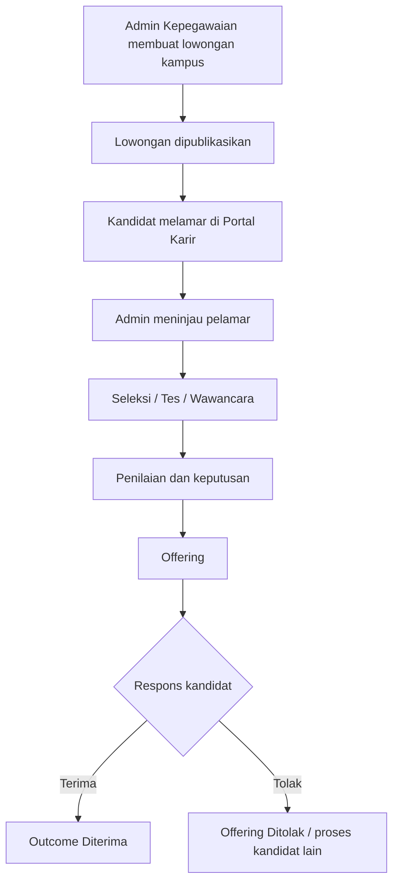
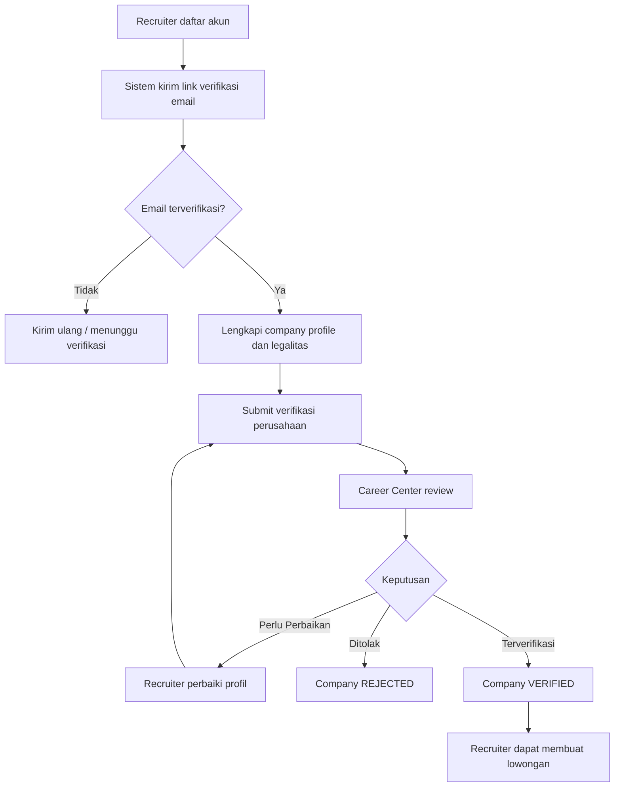
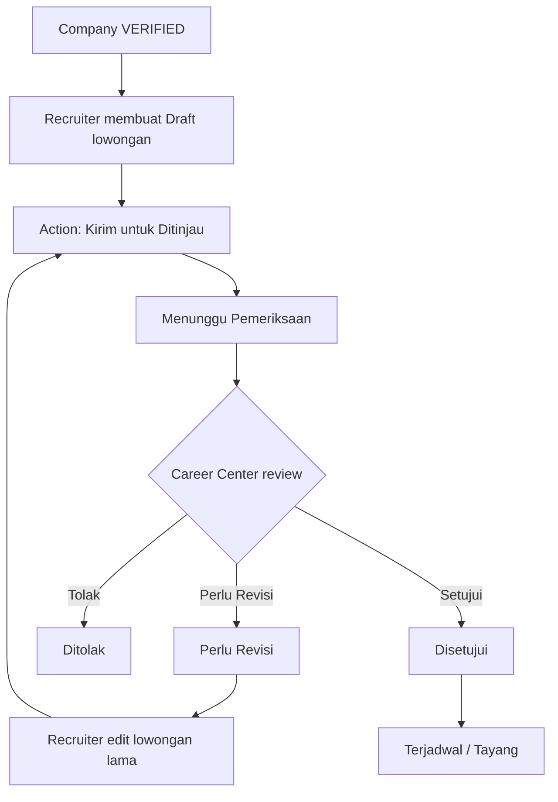

# BUSINESS REQUIREMENTS DOCUMENT (BRD)

## Portal Karir Kampus

**Versi:** 1.1  
**Tanggal:** 23 Agustus 2026  
**Status:** Revised Baseline / Frontend Freeze Alignment  
**Pemilik Bisnis:** Perguruan Tinggi  
**Unit Utama:** Career Center dan Admin Kepegawaian/HR-SDM  
**Acuan Sebelumnya:** BRD Portal Karir Kampus Versi 1.0, 22 Agustus 2026

---

## 1. Informasi Dokumen

### 1.1 Tujuan Dokumen

Dokumen ini mendefinisikan kebutuhan bisnis Portal Karir Kampus sebagai kanal resmi untuk:

1. membuka lowongan pegawai kampus kepada kandidat eksternal, mahasiswa tingkat akhir yang memenuhi kriteria, dan alumni;
2. memfasilitasi perusahaan yang telah **terverifikasi** untuk mempublikasikan lowongan bagi kandidat yang sesuai target audiens;
3. memisahkan secara jelas **status verifikasi perusahaan** dan **status kemitraan dengan kampus**;
4. mengelola proses lamaran dan status seleksi secara terpusat;
5. menyediakan data penyerapan alumni, aktivitas perusahaan, kemitraan, dan efektivitas rekrutmen untuk Career Center, Admin Kepegawaian/HR-SDM, dan pimpinan;
6. menjadi baseline bisnis yang selaras dengan frontend Portal Karir Kampus yang telah dibekukan untuk implementasi.

Dokumen ini menjadi dasar persetujuan kebutuhan bisnis sebelum perancangan teknis, pengembangan, pengujian, dan implementasi sistem.

### 1.2 Latar Belakang

Perguruan tinggi membutuhkan satu portal karier terpusat untuk dua domain proses yang berbeda tetapi saling berkaitan:

1. **Karier di Kampus**, yaitu publikasi dan pengelolaan lowongan dosen, tenaga kependidikan, tenaga kontrak, staf administrasi, serta posisi lainnya di lingkungan kampus.
2. **Karier untuk Alumni**, yaitu publikasi lowongan kerja dan magang dari perusahaan eksternal yang telah diverifikasi Career Center. Perusahaan dapat berstatus **Mitra Kampus** apabila memiliki kemitraan aktif, namun kemitraan bukan syarat untuk mempublikasikan lowongan.

Informasi lowongan yang tersebar melalui media sosial, grup percakapan, formulir umum, surat elektronik, atau dokumen terpisah menimbulkan risiko:

- tidak adanya satu sumber informasi resmi;
- sulit memastikan legalitas perusahaan dan validitas lowongan;
- data pelamar tersebar dan sulit ditelusuri;
- kandidat tidak mengetahui status lamarannya;
- perusahaan harus berulang kali mengirim data kepada Career Center;
- Career Center kesulitan mengukur penyerapan alumni;
- Admin Kepegawaian tidak memiliki applicant tracking yang terdokumentasi;
- pimpinan tidak memperoleh laporan rekrutmen dan kemitraan secara konsisten.

### 1.3 Referensi Benchmark

Konsep bisnis mengadopsi praktik umum dari:

- Handshake: akun perusahaan, moderasi lowongan oleh institusi, dan pengelolaan pelamar;
- Symplicity CSM: relasi pemberi kerja, lowongan, kegiatan karier, dan pelaporan outcome;
- ITB Career Center: pemisahan layanan kandidat dan employer service;
- ECC: publikasi lowongan, in-campus recruitment, dan layanan rekrutmen mitra;
- UIII Careers: publikasi lowongan pegawai kampus kepada masyarakat umum;
- BINUS Career: portal karier resmi universitas untuk komunitas kampus.

### 1.4 Perubahan Utama Versi 1.1

Versi 1.1 mengunci keputusan bisnis yang telah disepakati setelah BRD/FSD 1.0:

1. onboarding recruiter berubah menjadi **daftar akun → verifikasi email → company profile → verifikasi perusahaan → baru membuat lowongan**;
2. tidak ada lagi pembuatan akun recruiter otomatis dari formulir lowongan dan tidak ada temporary password untuk onboarding recruiter;
3. verifikasi email menggunakan **tautan verifikasi**;
4. perusahaan harus berstatus **Terverifikasi** sebelum dapat membuat lowongan;
5. perusahaan nonmitra tetap boleh memasang lowongan selama telah terverifikasi;
6. `Mitra Kampus` adalah atribut kemitraan aktif, terpisah dari `Terverifikasi`;
7. `Diajukan/Submit` adalah **aksi**, bukan status lowongan yang disimpan;
8. mahasiswa tingkat akhir tidak otomatis menjadi kandidat dan harus mendaftar serta melamar secara mandiri;
9. lamaran ulang pada lowongan yang sama dilakukan dengan **membuka kembali application yang sama**, bukan membuat application baru;
10. klik External ATS dicatat sebagai `EXTERNAL_APPLY_STARTED` dan bukan lamaran terkonfirmasi;
11. outcome yang belum dilengkapi hanya menghasilkan reminder, tidak memblokir lowongan baru;
12. rekrutmen pegawai kampus pada MVP dikelola linear oleh **Admin Kepegawaian**, tanpa approval kebutuhan pegawai bertingkat;
13. Time-to-Fill dihitung dari lowongan dipublikasikan sampai kandidat menerima offering;
14. retensi data rekrutmen disimpan tanpa batas waktu secara default, dengan pengecualian apabila kebijakan institusi atau ketentuan yang berlaku mengharuskan penghapusan/anonymization;
15. target kandidat dibakukan menjadi: **Publik, Alumni, Mahasiswa Tingkat Akhir & Alumni, Internal**.

---

## 2. Ringkasan Solusi Bisnis

Portal Karir Kampus menggunakan konsep **satu portal, dua jalur bisnis, dan satu basis data kandidat**.

### 2.1 Jalur Karier di Kampus

Admin Kepegawaian/HR-SDM menjadi pemilik proses rekrutmen pegawai kampus pada MVP. Admin Kepegawaian dapat membuat dan mempublikasikan lowongan kampus, mengelola pelamar, tahapan seleksi, jadwal, penilaian, offering, outcome, dan laporan.

Pada MVP **tidak diwajibkan workflow pengajuan kebutuhan dan approval bertingkat**. Arsitektur dapat disiapkan agar workflow approval dapat ditambahkan di fase berikutnya tanpa mengubah domain utama.

Lowongan Karier di Kampus **wajib menggunakan lamaran di dalam Portal Karir Kampus** untuk menjaga dokumentasi, status, consent, dan audit.

### 2.2 Jalur Karier untuk Alumni

Perusahaan menggunakan onboarding linear:

1. PIC/recruiter mendaftarkan akun;
2. recruiter memverifikasi email melalui tautan yang dikirim sistem;
3. recruiter melengkapi profil perusahaan dan dokumen legalitas;
4. recruiter mengirim profil perusahaan untuk verifikasi;
5. Career Center memverifikasi, meminta perbaikan, atau menolak perusahaan;
6. hanya perusahaan berstatus `Terverifikasi` yang dapat membuat lowongan;
7. lowongan perusahaan tetap harus melalui moderasi Career Center sebelum tayang;
8. perusahaan menjadi pemilik keputusan seleksi kandidat, sedangkan Career Center memantau proses dan outcome.

### 2.3 Prinsip Verifikasi dan Kemitraan

- **Terverifikasi** adalah status bahwa identitas/legalitas perusahaan telah lolos pemeriksaan Career Center.
- **Mitra Kampus** adalah atribut tambahan apabila perusahaan memiliki kemitraan aktif dengan kampus.
- Perusahaan **tidak wajib menjadi Mitra Kampus** untuk membuat lowongan.
- Perusahaan **wajib Terverifikasi** sebelum menu/aksi pembuatan lowongan tersedia.

### 2.4 Prinsip Kandidat

- Kandidat dapat berupa kandidat eksternal, mahasiswa tingkat akhir, atau alumni.
- Mahasiswa tingkat akhir tidak otomatis dibuat sebagai kandidat dan tidak otomatis dimasukkan ke lowongan tertentu.
- Kandidat wajib memiliki akun, melengkapi profil, dan mengirim lamaran secara mandiri.
- Perubahan status mahasiswa menjadi alumni tidak membuat akun baru.
- Kandidat menggunakan satu profil dan kumpulan dokumen privat untuk beberapa lamaran.

---

## 3. Tujuan Bisnis

| ID | Tujuan bisnis |
|---|---|
| OBJ-01 | Menyediakan kanal resmi dan terpercaya untuk seluruh publikasi lowongan terkait kampus. |
| OBJ-02 | Memudahkan kandidat eksternal, mahasiswa tingkat akhir, dan alumni menemukan serta melamar pekerjaan sesuai eligibility. |
| OBJ-03 | Menyediakan onboarding recruiter dan verifikasi perusahaan yang jelas sebelum perusahaan membuat lowongan. |
| OBJ-04 | Memastikan perusahaan diverifikasi dan lowongan perusahaan dimoderasi sebelum dipublikasikan. |
| OBJ-05 | Menyediakan proses rekrutmen pegawai kampus yang terdokumentasi dan dapat diaudit tanpa approval bertingkat pada MVP. |
| OBJ-06 | Menyediakan pemantauan status lamaran sampai hasil akhir. |
| OBJ-07 | Menghasilkan data penyerapan alumni dan efektivitas hubungan pemberi kerja. |
| OBJ-08 | Mengurangi pengelolaan manual melalui email, spreadsheet, dan formulir terpisah. |
| OBJ-09 | Menjaga konsistensi status, hak akses, consent, dan riwayat proses lintas peran. |

---

## 4. Indikator Keberhasilan

| ID | Indikator |
|---|---|
| KPI-01 | Persentase lowongan kampus dan perusahaan yang dipublikasikan melalui portal resmi. |
| KPI-02 | Jumlah perusahaan terverifikasi dan jumlah Mitra Kampus aktif. |
| KPI-03 | Waktu rata-rata verifikasi perusahaan dan moderasi lowongan. |
| KPI-04 | Jumlah alumni yang aktif, melamar, dipanggil seleksi, menerima offering, dan diterima. |
| KPI-05 | Persentase perusahaan yang melaporkan outcome akhir rekrutmen. |
| KPI-06 | Time-to-Fill lowongan pegawai kampus: tanggal lowongan dipublikasikan sampai kandidat menerima offering. |
| KPI-07 | Persentase kandidat yang dapat melihat status lamarannya. |
| KPI-08 | Penurunan penggunaan formulir dan spreadsheet terpisah. |
| KPI-09 | Persentase External Apply yang memiliki outcome terkonfirmasi dibanding jumlah `EXTERNAL_APPLY_STARTED`. |

### 4.1 Definisi KPI Time-to-Fill

`Time-to-Fill = offer_accepted_at - vacancy_published_at`

Time-to-Fill **tidak** menunggu tanggal onboarding, tanggal mulai bekerja, atau penandatanganan kontrak.

---

## 5. Ruang Lingkup

### 5.1 Dalam Ruang Lingkup MVP

1. Portal publik lowongan.
2. Kategori Karier di Kampus dan Karier untuk Alumni.
3. Registrasi, login, dan verifikasi email kandidat.
4. Registrasi, login, dan verifikasi email recruiter melalui tautan email.
5. Verifikasi alumni melalui sumber data resmi kampus yang ditetapkan.
6. Status mahasiswa tingkat akhir sebagai eligibility, tanpa pembuatan kandidat otomatis.
7. Profil kandidat dan CV digital.
8. Pengunggahan dan pengelolaan dokumen kandidat privat.
9. Pembuatan dan publikasi lowongan pegawai kampus oleh Admin Kepegawaian.
10. Registrasi company profile dan dokumen legalitas oleh recruiter.
11. Verifikasi perusahaan oleh Career Center sebelum recruiter dapat membuat lowongan.
12. Moderasi dan revisi lowongan perusahaan.
13. Pengelolaan kemitraan dasar.
14. Target kandidat/visibilitas: Publik, Alumni, Mahasiswa Tingkat Akhir & Alumni, Internal.
15. Lamaran langsung di dalam portal.
16. Dukungan tautan lamaran eksternal untuk perusahaan yang memiliki ATS.
17. Tracking `EXTERNAL_APPLY_STARTED` tanpa menganggapnya application confirmed.
18. Applicant Tracking System ringan.
19. Penjadwalan tes dan wawancara.
20. Penilaian untuk rekrutmen kampus.
21. Status hasil seleksi sampai diterima, ditolak, mengundurkan diri, atau tidak hadir.
22. Offering dan pencatatan respons kandidat.
23. Reopen application lama untuk lamaran ulang pada lowongan yang sama apabila diotorisasi.
24. Dashboard Career Center, Admin Kepegawaian, recruiter, kandidat, dan pimpinan.
25. Laporan dan ekspor data.
26. Role, permission, consent, audit log, dan riwayat status.
27. Notifikasi email dan in-app termasuk retry kegagalan SMTP.
28. Reminder outcome yang belum lengkap tanpa memblokir lowongan baru.

### 5.2 Di Luar Ruang Lingkup MVP

1. Workflow pengajuan kebutuhan pegawai dan approval bertingkat sebagai kewajiban sebelum lowongan kampus.
2. Payroll dan penggajian pegawai.
3. Presensi dan manajemen kinerja pegawai.
4. Pembuatan kontrak kerja secara penuh.
5. Onboarding pegawai secara end-to-end.
6. Psikotes terintegrasi.
7. Video interview bawaan.
8. Career counseling lengkap.
9. Career fair dan ticketing acara.
10. Rekomendasi pekerjaan berbasis AI, smart matching, candidate ranking, atau premium placement.
11. Integrasi dua arah dengan seluruh ATS perusahaan.
12. Tracer study lengkap; MVP hanya menyediakan data outcome rekrutmen.
13. Digital contract signing.

---

## 6. Pemangku Kepentingan dan Aktor

| Aktor | Kepentingan dan tanggung jawab |
|---|---|
| Pengunjung publik | Melihat lowongan publik, profil perusahaan, panduan, dan informasi portal. |
| Kandidat eksternal | Membuat akun, memverifikasi email, melengkapi profil, dan melamar lowongan publik. |
| Mahasiswa tingkat akhir | Membuat akun secara mandiri, memperoleh status/eligibility apabila memenuhi kriteria, dan melamar secara mandiri. |
| Alumni | Memverifikasi status alumni, melengkapi profil, melamar, dan memantau outcome. |
| Recruiter perusahaan | Mendaftarkan akun, memverifikasi email, mengelola profil perusahaan, membuat lowongan setelah perusahaan terverifikasi, mengelola pelamar, dan melaporkan outcome. |
| Admin perusahaan | Mengelola profil perusahaan dan anggota recruiter sesuai kewenangan. |
| Career Center | Memverifikasi perusahaan, memoderasi lowongan, mengelola kemitraan, dan memantau penyerapan alumni. |
| Admin Kepegawaian/HR-SDM | Membuat lowongan kampus, mengelola pelamar, seleksi, jadwal, penilaian, offering, outcome, dan laporan. |
| Tim seleksi | Menilai kandidat sesuai tahapan yang ditugaskan apabila digunakan. |
| Pimpinan/Auditor | Mengakses laporan dan ringkasan sesuai kewenangan tanpa mengambil alih proses operasional. |
| Super Admin | Mengelola konfigurasi, role, master data, integrasi, audit, dan keamanan. |

---

## 7. Proses Bisnis Utama

### 7.1 Rekrutmen Pegawai Kampus — MVP Linear

Aturan:

1. tidak ada approval kebutuhan pegawai bertingkat yang wajib pada MVP;
2. lowongan kampus dibuat dan dikelola Admin Kepegawaian;
3. lowongan kampus selalu menggunakan in-portal apply;
4. semua perpindahan status penting memiliki riwayat;
5. Time-to-Fill berhenti ketika kandidat menerima offering.

### 7.2 Registrasi Recruiter dan Verifikasi Perusahaan

Aturan:

- recruiter tidak dapat membuat lowongan sebelum company `VERIFIED`;
- perusahaan nonmitra dapat membuat lowongan setelah terverifikasi;
- `Mitra Kampus` hanya tampil bila kemitraan aktif;
- verifikasi email dan verifikasi perusahaan adalah dua proses yang berbeda.

### 7.3 Pembuatan dan Moderasi Lowongan Perusahaan

`Diajukan/Submit` adalah **aksi**, bukan status persisted.

### 7.4 Lamaran In-Portal

1. Kandidat membuka lowongan yang eligible.
2. Sistem memeriksa periode dan target kandidat.
3. Kandidat meninjau profil dan memilih dokumen yang akan dibagikan.
4. Kandidat menjawab screening question bila ada.
5. Kandidat memberikan consent eksplisit.
6. Sistem mencegah duplicate application untuk kandidat+lowongan yang sama.
7. Lamaran dibuat dan dilacak sampai outcome akhir.
8. Kandidat dapat mengundurkan diri tanpa menghapus riwayat application.
9. Jika reapply pada lowongan yang sama diizinkan, application lama dibuka kembali dan history dipertahankan.

### 7.5 External Apply

1. Kandidat membuka lowongan dengan metode External ATS.
2. Portal menampilkan peringatan bahwa kandidat akan meninggalkan Portal Karir Kampus.
3. Setelah kandidat melanjutkan, portal mencatat `EXTERNAL_APPLY_STARTED` bila tracking diizinkan.
4. Status tersebut **bukan** application confirmed.
5. Outcome hanya dianggap terkonfirmasi setelah ada konfirmasi perusahaan, kandidat, atau integrasi ATS pada fase yang mendukung.

### 7.6 Outcome Perusahaan

Recruiter diminta melengkapi outcome akhir. Jika outcome belum lengkap:

- sistem mengirim reminder;
- Career Center dapat memantau daftar outcome belum lengkap;
- sistem **tidak memblokir** recruiter membuat lowongan baru hanya karena outcome sebelumnya belum lengkap.

---

## 8. Kebutuhan Bisnis

### 8.1 Portal dan Identitas Pengguna

| ID | Kebutuhan |
|---|---|
| BR-001 | Sistem harus menyediakan portal publik yang dapat diakses tanpa login. |
| BR-002 | Sistem harus membedakan Karier di Kampus dan Karier untuk Alumni/perusahaan. |
| BR-003 | Sistem harus menyediakan akun kandidat, recruiter, Career Center, Admin Kepegawaian, pimpinan/auditor, dan Super Admin. |
| BR-004 | Alumni harus dapat diverifikasi menggunakan sumber data resmi kampus yang ditetapkan. |
| BR-005 | Satu alamat email tidak boleh membuat akun pengguna duplikat dan dibandingkan case-insensitive. |
| BR-006 | Kandidat dan recruiter harus memverifikasi email melalui tautan verifikasi sebelum menggunakan fungsi yang mensyaratkan email terverifikasi. |
| BR-007 | Mahasiswa tingkat akhir tidak boleh dibuat otomatis sebagai kandidat atau otomatis dilamarkan ke lowongan. |

### 8.2 Perusahaan dan Recruiter

| ID | Kebutuhan |
|---|---|
| BR-010 | Recruiter harus mendaftarkan akun sebelum membuat/mengelola company profile. |
| BR-011 | Recruiter harus memverifikasi email melalui link sebelum melanjutkan onboarding perusahaan. |
| BR-012 | Recruiter harus dapat melengkapi company profile dan dokumen legalitas setelah email terverifikasi. |
| BR-013 | Company profile harus melalui verifikasi Career Center sebelum recruiter dapat membuat lowongan. |
| BR-014 | Career Center harus dapat memverifikasi, meminta perbaikan, menolak, menangguhkan, atau mengaktifkan kembali perusahaan sesuai status yang sah. |
| BR-015 | Perusahaan yang terverifikasi tetapi bukan Mitra Kampus tetap boleh membuat lowongan. |
| BR-016 | `Mitra Kampus` hanya diberikan jika dokumen kemitraan aktif. |
| BR-017 | Perusahaan harus dapat memiliki lebih dari satu recruiter dengan kewenangan yang ditentukan. |
| BR-018 | Recruiter hanya dapat mengakses perusahaan tempat ia menjadi anggota aktif. |

### 8.3 Lowongan

| ID | Kebutuhan |
|---|---|
| BR-020 | Admin Kepegawaian dapat membuat dan mempublikasikan lowongan Karier di Kampus sesuai kewenangan. |
| BR-021 | Recruiter hanya dapat membuat lowongan setelah company berstatus `Terverifikasi`. |
| BR-022 | Lowongan perusahaan harus melalui moderasi Career Center sebelum tayang. |
| BR-023 | Career Center harus dapat memberikan catatan revisi kepada recruiter. |
| BR-024 | Recruiter harus memperbaiki lowongan yang sama dan mengirim ulang tanpa membuat record lowongan baru. |
| BR-025 | Sistem harus mendukung target kandidat: Publik, Alumni, Mahasiswa Tingkat Akhir & Alumni, dan Internal. |
| BR-026 | Lowongan perusahaan dapat menggunakan in-portal apply atau External ATS. |
| BR-027 | Lowongan Karier di Kampus wajib menggunakan in-portal apply. |
| BR-028 | Lowongan harus memiliki tanggal buka dan tutup. |
| BR-029 | Sistem harus menutup lowongan secara otomatis ketika melewati batas waktu. |
| BR-029A | `Diajukan/Submit` adalah action yang memindahkan Draft ke Menunggu Pemeriksaan, bukan status persisted. |

### 8.4 Kandidat dan Lamaran

| ID | Kebutuhan |
|---|---|
| BR-030 | Kandidat harus dapat menggunakan satu profil untuk beberapa lamaran. |
| BR-031 | Kandidat harus dapat menyimpan dokumen umum secara privat dan memilih dokumen yang dibagikan per lamaran. |
| BR-032 | Kandidat harus memberikan consent eksplisit sebelum data dibagikan kepada pemilik lowongan. |
| BR-033 | Sistem harus mencegah application duplikat pada candidate+vacancy yang sama. |
| BR-034 | Apabila reapply pada lowongan yang sama diotorisasi, sistem membuka kembali application lama dan mempertahankan riwayat. |
| BR-035 | Kandidat harus dapat melihat status lamarannya. |
| BR-036 | Kandidat dapat mengundurkan diri tanpa menghapus application dan riwayatnya. |
| BR-037 | Dokumen kandidat hanya boleh diakses pemilik lowongan yang berwenang dan hanya dokumen yang dibagikan pada application terkait. |

### 8.5 Seleksi dan Offering

| ID | Kebutuhan |
|---|---|
| BR-040 | Tahapan seleksi harus dapat dikonfigurasi per lowongan. |
| BR-041 | Pemilik lowongan harus dapat memindahkan kandidat antartahap sesuai kewenangan. |
| BR-042 | Sistem harus menyimpan riwayat perubahan status kandidat. |
| BR-043 | Sistem harus mendukung jadwal tes dan wawancara. |
| BR-044 | Sistem harus mendukung hasil Diterima, Ditolak, Mengundurkan Diri, dan Tidak Hadir. |
| BR-045 | Recruiter perusahaan harus dapat melaporkan outcome akhir kandidat. |
| BR-046 | Sistem harus mendukung offering, batas respons, serta respons Terima/Tolak. |
| BR-047 | Time-to-Fill berakhir saat kandidat menerima offering. |

### 8.6 External Apply

| ID | Kebutuhan |
|---|---|
| BR-048 | Sistem harus menampilkan peringatan sebelum kandidat diarahkan ke ATS eksternal. |
| BR-049 | Klik ke ATS eksternal hanya boleh dicatat sebagai `EXTERNAL_APPLY_STARTED`, bukan application confirmed. |
| BR-049A | Outcome External Apply hanya dianggap terkonfirmasi setelah ada konfirmasi perusahaan, kandidat, atau integrasi yang sah. |

### 8.7 Notifikasi

| ID | Kebutuhan |
|---|---|
| BR-050 | Sistem harus mengirim email verifikasi akun. |
| BR-051 | Sistem harus mendukung kirim ulang link verifikasi dengan kontrol keamanan. |
| BR-052 | Sistem harus mengirim notifikasi perubahan status perusahaan dan lowongan. |
| BR-053 | Sistem harus mengirim notifikasi lamaran kepada kandidat dan pemilik lowongan sesuai preferensi. |
| BR-054 | Sistem harus mengirim notifikasi jadwal, hasil seleksi, dan offering. |
| BR-055 | Kegagalan SMTP tidak boleh menghilangkan data transaksi utama. |
| BR-056 | Sistem harus mengirim reminder outcome yang belum lengkap tanpa memblokir pembuatan lowongan baru. |

### 8.8 Laporan dan Audit

| ID | Kebutuhan |
|---|---|
| BR-060 | Career Center harus memiliki laporan perusahaan, lowongan, pelamar alumni, External Apply, dan outcome. |
| BR-061 | Admin Kepegawaian harus memiliki laporan lowongan kampus, pelamar, progres seleksi, offering, dan Time-to-Fill. |
| BR-062 | Pimpinan harus memperoleh ringkasan rekrutmen dan penyerapan alumni. |
| BR-063 | Sistem harus menyediakan ekspor data sesuai kewenangan. |
| BR-064 | Aktivitas sensitif harus tercatat dalam audit log. |
| BR-065 | Riwayat reopening application, withdrawal, revision, submit ulang, offering, dan perubahan status harus dipertahankan. |

---

## 9. Aturan Bisnis

| ID | Aturan |
|---|---|
| RULE-001 | Email pengguna dibandingkan secara case-insensitive dan harus unik. |
| RULE-002 | Recruiter dan kandidat yang disyaratkan harus memverifikasi email melalui tautan satu kali pakai dengan masa berlaku terbatas. |
| RULE-003 | Company yang belum `VERIFIED` tidak dapat membuat lowongan perusahaan. |
| RULE-004 | Company `VERIFIED` dapat membuat lowongan tanpa harus berstatus Mitra Kampus. |
| RULE-005 | Badge `Mitra Kampus` hanya ditampilkan jika kemitraan aktif. |
| RULE-006 | Setiap lowongan perusahaan harus disetujui Career Center sebelum tayang. |
| RULE-007 | `Submit/Diajukan` merupakan action, bukan persisted vacancy status. |
| RULE-008 | Lowongan tidak boleh memungut biaya kepada kandidat. |
| RULE-009 | Lowongan perusahaan dapat menggunakan in-portal apply atau External ATS. |
| RULE-010 | Lowongan Karier di Kampus wajib menggunakan in-portal apply. |
| RULE-011 | `EXTERNAL_APPLY_STARTED` tidak boleh dihitung sebagai application confirmed. |
| RULE-012 | Pemilik lowongan hanya dapat melihat kandidat dan dokumen yang terkait dengan lowongan yang dikelolanya. |
| RULE-013 | Career Center dapat memantau lowongan perusahaan tetapi tidak menetapkan kandidat diterima atas nama perusahaan. |
| RULE-014 | Perubahan substansi penting lowongan yang sudah tayang dapat memerlukan moderasi ulang. |
| RULE-015 | Mahasiswa tingkat akhir harus mendaftar dan melamar secara mandiri. |
| RULE-016 | Target kandidat resmi hanya: Publik, Alumni, Mahasiswa Tingkat Akhir & Alumni, Internal. |
| RULE-017 | Satu candidate+vacancy menggunakan satu lifecycle application; reapply yang diotorisasi membuka kembali application lama. |
| RULE-018 | Withdrawal mengubah status menjadi Mengundurkan Diri dan tidak menghapus history. |
| RULE-019 | Outcome belum lengkap hanya memicu reminder dan tidak memblokir lowongan baru. |
| RULE-020 | Time-to-Fill berakhir saat candidate menerima offering. |
| RULE-021 | Data recruitment disimpan tanpa batas waktu secara default, kecuali terdapat kebijakan institusi atau ketentuan yang mewajibkan penghapusan/anonymization. |
| RULE-022 | Kegagalan SMTP tidak membatalkan transaksi bisnis; notifikasi diproses ulang secara terkontrol. |
| RULE-023 | Admin Kepegawaian mengelola rekrutmen kampus secara linear pada MVP tanpa approval bertingkat yang diwajibkan. |

---

## 10. Status Bisnis

### 10.1 Status Akun Pengguna

`Menunggu Verifikasi Email → Aktif → Ditangguhkan/Dinonaktifkan`

Verifikasi email dan status perusahaan adalah dua hal berbeda.

### 10.2 Status Perusahaan

`Draft → Menunggu Verifikasi → Perlu Perbaikan → Menunggu Verifikasi → Terverifikasi`

Cabang:

- `Menunggu Verifikasi → Ditolak`
- `Terverifikasi → Ditangguhkan → Terverifikasi`

`Mitra Kampus` adalah atribut kemitraan, bukan status perusahaan.

### 10.3 Status Lowongan Perusahaan

`Draft → Menunggu Pemeriksaan → Perlu Revisi → Menunggu Pemeriksaan → Disetujui → Terjadwal/Tayang → Ditutup/Kedaluwarsa`

Cabang:

- `Menunggu Pemeriksaan → Ditolak`
- `Tayang → Ditangguhkan`

`Diajukan/Submit` tidak menjadi status tersendiri.

### 10.4 Status Lowongan Kampus

`Draft → Terjadwal/Tayang → Ditutup/Kedaluwarsa`

Status `Ditangguhkan` dapat digunakan jika diperlukan oleh kewenangan operasional.

### 10.5 Status Lamaran — Candidate-Facing

`Lamaran Diterima → Sedang Ditinjau → Shortlisted → Proses Seleksi → Wawancara → Offering → Diterima`

Cabang akhir:

- `Ditolak`
- `Mengundurkan Diri`
- `Tidak Hadir`

Event tambahan yang tidak menghapus history:

- `Lamaran Dibuka Kembali`

### 10.6 Status External Apply

`EXTERNAL_APPLY_STARTED → Menunggu Konfirmasi → Outcome Terkonfirmasi` bila tersedia.

`EXTERNAL_APPLY_STARTED` bukan sinonim `Lamaran Diterima`.

---

## 11. Kebutuhan Data Tingkat Tinggi

Data utama yang dikelola:

1. identitas dan akun pengguna;
2. token/status verifikasi email;
3. profil kandidat dan status kandidat;
4. verifikasi alumni/mahasiswa tingkat akhir;
5. pendidikan, pengalaman, keterampilan, dan CV;
6. dokumen kandidat privat;
7. profil dan legalitas perusahaan;
8. data recruiter dan keanggotaan perusahaan;
9. verifikasi perusahaan dan riwayat keputusan;
10. kemitraan dan masa berlaku;
11. lowongan, kualifikasi, target audiens, metode lamaran, dan versi;
12. lamaran, dokumen yang dibagikan, consent, dan riwayat status;
13. aktivitas External Apply dan konfirmasi outcome;
14. tahapan seleksi, jadwal, penilaian, dan hasil;
15. offering dan respons;
16. notifikasi dan status pengiriman email;
17. audit log dan riwayat perubahan.

---

## 12. Kebutuhan Laporan

### 12.1 Career Center

- perusahaan Draft, Menunggu Verifikasi, Perlu Perbaikan, Terverifikasi, Ditolak, dan Ditangguhkan;
- Mitra Kampus aktif dan kemitraan yang akan berakhir;
- lowongan per perusahaan, program studi, lokasi, dan jenis pekerjaan;
- jumlah alumni melihat, melamar in-portal, memulai External Apply, terkonfirmasi melamar, diproses, menerima offering, dan diterima;
- perusahaan paling aktif;
- lowongan/outcome yang belum dilengkapi;
- penempatan alumni berdasarkan program studi dan tahun lulus.

### 12.2 Admin Kepegawaian

- lowongan kampus aktif dan jumlah pelamar;
- funnel seleksi per posisi;
- Time-to-Review;
- Time-to-Fill berdasarkan offering accepted;
- kandidat offering, diterima, menolak offering, ditolak, mengundurkan diri, dan tidak hadir.

### 12.3 Pimpinan

- ringkasan lowongan pegawai kampus;
- outcome pemenuhan posisi;
- pertumbuhan perusahaan terverifikasi dan Mitra Kampus;
- tingkat partisipasi dan penyerapan alumni;
- tren outcome berdasarkan periode.

---

## 13. Kebutuhan Nonfungsional Tingkat Bisnis

1. Portal harus responsif pada desktop dan perangkat bergerak.
2. Sistem harus menjaga kerahasiaan data kandidat dan perusahaan.
3. Hak akses harus mengikuti prinsip least privilege dan object ownership.
4. Aktivitas sensitif harus dapat diaudit.
5. Data transaksi tidak boleh hilang karena kegagalan pengiriman email.
6. Portal publik harus tetap dapat menampilkan lowongan saat beban akses meningkat secara wajar.
7. Sistem harus menyediakan reset password dan verifikasi email yang aman.
8. Sistem harus menyediakan mekanisme pelaporan lowongan bermasalah.
9. Dokumen kandidat hanya dapat diakses pihak yang berwenang dan hanya dalam konteks application terkait.
10. Consent kandidat harus tercatat.
11. Data rekrutmen disimpan tanpa batas waktu secara default dengan dukungan penghapusan/anonymization apabila diwajibkan kebijakan institusi atau ketentuan yang berlaku.
12. Perubahan status antar-role harus konsisten dan tidak boleh memberikan hak bisnis lintas role tanpa otorisasi.

---

## 14. Risiko dan Mitigasi

| Risiko | Mitigasi |
|---|---|
| Perusahaan atau lowongan palsu | Verifikasi legalitas, email resmi, moderasi, audit, dan tombol Laporkan Lowongan. |
| Recruiter memakai email tidak sah | Verifikasi email melalui link dan verifikasi company profile oleh Career Center. |
| SMTP gagal | Transactional outbox, retry terkontrol, status pengiriman, dan resend. |
| Akun pengguna duplikat | Normalisasi dan unique constraint email. |
| Perusahaan ganda | Deduplication company name, legal number, domain, dan pemeriksaan manual. |
| Company belum verified tetapi mencoba membuat lowongan | Gate authorization pada UI dan backend berdasarkan `company.status = VERIFIED`. |
| Mitra Kampus dianggap sama dengan perusahaan terverifikasi | Badge dan data model dipisahkan; partnership bukan prerequisite posting. |
| Perusahaan tidak memperbarui outcome | Reminder otomatis dan daftar monitoring; tidak memblokir vacancy baru. |
| Data kandidat diakses tidak sah | Role-based access, object-level authorization, consent, audit log, dan pembatasan unduhan. |
| External Apply dianggap application berhasil | Gunakan `EXTERNAL_APPLY_STARTED` dan metrik terpisah sampai outcome dikonfirmasi. |
| Duplicate application | Idempotency dan aturan satu lifecycle application per candidate+vacancy. |
| History hilang saat reopen/withdraw | Application tidak dihapus; seluruh status history dipertahankan. |
| Proses kampus menjadi terlalu kompleks untuk MVP | Admin Kepegawaian mengelola alur linear; approval bertingkat ditunda. |

---

## 15. Asumsi dan Batasan

1. Kampus menyediakan domain, identitas merek, dan akun SMTP yang aktif.
2. Kampus menetapkan Career Center dan Admin Kepegawaian sebagai pemilik proses masing-masing.
3. Kampus menyediakan sumber data alumni dan/atau mahasiswa untuk kebutuhan verifikasi eligibility.
4. Perusahaan bertanggung jawab atas kebenaran informasi lowongan dan hasil seleksi.
5. Sistem tidak menjamin completion External Apply tanpa konfirmasi atau integrasi ATS.
6. Recruiter membuat password sendiri saat registrasi; tidak menggunakan temporary password onboarding.
7. Link verifikasi email bersifat satu kali pakai, memiliki masa berlaku, dan dapat dikirim ulang secara aman.
8. Workflow approval kebutuhan pegawai tidak diwajibkan pada MVP dan dapat dirancang sebagai pengembangan berikutnya.
9. Retensi default data recruitment adalah tanpa batas waktu dengan pengecualian sesuai kebijakan institusi/ketentuan yang berlaku.
10. Frontend baseline dibekukan setelah final cross-role consistency pass; perubahan business flow setelah freeze diperlakukan sebagai change request.

---

## 16. Kriteria Penerimaan Bisnis

1. Recruiter dapat membuat akun dan wajib memverifikasi email melalui link.
2. Recruiter hanya dapat melengkapi dan mengajukan company profile setelah email terverifikasi.
3. Recruiter tidak dapat membuat lowongan sebelum perusahaan berstatus `Terverifikasi`.
4. Perusahaan nonmitra yang `Terverifikasi` dapat membuat lowongan.
5. `Terverifikasi` dan `Mitra Kampus` ditampilkan sebagai dua konsep berbeda.
6. Career Center dapat meminta perbaikan, memverifikasi, menolak, menangguhkan, dan memulihkan company sesuai transisi sah.
7. Lowongan perusahaan tidak tampil sebelum disetujui Career Center.
8. `Diajukan/Submit` berfungsi sebagai action dan tidak muncul sebagai status lowongan.
9. Recruiter yang menerima revisi mengedit company/vacancy yang sama dan history tetap tersimpan.
10. Admin Kepegawaian dapat membuat dan mempublikasikan lowongan kampus tanpa approval bertingkat pada MVP.
11. Lowongan kampus hanya menggunakan in-portal apply.
12. Kandidat mahasiswa tingkat akhir tidak dibuat atau dilamarkan otomatis.
13. Target kandidat hanya menggunakan Publik, Alumni, Mahasiswa Tingkat Akhir & Alumni, dan Internal.
14. Kandidat dapat menggunakan satu profil untuk beberapa lamaran dan memilih dokumen yang dibagikan.
15. Consent kandidat wajib sebelum submit in-portal application.
16. Duplicate application candidate+vacancy dicegah.
17. Reapply yang diotorisasi membuka kembali application yang sama dan mempertahankan history.
18. Withdrawal tidak menghapus application atau history.
19. External ATS click dicatat sebagai `EXTERNAL_APPLY_STARTED`, bukan application confirmed.
20. Kandidat dapat melihat status, jadwal, dan offering.
21. Offering diterima menghasilkan outcome Diterima dan menghentikan Time-to-Fill.
22. Outcome belum lengkap menghasilkan reminder saja dan tidak memblokir lowongan baru.
23. Recruiter hanya melihat kandidat/dokumen pada lowongan perusahaannya; Admin Kepegawaian hanya mengakses rekrutmen kampus sesuai kewenangan.
24. Kegagalan SMTP tidak membatalkan transaksi utama.
25. Seluruh perubahan status penting memiliki actor, timestamp, dan riwayat.

---

## 17. Persetujuan Dokumen

| Peran | Nama | Keputusan | Tanggal |
|---|---|---|---|
| Pemilik Bisnis Career Center |  |  |  |
| Pemilik Bisnis Admin Kepegawaian/HR-SDM |  |  |  |
| Perwakilan Pimpinan |  |  |  |
| Product Owner |  |  |  |
| Tim Teknologi Informasi |  |  |  |

---

## 18. Glosarium

| Istilah | Definisi |
|---|---|
| ATS | Applicant Tracking System, sistem pengelolaan pelamar dan tahapan seleksi. |
| Career Center | Unit kampus yang mengelola layanan karier, verifikasi perusahaan, moderasi lowongan perusahaan, kemitraan, dan outcome alumni. |
| Admin Kepegawaian | Pengguna HR/SDM yang mengelola lowongan dan proses rekrutmen pegawai kampus pada MVP. |
| Recruiter | Pengguna perwakilan perusahaan yang mengelola profil perusahaan, lowongan, pelamar, dan outcome sesuai kewenangan. |
| SMTP | Protokol/layanan yang digunakan sistem untuk mengirim email. |
| Terverifikasi | Status perusahaan setelah lolos verifikasi Career Center. |
| Mitra Kampus | Atribut perusahaan yang memiliki kemitraan aktif dengan kampus; bukan pengganti status verifikasi. |
| Outcome | Hasil akhir proses lamaran, misalnya diterima, ditolak, mengundurkan diri, tidak hadir, atau offering ditolak. |
| External Apply | Lamaran yang dilanjutkan ke situs/ATS milik perusahaan. |
| EXTERNAL_APPLY_STARTED | Event bahwa kandidat memulai alur ke ATS eksternal; bukan bukti application telah selesai. |
| Reopen Application | Membuka kembali application yang sama untuk candidate+vacancy yang sama dengan tetap mempertahankan history. |
| Time-to-Fill | Durasi dari lowongan dipublikasikan sampai kandidat menerima offering. |
| Submit/Diajukan | Aksi untuk mengirim record ke proses review; bukan status lowongan persisted. |

---

## 19. Decision Log Versi 1.1

| ID | Keputusan | Status |
|---|---|---|
| DEC-001 | Scope MVP tetap dikerjakan sebagai satu kesatuan. | Decided |
| DEC-002 | Mahasiswa tingkat akhir tidak menjadi kandidat otomatis; wajib daftar dan apply mandiri. | Decided |
| DEC-003 | Recruiter register dan verify email sebelum company profile. | Decided |
| DEC-004 | Verifikasi email menggunakan link. | Decided |
| DEC-005 | Company harus VERIFIED sebelum recruiter dapat membuat lowongan. | Decided |
| DEC-006 | Diajukan merupakan action submit, bukan status. | Decided |
| DEC-007 | Perusahaan nonmitra dapat posting setelah verified. | Decided |
| DEC-008 | Reapply pada lowongan yang sama membuka application lama dan mempertahankan history. | Decided |
| DEC-009 | External Apply click = EXTERNAL_APPLY_STARTED, bukan application confirmed. | Decided |
| DEC-010 | Outcome belum lengkap hanya memicu reminder. | Decided |
| DEC-011 | Retensi default data recruitment tanpa batas waktu. | Decided |
| DEC-012 | Approval rekrutmen kampus bertingkat tidak diwajibkan pada MVP; satu Admin Kepegawaian mengelola alur. | Decided |
| DEC-013 | Time-to-Fill berakhir saat kandidat menerima offering. | Decided |
| DEC-014 | Development dan prototype mengikuti dependency flow yang linear. | Decided |
| DEC-015 | Target kandidat dibakukan menjadi Publik, Alumni, Mahasiswa Tingkat Akhir & Alumni, Internal. | Decided |
