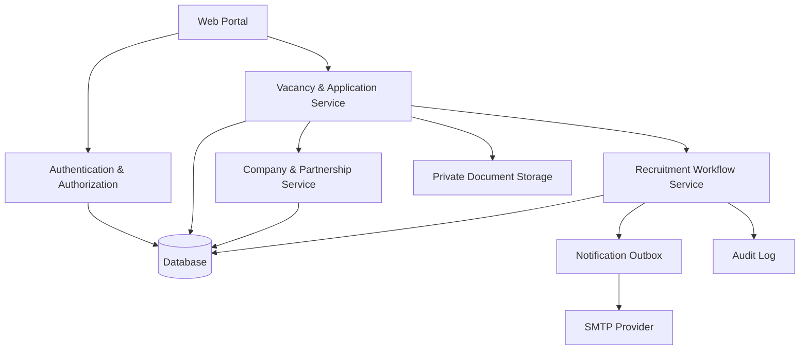
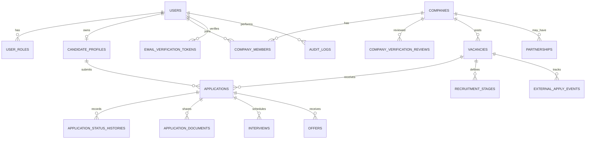

# FUNCTIONAL SPECIFICATION DOCUMENT (FSD)

## Portal Karir Kampus

**Versi:** 1.1  
**Tanggal:** 23 Agustus 2026  
**Status:** Revised Baseline / Frontend Freeze Alignment  
**Dokumen Acuan:** BRD Portal Karir Kampus Versi 1.1  
**Acuan Sebelumnya:** FSD Portal Karir Kampus Versi 1.0, 22 Agustus 2026

---

## 1. Informasi Dokumen

### 1.1 Tujuan

Dokumen ini menerjemahkan BRD Portal Karir Kampus Versi 1.1 menjadi spesifikasi fungsi sistem yang dapat digunakan oleh product manager, UI/UX designer, software developer, QA, dan tim implementasi.

### 1.2 Batasan Spesifikasi

Spesifikasi bersifat technology-agnostic. Pemilihan framework, database, object storage, queue, layanan SMTP, dan detail infrastruktur ditetapkan pada dokumen arsitektur teknis atau keputusan implementasi terpisah.

### 1.3 Prinsip Sistem

1. Satu akun pengguna dapat memiliki satu atau lebih role yang sah.
2. Satu email pengguna bersifat unik dan dibandingkan case-insensitive.
3. Email kandidat/recruiter yang disyaratkan harus diverifikasi melalui tautan satu kali pakai sebelum fungsi tertentu tersedia.
4. Portal melayani dua domain proses: Karier di Kampus dan lowongan perusahaan.
5. Company verification dan partnership adalah dua konsep terpisah.
6. Recruiter tidak dapat membuat vacancy sebelum company berstatus `VERIFIED`.
7. Lowongan perusahaan tidak dapat tayang sebelum moderasi Career Center.
8. Lowongan kampus wajib menggunakan in-portal apply.
9. `Submit/Diajukan` adalah action, bukan persisted vacancy status.
10. Data utama harus tersimpan walaupun pengiriman notifikasi gagal.
11. Seluruh perubahan status penting harus memiliki actor, waktu, dan riwayat.
12. Satu candidate+vacancy menggunakan satu lifecycle application; reopen mempertahankan history.
13. External ATS click hanya mencatat `EXTERNAL_APPLY_STARTED`, bukan application confirmed.
14. Time-to-Fill berakhir saat kandidat menerima offering.
15. Pada MVP, Admin Kepegawaian mengelola rekrutmen kampus secara linear tanpa mandatory multi-level approval.

### 1.4 Perubahan Utama dari FSD 1.0

1. Menghapus onboarding recruiter berbasis akun otomatis dan temporary password.
2. Mengganti dengan self-registration recruiter + link verifikasi email.
3. Memisahkan registrasi recruiter/company verification dari vacancy creation.
4. Menjadikan `company.status = VERIFIED` sebagai gate vacancy creation.
5. Menetapkan company nonpartner dapat membuat vacancy setelah verified.
6. Menghapus `PENDING_EMAIL_VERIFICATION` dari lifecycle vacancy.
7. Menetapkan `Diajukan` sebagai action submit.
8. Menonaktifkan mandatory workforce request/approval pada MVP HR.
9. Menambahkan reopening application lama.
10. Menegaskan External Apply tracking dan confirmed outcome.
11. Menetapkan retention default tanpa batas waktu.
12. Menetapkan Time-to-Fill sampai offering accepted.
13. Membakukan target audience menjadi empat kategori resmi.

---

## 2. Gambaran Sistem

### 2.1 Kanal Aplikasi

| Kanal | Pengguna | Fungsi utama |
|---|---|---|
| Portal Publik | Pengunjung dan calon kandidat | Mencari lowongan, melihat detail perusahaan/lowongan, mendaftar kandidat/recruiter, panduan, dan pelaporan lowongan. |
| Portal Kandidat | Kandidat eksternal, mahasiswa tingkat akhir, alumni | Profil, verifikasi status, CV/dokumen, lamaran, jadwal, notifikasi, offering, dan status seleksi. |
| Portal Recruiter | Company Admin dan Company Recruiter | Company profile, status verifikasi, lowongan setelah company verified, pelamar, jadwal, outcome, dan anggota perusahaan. |
| Back Office Career Center | Staf/manager Career Center | Verifikasi perusahaan, moderasi lowongan perusahaan, kemitraan, outcome alumni, laporan. |
| Back Office Kepegawaian | Admin Kepegawaian/HR-SDM | Lowongan kampus, pelamar, tahapan seleksi, jadwal, penilaian, offering, outcome, laporan. |
| Super Admin | Administrator platform | Role, master data, konfigurasi, SMTP, audit, integrasi, dan keamanan. |

### 2.2 Komponen Logis

---

## 3. Role dan Hak Akses

### 3.1 Daftar Role

| Kode | Role |
|---|---|
| PUBLIC | Pengunjung publik |
| CANDIDATE_EXTERNAL | Kandidat eksternal |
| CANDIDATE_STUDENT_FINAL_YEAR | Mahasiswa tingkat akhir |
| CANDIDATE_ALUMNI | Alumni |
| COMPANY_ADMIN | Admin perusahaan |
| COMPANY_RECRUITER | Recruiter perusahaan |
| CAREER_CENTER_STAFF | Staf Career Center |
| CAREER_CENTER_MANAGER | Kepala Career Center |
| HR_ADMIN | Admin Kepegawaian/HR-SDM |
| SELECTOR | Tim seleksi apabila digunakan |
| AUDITOR | Akses baca laporan/audit |
| SUPER_ADMIN | Administrator sistem |

Role `REQUESTING_UNIT` dan `APPROVER` tidak menjadi dependency wajib MVP. Dukungan role tersebut dapat disiapkan untuk fase berikutnya.

### 3.2 Matriks Akses Ringkas

| Fungsi | Kandidat | Recruiter | Career Center | Admin Kepegawaian | Selector | Super Admin |
|---|---:|---:|---:|---:|---:|---:|
| Melihat lowongan sesuai visibilitas | Ya | Ya | Ya | Ya | Ya | Ya |
| Melamar lowongan | Ya | Tidak | Tidak | Tidak | Tidak | Tidak |
| Mengelola company profile | Tidak | Sesuai membership | Pantau/review | Tidak | Tidak | Darurat/audit |
| Memverifikasi perusahaan | Tidak | Tidak | Ya | Tidak | Tidak | Darurat/audit sesuai kebijakan |
| Membuat lowongan perusahaan | Tidak | Ya, hanya company VERIFIED | Atas nama sesuai kewenangan | Tidak | Tidak | Darurat/audit |
| Memoderasi lowongan perusahaan | Tidak | Tidak | Ya | Tidak | Tidak | Darurat/audit |
| Mengelola kandidat lowongan perusahaan | Milik sendiri | Milik company/vacancy | Pantau | Tidak | Tidak | Darurat/audit |
| Membuat lowongan kampus | Tidak | Tidak | Tidak | Ya | Tidak | Darurat/audit |
| Mengelola kandidat lowongan kampus | Milik sendiri | Tidak | Tidak | Ya | Sesuai penugasan | Darurat/audit |
| Mengelola offering kampus | Milik sendiri | Tidak | Tidak | Ya | Tidak | Darurat/audit |
| Mengelola master/role | Tidak | Tidak | Tidak | Tidak | Tidak | Ya |

### 3.3 Object-Level Authorization

RBAC wajib dikombinasikan dengan object ownership:

- recruiter company A tidak dapat mengakses company/vacancy/applicant company B;
- Career Center dapat memantau company/vacancy perusahaan tetapi tidak mengambil keputusan penerimaan kandidat atas nama perusahaan;
- Admin Kepegawaian hanya mengelola lowongan dan applicant Karier di Kampus;
- recruiter/Admin hanya melihat dokumen yang dibagikan kandidat untuk application terkait;
- kandidat hanya melihat application miliknya.

---

## 4. Modul dan Navigasi

### 4.1 Portal Publik

- Beranda;
- Cari Lowongan;
- Karier di Kampus;
- Karier untuk Alumni;
- Perusahaan;
- Panduan;
- Daftarkan Perusahaan;
- Masuk/Daftar;
- Laporkan Lowongan.

### 4.2 Portal Kandidat

- Dashboard;
- Profil Saya;
- CV & Dokumen;
- Cari Lowongan;
- Lamaran Saya;
- Jadwal Seleksi;
- Lowongan Tersimpan;
- Notifikasi;
- Pengaturan Akun.

### 4.3 Portal Recruiter

- Dashboard;
- Profil Perusahaan;
- Status Verifikasi;
- Dokumen Legalitas;
- Kemitraan;
- Lowongan;
- Pelamar;
- Jadwal Seleksi;
- Outcome Rekrutmen;
- Anggota Perusahaan;
- Notifikasi;
- Pengaturan Akun.

### 4.4 Back Office Career Center

- Dashboard;
- Verifikasi Perusahaan;
- Moderasi Lowongan;
- Data Perusahaan;
- Kemitraan;
- Alumni & Outcome;
- Laporan;
- Notifikasi;
- Template Email;
- Pengaturan Moderasi.

### 4.5 Back Office Kepegawaian

- Dashboard;
- Lowongan Kampus;
- Pelamar;
- Jadwal Seleksi;
- Penilaian;
- Offering;
- Outcome Rekrutmen;
- Laporan;
- Notifikasi;
- Pengaturan.

### 4.6 Super Admin

- Pengguna dan Role;
- Master Data;
- Unit Organisasi;
- Program Studi;
- Jenis Lowongan;
- Template Workflow;
- Konfigurasi SMTP;
- Template Notifikasi;
- Integrasi;
- Audit Log;
- Retensi Data;
- Pengaturan Sistem.

---

## 5. Spesifikasi Fungsional

## 5.1 Authentication, Registration, dan Email Verification

### FR-AUTH-001 — Normalisasi Email

- Sistem menghapus spasi sebelum/sesudah email.
- Sistem menyimpan normalized email dalam lowercase untuk pencarian dan unique constraint.
- Email dengan perbedaan huruf besar/kecil dianggap satu akun.

### FR-AUTH-002 — Registrasi Akun

Sistem mendukung self-registration untuk kandidat dan recruiter.

Field minimum:

- nama;
- email;
- nomor kontak sesuai jenis akun;
- password;
- konfirmasi password;
- persetujuan syarat/kebijakan yang diwajibkan.

Post-condition:

- user dibuat dengan status `PENDING_EMAIL_VERIFICATION` atau ekuivalen;
- email outbox verifikasi dibuat dalam transaksi bisnis yang konsisten;
- tidak ada temporary password onboarding.

### FR-AUTH-003 — Verifikasi Email melalui Link

1. Sistem membuat token verifikasi acak, satu kali pakai, dan kedaluwarsa.
2. Sistem mengirim link verifikasi melalui email.
3. Saat link valid diklik, sistem mencatat `email_verified_at`.
4. Token lama menjadi tidak valid setelah digunakan.
5. Pengguna mendapat status akun aktif sesuai rule setelah verifikasi berhasil.
6. Verifikasi email tidak otomatis berarti company telah diverifikasi.

### FR-AUTH-004 — Kirim Ulang Verifikasi Email

- Pengguna dapat meminta link baru.
- Token lama dapat dicabut ketika link baru dibuat.
- Endpoint harus rate-limited.
- Respons tidak membocorkan data akun lain.

### FR-AUTH-005 — Login

- Pengguna login dengan email dan password.
- Akun yang belum memverifikasi email dapat dibatasi hanya ke halaman verifikasi/bantuan sesuai kebijakan.
- Akun suspended/disabled ditolak sesuai status.

### FR-AUTH-006 — Kebijakan Password

Minimal:

- 8 karakter;
- kombinasi huruf besar, huruf kecil, dan angka;
- tidak sama dengan email;
- rate limit dan lock sementara setelah percobaan gagal berulang;
- password hanya disimpan sebagai hash adaptif;
- password tidak dicatat dalam log/audit.

### FR-AUTH-007 — Lupa/Reset Password

- reset menggunakan token satu kali pakai dengan expiry;
- setelah reset sukses, token lama dinonaktifkan;
- sistem dapat mencabut sesi lain sesuai kebijakan keamanan.

---

## 5.2 Recruiter Onboarding dan Company Verification

### FR-ONB-001 — Urutan Onboarding Recruiter

Flow wajib:

`Register Recruiter → Verify Email → Company Profile → Submit Verification → Career Center Review → VERIFIED → Create Vacancy`

Recruiter tidak dapat melewati email verification atau company verification gate.

### FR-ONB-002 — Company Profile

Setelah email verified, recruiter dapat membuat/melengkapi company profile dengan field minimum:

| Field | Wajib | Catatan |
|---|---:|---|
| Nama perusahaan | Ya | 2–200 karakter |
| Bentuk badan/jenis organisasi | Ya | Master data |
| Industri | Ya | Master data |
| Website | Kondisional | URL valid |
| Email resmi perusahaan | Ya | Format valid |
| Telepon | Tidak | Format valid |
| Alamat | Ya | Sesuai konfigurasi |
| Provinsi/kota | Ya | Master wilayah |
| Logo | Tidak | File gambar terkontrol |
| NIB/nomor legalitas | Kondisional | Sesuai kebijakan verifikasi |
| Dokumen legalitas | Ya | PDF/gambar, MIME dan ukuran dibatasi |

### FR-ONB-003 — Submit Company Verification

Saat recruiter memilih **Kirim untuk Verifikasi**:

1. sistem validasi data dan dokumen;
2. company berstatus `PENDING_VERIFICATION`;
3. sistem membuat nomor pengajuan verifikasi;
4. sistem membuat history/audit;
5. Career Center menerima queue item;
6. kegagalan email tidak membatalkan submit.

### FR-ONB-004 — Company Review

Career Center dapat:

- `VERIFY` → `VERIFIED`;
- `REQUEST_REVISION` → `REVISION_REQUIRED`;
- `REJECT` → `REJECTED`;
- `SUSPEND` hanya pada company yang sudah aktif/verified sesuai rule;
- `RESTORE` dari `SUSPENDED` ke `VERIFIED`.

Revision/rejection/suspension wajib memiliki reason.

### FR-ONB-005 — Revision Company

- recruiter mengedit company yang sama;
- tidak membuat company record baru;
- submit ulang memindahkan `REVISION_REQUIRED → PENDING_VERIFICATION`;
- history sebelum/sesudah dipertahankan.

### FR-ONB-006 — Vacancy Creation Gate

Backend dan UI wajib menegakkan:

`company.status != VERIFIED → create vacancy forbidden`

`company.status == VERIFIED → create vacancy allowed`

`Mitra Kampus` tidak menjadi syarat.

---

## 5.3 Perusahaan dan Kemitraan

### FR-COMP-001 — Deduplication Company

Sistem menandai potensi duplikasi berdasarkan kombinasi:

- normalized company name;
- NIB/nomor legalitas;
- domain website;
- domain email resmi;
- nomor telepon.

Merge hanya dilakukan role berwenang dan tercatat audit.

### FR-COMP-002 — Status Perusahaan

| Status | Makna |
|---|---|
| DRAFT | Company profile belum dikirim. |
| PENDING_VERIFICATION | Menunggu review Career Center. |
| REVISION_REQUIRED | Recruiter harus memperbaiki company profile. |
| VERIFIED | Company lolos verifikasi dan boleh membuat vacancy. |
| REJECTED | Verifikasi ditolak. |
| SUSPENDED | Akses company ditangguhkan sementara. |

### FR-COMP-003 — Kemitraan

Career Center dapat mencatat:

- nomor dokumen kerja sama;
- jenis kemitraan;
- tanggal mulai/berakhir;
- PIC kampus/perusahaan;
- dokumen;
- status aktif/kedaluwarsa;
- catatan.

Badge `Mitra Kampus` hanya tampil jika partnership aktif.

Company `VERIFIED` tanpa partnership tetap boleh membuat vacancy.

### FR-COMP-004 — Anggota Perusahaan

- company dapat memiliki lebih dari satu member;
- akses hanya untuk member aktif;
- penghapusan membership tidak menghapus audit/history;
- undangan anggota baru harus memverifikasi email/akun sesuai mekanisme keamanan.

---

## 5.4 Pengelolaan Lowongan Perusahaan

### FR-VAC-001 — Vacancy Types

- `CAMPUS_EMPLOYMENT`;
- `COMPANY_EMPLOYMENT`;
- `INTERNSHIP`;
- tipe tambahan melalui master data.

### FR-VAC-002 — Target Kandidat / Visibilitas

Gunakan hanya:

| Kode | Label | Eligibility utama |
|---|---|---|
| PUBLIC | Publik | Kandidat yang memenuhi syarat umum. |
| ALUMNI_ONLY | Alumni | Alumni terverifikasi. |
| FINAL_YEAR_AND_ALUMNI | Mahasiswa Tingkat Akhir & Alumni | Mahasiswa tingkat akhir eligible dan alumni. |
| INTERNAL | Internal | Pengguna internal sesuai konfigurasi. |

`Mahasiswa Aktif`, `Fresh Graduate`, atau kombinasi ad-hoc bukan nilai resmi.

### FR-VAC-003 — Field Lowongan Perusahaan

Minimal:

- judul posisi;
- deskripsi pekerjaan;
- kualifikasi;
- jenis pekerjaan;
- lokasi / remote / hybrid;
- jumlah kebutuhan;
- pendidikan minimal;
- program studi;
- pengalaman;
- keterampilan;
- rentang gaji jika digunakan;
- tanggal buka;
- tanggal tutup;
- target kandidat;
- metode lamaran;
- URL ATS jika external;
- dokumen kandidat wajib;
- screening questions.

### FR-VAC-004 — Submit adalah Action

Stored vacancy status tidak memiliki `SUBMITTED/DIAJUKAN`.

Flow:

`DRAFT --submit--> PENDING_REVIEW`

Action dapat diberi nama UI **Kirim untuk Ditinjau**.

### FR-VAC-005 — Status Lowongan Perusahaan

| Status | Makna |
|---|---|
| DRAFT | Belum diajukan. |
| PENDING_REVIEW | Menunggu moderasi Career Center. |
| REVISION_REQUIRED | Perlu revisi recruiter. |
| APPROVED | Disetujui, menunggu kondisi publikasi. |
| SCHEDULED | Terjadwal. |
| PUBLISHED | Tayang. |
| REJECTED | Ditolak. |
| CLOSED | Ditutup manual. |
| EXPIRED | Melewati close_at. |
| SUSPENDED | Ditangguhkan. |

### FR-VAC-006 — Moderasi

Career Center dapat:

- setujui;
- minta revisi;
- tolak;
- suspend lowongan tayang.

Revision/rejection harus memiliki kategori dan recruiter-visible note. Internal note tidak terlihat recruiter.

### FR-VAC-007 — Revision Existing Vacancy

- recruiter mengedit vacancy yang sama;
- version sebelum/sesudah disimpan;
- `REVISION_REQUIRED --submit--> PENDING_REVIEW`;
- tidak membuat vacancy baru.

### FR-VAC-008 — Penutupan Otomatis

Scheduler menandai `EXPIRED` setelah `close_at`.

---

## 5.5 Karier di Kampus — Admin Kepegawaian

### FR-HR-001 — Prinsip MVP

Pada MVP tidak ada mandatory workforce request/approval chain.

Admin Kepegawaian dapat langsung membuat, menyimpan Draft, menjadwalkan, atau mempublikasikan lowongan sesuai kewenangan.

### FR-HR-002 — Field Lowongan Kampus

Minimal:

- judul posisi;
- unit/fakultas/bagian;
- jenis posisi/status kepegawaian;
- jumlah kebutuhan;
- lokasi/sistem kerja;
- deskripsi/tanggung jawab;
- kualifikasi;
- pendidikan;
- program studi;
- pengalaman;
- keterampilan;
- target kandidat;
- dokumen kandidat;
- screening questions;
- tanggal buka/tutup.

### FR-HR-003 — Metode Lamaran

`CAMPUS_EMPLOYMENT` wajib `IN_PORTAL`.

UI/backend tidak boleh menyediakan External ATS untuk lowongan kampus.

### FR-HR-004 — Status Lowongan Kampus

- `DRAFT`;
- `SCHEDULED`;
- `PUBLISHED`;
- `CLOSED`;
- `EXPIRED`;
- `SUSPENDED` bila diperlukan.

### FR-HR-005 — Applicant Management

Admin Kepegawaian dapat:

- melihat applicant lowongan kampus;
- memfilter kandidat;
- membuka detail application;
- memindahkan tahap;
- menjadwalkan seleksi;
- menolak kandidat;
- membuat penilaian;
- membuat offering;
- mencatat outcome.

### FR-HR-006 — Tim Seleksi

Jika selector digunakan, Admin Kepegawaian menetapkan tahap/data yang dapat diakses. Selector hanya melihat data yang diperlukan untuk penugasannya.

### FR-HR-007 — Penilaian

Form penilaian dapat memuat:

- kriteria;
- bobot;
- skor;
- komentar;
- rekomendasi.

Hasil internal tidak otomatis menjadi candidate-facing status tanpa action transisi eksplisit.

---

## 5.6 Kandidat dan Profil

### FR-CAN-001 — Jenis Kandidat

- Kandidat Eksternal;
- Mahasiswa Tingkat Akhir;
- Alumni;
- Alumni Terverifikasi sebagai status verifikasi.

Tidak ada candidate type `Fresh Graduate`, `Premium`, atau generic `Verified`.

### FR-CAN-002 — Mahasiswa Tingkat Akhir

- tidak dibuat otomatis;
- harus register sendiri;
- harus apply manual;
- status hanya mempengaruhi eligibility `FINAL_YEAR_AND_ALUMNI`.

### FR-CAN-003 — Profil Kandidat

Minimal:

- identitas dasar;
- kontak;
- domisili;
- pendidikan;
- pengalaman;
- organisasi;
- sertifikasi;
- keterampilan;
- preferensi kerja;
- link profesional/portfolio;
- CV utama.

Data sensitif diminimalkan.

### FR-CAN-004 — Alumni Verification

Sistem memverifikasi alumni menggunakan sumber data resmi yang ditetapkan.

Status:

- `NOT_VERIFIED`;
- `PENDING`;
- `VERIFIED`;
- `MISMATCH/MANUAL_REVIEW`.

Alumni verification hanya untuk identity/eligibility, bukan premium/ranking/recommendation.

### FR-CAN-005 — Dokumen Privat

- dokumen kandidat tidak publik;
- validasi MIME dan ukuran;
- kandidat memilih dokumen yang dibagikan per application;
- owner vacancy hanya mengakses dokumen pada application terkait.

---

## 5.7 Lamaran dan Applicant Tracking

### FR-APP-001 — In-Portal Apply

Sebelum submit, sistem memeriksa:

- vacancy `PUBLISHED`;
- periode aktif;
- target kandidat/eligibility;
- profil/dokumen required;
- screening required;
- consent;
- duplicate application.

Sistem membuat nomor application, snapshot data relevan, selected documents, consent link, dan status awal.

### FR-APP-002 — Duplicate Rule

Sistem menegakkan satu lifecycle application per `candidate_id + vacancy_id`.

Jika application aktif sudah ada:

- submit baru ditolak idempotently;
- UI mengarahkan ke **Lihat Status Lamaran**.

### FR-APP-003 — Reopen Application

Apabila reapply pada vacancy yang sama diotorisasi:

1. gunakan application yang sama;
2. buat event/history `APPLICATION_REOPENED`;
3. pertahankan seluruh history sebelumnya;
4. tidak membuat application kedua;
5. catat actor, timestamp, reason.

### FR-APP-004 — Candidate-Facing Status

- `APPLIED` → Lamaran Diterima;
- `UNDER_REVIEW` → Sedang Ditinjau;
- `SHORTLISTED` → Shortlisted;
- `ASSESSMENT` → Proses Seleksi;
- `INTERVIEW` → Wawancara;
- `OFFERED` → Offering;
- `HIRED` → Diterima;
- `REJECTED` → Ditolak;
- `WITHDRAWN` → Mengundurkan Diri;
- `NO_SHOW` → Tidak Hadir.

Internal stage dapat lebih detail tetapi tidak otomatis diekspos sebagai status utama kandidat.

### FR-APP-005 — Status History

Setiap perubahan menyimpan:

- old status/stage;
- new status/stage;
- actor;
- timestamp;
- reason/note;
- visibility note.

### FR-APP-006 — Withdrawal

Kandidat dapat withdraw sesuai rule.

- application tidak dihapus;
- status menjadi `WITHDRAWN`;
- history tetap tersedia;
- alasan opsional;
- owner vacancy menerima notifikasi.

### FR-APP-007 — Bulk Action

Role berwenang dapat:

- memindahkan kandidat;
- menjadwalkan;
- mengirim notifikasi;
- menolak;
- ekspor data sesuai hak.

Semua bulk action diaudit.

---

## 5.8 External Apply

### FR-EXT-001 — External ATS Warning

Sebelum redirect, sistem menampilkan pemberitahuan bahwa kandidat akan meninggalkan Portal Karir Kampus dan portal belum dapat memastikan completion.

### FR-EXT-002 — Tracking

Jika kandidat login dan tracking diizinkan:

- catat event `EXTERNAL_APPLY_STARTED`;
- simpan candidate, vacancy, timestamp, destination URL reference, dan consent tracking bila diwajibkan;
- jangan membuat status `APPLIED` hanya karena redirect.

### FR-EXT-003 — Confirmation

External application dapat ditandai confirmed hanya setelah:

- konfirmasi perusahaan;
- konfirmasi kandidat;
- integrasi ATS yang sah pada fase yang mendukung.

### FR-EXT-004 — Reporting

Dashboard/report harus membedakan:

- vacancy views;
- external apply started;
- external application confirmed;
- interview;
- offering;
- hired.

---

## 5.9 Consent dan Document Sharing

### FR-CONSENT-001 — Explicit Consent

Consent application:

- tidak pre-checked;
- wajib sebelum submit;
- menjelaskan tujuan recruitment;
- mengidentifikasi vacancy/company penerima.

### FR-CONSENT-002 — Consent Record

Simpan:

- consent version;
- consent text reference/hash;
- timestamp;
- purpose;
- vacancy;
- receiving company/unit;
- user;
- revocation state jika relevan.

### FR-CONSENT-003 — Shared Document Snapshot

Application menyimpan daftar dokumen yang dipilih kandidat pada waktu submit. Owner vacancy tidak otomatis mendapat akses ke dokumen lain yang disimpan kandidat.

---

## 5.10 Jadwal, Penilaian, dan Offering

### FR-SEL-001 — Jadwal Seleksi

Field:

- jenis seleksi;
- application/candidate;
- vacancy;
- tanggal/waktu;
- zona waktu;
- metode online/on-site;
- lokasi atau meeting URL;
- PIC;
- instruksi;
- lampiran.

Perubahan/pembatalan mempertahankan history dan mengirim notifikasi.

### FR-SEL-002 — Penilaian

Untuk rekrutmen kampus:

- form kriteria;
- bobot;
- skor;
- komentar;
- rekomendasi;
- evaluator.

Akses dibatasi role.

### FR-SEL-003 — Offering

Simpan:

- application;
- tanggal offering;
- batas respons;
- catatan;
- dokumen offering bila ada;
- status `DRAFT/SENT/PENDING_RESPONSE/ACCEPTED/REJECTED/EXPIRED`.

### FR-SEL-004 — Accept Offering

Saat kandidat menerima:

1. offering menjadi `ACCEPTED`;
2. application menjadi `HIRED/Diterima` sesuai workflow;
3. `offer_accepted_at` disimpan;
4. Time-to-Fill dapat dihitung;
5. history/audit dicatat.

### FR-SEL-005 — Reject Offering

Saat kandidat menolak:

- offering menjadi `REJECTED`;
- alasan opsional disimpan;
- application/outcome tetap memiliki history;
- owner lowongan dapat melanjutkan kandidat lain.

---

## 5.11 Notifikasi dan SMTP

### FR-NOTIF-001 — Transactional Outbox

Email transaksional dibuat sebagai record outbox dalam transaksi bisnis yang relevan. Worker mengirim email asynchronous.

Status:

`PENDING → PROCESSING → SENT`

atau:

`FAILED → RETRY_SCHEDULED → SENT/DEAD_LETTER`

### FR-NOTIF-002 — Trigger Email Utama

| Trigger | Penerima |
|---|---|
| Verifikasi email akun | Kandidat/Recruiter |
| Company profile submitted | Recruiter/Career Center sesuai preferensi |
| Company perlu perbaikan/verified/rejected/suspended | Recruiter terkait |
| Vacancy submitted/revision/approved/rejected/published/closed | Recruiter terkait |
| Application berhasil | Kandidat dan owner lowongan sesuai preferensi |
| Status seleksi berubah | Kandidat sesuai visibility |
| Jadwal dibuat/diubah/dibatalkan | Kandidat dan petugas terkait |
| Offering diterbitkan | Kandidat |
| Offering accepted/rejected | Owner lowongan |
| Outcome belum lengkap | Recruiter |
| Partnership akan berakhir | Career Center/PIC |

### FR-NOTIF-003 — Retry SMTP

- retry dengan backoff;
- max attempt configurable;
- error log tidak menyimpan password/token/secret;
- admin dapat resend;
- setelah limit masuk `DEAD_LETTER` dan alert.

### FR-NOTIF-004 — Outcome Reminder

Outcome incomplete hanya menghasilkan reminder/list monitoring. Tidak boleh digunakan sebagai gate untuk create vacancy baru.

### FR-NOTIF-005 — Konfigurasi SMTP

Super Admin dapat mengelola host, port, encryption, username, encrypted secret, from, reply-to, timeout, retry policy, dan test email.

---

## 5.12 Dashboard dan Laporan

### FR-REP-001 — Dashboard Recruiter

- company verification status;
- vacancy by status;
- applicants/stages;
- upcoming schedules;
- revision requests;
- missing outcome reminder.

### FR-REP-002 — Dashboard Career Center

- company verification queue;
- vacancy moderation queue;
- verified company;
- active Mitra Kampus;
- active vacancies;
- alumni in process/hired;
- external apply started vs confirmed;
- incomplete outcome.

### FR-REP-003 — Dashboard Admin Kepegawaian

- active campus vacancies;
- applicants;
- recruitment funnel;
- selection schedule;
- candidates in offering;
- accepted offering;
- Time-to-Fill.

### FR-REP-004 — Metric Definition

**Time-to-Fill**:

`offer_accepted_at - vacancy_published_at`

Tidak menggunakan onboarding/start work/contract date.

### FR-REP-005 — Export

CSV/XLSX sesuai role/filter. Export candidate data diaudit dan hanya memuat data yang diperlukan.

---

## 5.13 Audit dan Retensi

### FR-AUD-001 — Audit Event

Audit minimum:

- login berhasil/gagal/lock;
- registration;
- email verification;
- role change;
- company submit/revision/verify/reject/suspend/restore;
- vacancy create/submit/revision/approve/reject/publish/suspend/close;
- document access/download;
- application create/status/reopen/withdraw;
- schedule create/update/cancel;
- evaluation;
- offering create/send/accept/reject/expire;
- SMTP configuration;
- export;
- sensitive admin action.

Simpan actor, timestamp, object, object ID, action, IP/device jika diizinkan, dan summary perubahan tanpa password/token/secret.

### FR-AUD-002 — Data Retention

Default business policy: data recruitment dipertahankan tanpa batas waktu.

Sistem tetap harus mampu melakukan deletion/anonymization bila diperintahkan oleh authorized institutional policy atau ketentuan yang berlaku.

Normal recruiter/candidate tidak memiliki unrestricted destructive delete terhadap historical recruitment record.

---

## 6. Model Data Konseptual

### 6.1 Entitas Utama

| Entitas | Fungsi |
|---|---|
| users | Identitas login global. |
| roles / user_roles | Role dan assignment. |
| password_credentials | Password hash dan metadata credential. |
| email_verification_tokens | Token verifikasi email, expiry, used/revoked metadata. |
| candidate_profiles | Profil kandidat. |
| candidate_verifications | Status alumni/mahasiswa tingkat akhir sesuai sumber data. |
| candidate_documents | Dokumen privat kandidat. |
| companies | Company profile dan verification status. |
| company_documents | Dokumen legalitas. |
| company_members | Hubungan user-company dan role. |
| company_verification_reviews | Keputusan verifikasi/revision/rejection/suspension. |
| partnerships | Data Mitra Kampus. |
| vacancies | Lowongan perusahaan/kampus. |
| vacancy_versions | Riwayat perubahan vacancy. |
| vacancy_requirements | Kualifikasi/requirements. |
| vacancy_documents | Dokumen pendukung vacancy. |
| recruitment_stages | Tahapan seleksi per vacancy. |
| applications | Satu lifecycle candidate+vacancy. |
| application_documents | Dokumen yang dibagikan untuk application. |
| application_status_histories | Riwayat status/stage/reopen/withdraw. |
| external_apply_events | Event `EXTERNAL_APPLY_STARTED` dan confirmation metadata. |
| interviews | Jadwal seleksi/wawancara. |
| evaluations | Penilaian. |
| offers | Offering dan respons. |
| consents | Consent data sharing/tracking. |
| notifications | In-app notifications. |
| email_outbox | Antrean email. |
| audit_logs | Jejak aktivitas. |

`workforce_requests` dan `approval_flows` tidak menjadi dependency MVP 1.1. Jika dibutuhkan pada fase lanjutan, keduanya ditambahkan melalui change request/arsitektur evolusioner.

### 6.2 Relasi Ringkas

### 6.3 Field Kritis User

| Field | Keterangan |
|---|---|
| users.id | Primary key. |
| users.email | Email tampilan. |
| users.email_normalized | Lowercase, unique index. |
| users.email_verified_at | Waktu email verified. |
| users.status | Pending email verification, active, suspended, disabled. |

### 6.4 Field Kritis Company

| Field | Keterangan |
|---|---|
| companies.id | Primary key. |
| companies.verification_status | DRAFT/PENDING_VERIFICATION/REVISION_REQUIRED/VERIFIED/REJECTED/SUSPENDED. |
| companies.verified_at | Waktu verified. |
| companies.suspended_at | Waktu suspended bila ada. |

### 6.5 Field Kritis Application

| Field | Keterangan |
|---|---|
| applications.id | Primary key. |
| applications.candidate_profile_id | Kandidat. |
| applications.vacancy_id | Lowongan. |
| applications.current_status | Status current. |
| applications.reopen_count | Opsional untuk tracking jumlah reopen. |
| applications.withdrawn_at | Timestamp withdraw bila ada. |
| applications.created_at | Waktu application pertama dibuat. |

Constraint/logic harus memastikan satu lifecycle aktif per candidate+vacancy sesuai rule.

---

## 7. Endpoint / Service Contract Konseptual

Nama endpoint dapat disesuaikan standar implementasi.

### 7.1 Authentication

| Method | Endpoint | Fungsi |
|---|---|---|
| POST | `/auth/register/candidate` | Registrasi kandidat. |
| POST | `/auth/register/recruiter` | Registrasi recruiter. |
| POST | `/auth/verify-email` | Verifikasi token email. |
| POST | `/auth/resend-verification` | Kirim ulang link verifikasi. |
| POST | `/auth/login` | Login. |
| POST | `/auth/forgot-password` | Meminta reset password. |
| POST | `/auth/reset-password` | Menetapkan password baru. |

### 7.2 Company

| Method | Endpoint | Fungsi |
|---|---|---|
| POST | `/companies` | Membuat company profile oleh recruiter verified email. |
| GET/PATCH | `/companies/{id}` | Baca/perbarui company sesuai ownership. |
| POST | `/companies/{id}/documents` | Upload legalitas. |
| POST | `/companies/{id}/submit-verification` | Submit company review. |
| POST | `/companies/{id}/review` | Career Center review. |
| POST | `/companies/{id}/members` | Kelola/undang member. |

### 7.3 Vacancy

| Method | Endpoint | Fungsi |
|---|---|---|
| GET | `/public/vacancies` | Daftar lowongan sesuai visibility. |
| GET | `/public/vacancies/{slug}` | Detail lowongan. |
| POST | `/companies/{id}/vacancies` | Create company vacancy; company harus VERIFIED. |
| POST | `/hr/vacancies` | Create campus vacancy. |
| PATCH | `/vacancies/{id}` | Edit vacancy sesuai status/ownership. |
| POST | `/vacancies/{id}/submit` | Action submit ke PENDING_REVIEW. |
| POST | `/vacancies/{id}/review` | Career Center moderation company vacancy. |
| POST | `/vacancies/{id}/publish` | Publish sesuai rule. |
| POST | `/vacancies/{id}/close` | Close. |

### 7.4 Application

| Method | Endpoint | Fungsi |
|---|---|---|
| POST | `/vacancies/{id}/applications` | In-portal application. |
| GET | `/applications/{id}` | Detail sesuai authorization. |
| POST | `/applications/{id}/transition` | Pindah status/stage. |
| POST | `/applications/{id}/withdraw` | Candidate withdraw. |
| POST | `/applications/{id}/reopen` | Authorized reopen existing application. |
| POST | `/applications/{id}/interviews` | Jadwal seleksi. |
| POST | `/applications/{id}/evaluations` | Penilaian. |
| POST | `/applications/{id}/offers` | Offering. |
| POST | `/offers/{id}/accept` | Candidate accept. |
| POST | `/offers/{id}/reject` | Candidate reject. |

### 7.5 External Apply

| Method | Endpoint | Fungsi |
|---|---|---|
| POST | `/vacancies/{id}/external-apply-events` | Catat `EXTERNAL_APPLY_STARTED`. |
| POST | `/external-apply-events/{id}/confirm` | Konfirmasi completion/outcome oleh actor/integration yang sah. |

### 7.6 API Requirement Umum

- authentication dan authorization endpoint privat;
- object-level authorization;
- idempotency key untuk submit penting;
- pagination/filter;
- standardized error;
- correlation ID;
- rate limit pada auth/public action;
- file upload MIME/size validation dan malware scanning jika tersedia;
- state transition validation pada server.

---

## 8. Status dan Transisi

### 8.1 User Account

| Dari | Aksi | Ke |
|---|---|---|
| Tidak ada | Register | PENDING_EMAIL_VERIFICATION |
| PENDING_EMAIL_VERIFICATION | Verify email | ACTIVE |
| ACTIVE | Suspend | SUSPENDED |
| SUSPENDED | Restore | ACTIVE |
| ACTIVE/SUSPENDED | Disable | DISABLED |

### 8.2 Company

| Dari | Aksi | Ke | Aktor |
|---|---|---|---|
| DRAFT | Submit verification | PENDING_VERIFICATION | Recruiter |
| PENDING_VERIFICATION | Request revision | REVISION_REQUIRED | Career Center |
| REVISION_REQUIRED | Resubmit | PENDING_VERIFICATION | Recruiter |
| PENDING_VERIFICATION | Verify | VERIFIED | Career Center |
| PENDING_VERIFICATION | Reject | REJECTED | Career Center |
| VERIFIED | Suspend | SUSPENDED | Career Center |
| SUSPENDED | Restore | VERIFIED | Career Center |

### 8.3 Company Vacancy

| Dari | Aksi | Ke |
|---|---|---|
| DRAFT | Submit | PENDING_REVIEW |
| PENDING_REVIEW | Request revision | REVISION_REQUIRED |
| REVISION_REQUIRED | Resubmit | PENDING_REVIEW |
| PENDING_REVIEW | Approve | APPROVED/SCHEDULED/PUBLISHED |
| PENDING_REVIEW | Reject | REJECTED |
| APPROVED/SCHEDULED | Reach open date | PUBLISHED |
| PUBLISHED | Close | CLOSED |
| PUBLISHED | Pass close date | EXPIRED |
| PUBLISHED | Suspend | SUSPENDED |
| SUSPENDED | Restore if valid | PUBLISHED/CLOSED |

Tidak ada status `SUBMITTED/DIAJUKAN`.

### 8.4 Campus Vacancy

| Dari | Aksi | Ke |
|---|---|---|
| DRAFT | Publish now | PUBLISHED |
| DRAFT | Schedule | SCHEDULED |
| SCHEDULED | Reach open date | PUBLISHED |
| PUBLISHED | Close | CLOSED |
| PUBLISHED | Pass close date | EXPIRED |
| PUBLISHED | Suspend | SUSPENDED |

### 8.5 Application

Perubahan mengikuti workflow vacancy dengan terminal standar:

`HIRED`, `REJECTED`, `WITHDRAWN`, `NO_SHOW`.

Reopen tidak menghapus terminal history; action `REOPEN` membuat event baru dan mengembalikan application ke stage/status yang diizinkan.

---

## 9. Validasi dan Penanganan Kesalahan

### 9.1 Validasi Utama

1. Email valid dan unique setelah normalisasi.
2. Email harus verified sebelum function tertentu.
3. Company harus VERIFIED sebelum create company vacancy.
4. Tanggal tutup > tanggal buka.
5. External ATS URL menggunakan protocol yang diizinkan.
6. Campus vacancy tidak boleh menggunakan External ATS.
7. User harus memiliki membership aktif ke company.
8. Vacancy harus pada status yang mengizinkan action.
9. Candidate memenuhi target audience.
10. Required documents/screening/consent lengkap.
11. Duplicate application candidate+vacancy ditolak.
12. Reopen hanya oleh actor berwenang dan tidak membuat application baru.
13. Invalid state transition ditolak.
14. Offering accept/reject hanya pada offering valid dan belum terminal.

### 9.2 Kode Kesalahan Fungsional Contoh

| Kode | Pesan pengguna |
|---|---|
| EMAIL_ALREADY_REGISTERED | Email sudah terdaftar. Silakan masuk. |
| EMAIL_NOT_VERIFIED | Verifikasi email terlebih dahulu. |
| COMPANY_NOT_VERIFIED | Perusahaan harus terverifikasi sebelum membuat lowongan. |
| COMPANY_ASSOCIATION_FORBIDDEN | Anda tidak memiliki akses ke perusahaan ini. |
| VACANCY_NOT_OPEN | Lowongan belum dibuka atau sudah ditutup. |
| APPLICATION_ALREADY_EXISTS | Anda sudah melamar lowongan ini. |
| APPLICATION_REOPEN_NOT_ALLOWED | Lamaran ini belum dapat dibuka kembali. |
| DOCUMENT_REQUIRED | Lengkapi dokumen wajib. |
| CONSENT_REQUIRED | Persetujuan pembagian data diperlukan. |
| INVALID_STATUS_TRANSITION | Perubahan status tidak diperbolehkan. |
| CAMPUS_EXTERNAL_APPLY_FORBIDDEN | Lowongan Karier di Kampus harus menggunakan lamaran melalui portal. |
| EMAIL_DELIVERY_PENDING | Data berhasil disimpan, tetapi email masih dalam antrean pengiriman. |

### 9.3 Prinsip Error Message

- tidak membocorkan akun/data pihak lain;
- mudah dipahami;
- memberi next action;
- correlation ID untuk bantuan teknis;
- detail teknis hanya internal.

---

## 10. Kebutuhan Nonfungsional

### 10.1 Keamanan

- TLS;
- adaptive password hashing;
- secure session/token;
- rate limiting;
- temporary account lock;
- CSRF protection bila menggunakan cookie session;
- input validation/output encoding;
- signed temporary file access;
- malware scanning bila tersedia;
- RBAC + object-level authorization;
- encrypted SMTP secrets;
- audit download/access dokumen;
- tidak mencatat password/token/secret pada log;
- email verification token satu kali pakai dan expiry.

### 10.2 Kinerja

- pagination list;
- search/filter indexed;
- email async;
- private files di object storage, bukan public web path;
- SLA teknis ditentukan terpisah.

### 10.3 Keandalan

- DB transaction untuk submit penting;
- idempotency;
- SMTP outbox/retry;
- database/document backup;
- scheduler locking;
- monitoring queue/job;
- state transition validation server-side.

### 10.4 Privasi

- consent auditable;
- candidate data scoped ke vacancy owner;
- minimize sensitive data;
- default retention indefinite sesuai keputusan bisnis;
- deletion/anonymization capability untuk authorized policy/legal requirement;
- private documents tidak terindeks search engine;
- export/download diaudit.

### 10.5 Aksesibilitas dan Responsivitas

- responsive desktop/mobile;
- form label/error/focus order jelas;
- status tidak mengandalkan warna saja;
- HTML + plain-text email;
- reasonable web accessibility practices.

---

## 11. Skenario Uji Penerimaan Utama

### UAT-001 — Registrasi Recruiter dan Verifikasi Email

**Given** email belum terdaftar  
**When** recruiter membuat akun valid  
**Then** akun dibuat `PENDING_EMAIL_VERIFICATION`, email verification outbox dibuat, dan recruiter belum dapat membuat vacancy.

### UAT-002 — Email Verification Recruiter

**Given** token valid  
**When** recruiter klik link verifikasi  
**Then** email menjadi verified dan recruiter dapat melengkapi company profile.

### UAT-003 — Company Verification Gate

**Given** company belum VERIFIED  
**When** recruiter mencoba create vacancy melalui UI atau API  
**Then** sistem menolak dengan `COMPANY_NOT_VERIFIED`.

### UAT-004 — Company Revision

**Given** company PENDING_VERIFICATION  
**When** Career Center request revision  
**Then** status REVISION_REQUIRED, recruiter mengedit record yang sama dan resubmit ke PENDING_VERIFICATION dengan history utuh.

### UAT-005 — Verified Nonpartner Company

**Given** company VERIFIED dan tidak memiliki partnership aktif  
**When** recruiter membuat vacancy  
**Then** create diperbolehkan dan badge Mitra Kampus tidak tampil.

### UAT-006 — Vacancy Submit Action

**Given** company vacancy DRAFT  
**When** recruiter klik Kirim untuk Ditinjau  
**Then** status langsung PENDING_REVIEW tanpa persisted status DIAJUKAN.

### UAT-007 — Vacancy Revision

**Given** PENDING_REVIEW  
**When** Career Center request revision  
**Then** recruiter memperbaiki vacancy yang sama, resubmit, dan version/history dipertahankan.

### UAT-008 — Proteksi Publikasi

**Given** company vacancy belum approved  
**When** public membuka list  
**Then** vacancy tidak tampil.

### UAT-009 — Mahasiswa Tingkat Akhir

**Given** mahasiswa tingkat akhir belum punya akun  
**When** vacancy FINAL_YEAR_AND_ALUMNI tayang  
**Then** mahasiswa tidak otomatis menjadi applicant; harus register dan apply manual.

### UAT-010 — Alumni-Only Eligibility

**Given** kandidat non-alumni membuka ALUMNI_ONLY  
**When** mencoba apply  
**Then** sistem menolak dan menawarkan alur verifikasi alumni jika relevan.

### UAT-011 — Document Privacy

**Given** kandidat menyimpan beberapa dokumen tetapi hanya memilih CV dan transkrip pada application  
**When** recruiter membuka applicant detail  
**Then** hanya CV dan transkrip yang dapat diakses.

### UAT-012 — Consent

**Given** application belum consent  
**When** kandidat submit  
**Then** sistem menolak sampai consent eksplisit diberikan dan record consent tersimpan.

### UAT-013 — Duplicate Application

**Given** application untuk candidate+vacancy sudah aktif  
**When** submit kembali  
**Then** sistem tidak membuat record application baru.

### UAT-014 — Reopen Application

**Given** application lama REJECTED/WITHDRAWN dan reopen diotorisasi  
**When** owner melakukan reopen  
**Then** application ID tetap sama, event APPLICATION_REOPENED ditambahkan, history lama tetap ada.

### UAT-015 — Withdrawal

**Given** kandidat application aktif  
**When** kandidat withdraw  
**Then** status WITHDRAWN, application/history tidak dihapus.

### UAT-016 — External Apply

**Given** vacancy External ATS  
**When** kandidat klik Lamar di Website Perusahaan  
**Then** modal warning tampil dan setelah melanjutkan hanya `EXTERNAL_APPLY_STARTED` dicatat, bukan APPLIED.

### UAT-017 — Campus Vacancy Apply Method

**Given** Admin Kepegawaian membuat CAMPUS_EMPLOYMENT  
**When** memilih metode lamaran  
**Then** hanya IN_PORTAL diperbolehkan.

### UAT-018 — Campus Recruitment Linear

**Given** Admin Kepegawaian login  
**When** membuat valid campus vacancy  
**Then** tidak membutuhkan mandatory multi-level approval untuk publish sesuai rule MVP.

### UAT-019 — Offering Accepted dan Time-to-Fill

**Given** offering valid  
**When** kandidat menerima  
**Then** offering ACCEPTED, application HIRED/Diterima, `offer_accepted_at` tersimpan, dan Time-to-Fill dihitung dari `vacancy_published_at`.

### UAT-020 — Outcome Reminder

**Given** company recruitment closed tetapi outcome belum lengkap  
**When** recruiter membuat vacancy baru  
**Then** sistem memberikan reminder tetapi tidak memblokir vacancy creation karena outcome lama.

### UAT-021 — SMTP Failure

**Given** transaksi valid dan SMTP gagal  
**When** business submit selesai  
**Then** transaksi utama tetap tersimpan dan email masuk retry/dead-letter sesuai policy.

### UAT-022 — Cross-Company Isolation

**Given** recruiter Company A  
**When** mencoba akses applicant Company B  
**Then** access forbidden dan event diaudit sesuai kebijakan.

---

## 12. Traceability BRD ke FSD

| BRD | Implementasi FSD Utama | UAT |
|---|---|---|
| BR-001–BR-007 | FR-AUTH, FR-CAN, Portal Publik | UAT-001, 002, 009, 010 |
| BR-010–BR-018 | FR-ONB, FR-COMP | UAT-001–005, 022 |
| BR-020–BR-029A | FR-VAC, FR-HR | UAT-003, 005–008, 017, 018 |
| BR-030–BR-037 | FR-CAN, FR-APP, FR-CONSENT | UAT-009–015 |
| BR-040–BR-047 | FR-APP, FR-SEL | UAT-014, 015, 019 |
| BR-048–BR-049A | FR-EXT | UAT-016 |
| BR-050–BR-056 | FR-NOTIF | UAT-001, 002, 020, 021 |
| BR-060–BR-065 | FR-REP, FR-AUD | UAT-014, 019–022 |

---

## 13. Dependensi Implementasi

1. Domain/subdomain Portal Karir.
2. Akun SMTP resmi kampus.
3. Identitas visual dan template email.
4. Sumber data alumni/mahasiswa tingkat akhir untuk verifikasi.
5. Struktur unit organisasi kampus untuk lowongan internal.
6. Kebijakan verifikasi perusahaan dan dokumen legalitas.
7. Kebijakan penggunaan salary field.
8. Object storage privat.
9. Queue/scheduler worker.
10. Backup, monitoring, audit.
11. Kebijakan final untuk invitation member company apabila detail role admin pertama belum ditetapkan lebih lanjut.

---

## 14. Open Questions Tersisa

Keputusan berikut **belum dikunci oleh revisi 1.1** dan tidak boleh diasumsikan tanpa persetujuan bisnis:

1. Sumber teknis final verifikasi alumni: SSO, sinkronisasi master alumni, NIM + data pembanding, atau kombinasi.
2. Dokumen legalitas minimum untuk tiap jenis organisasi/perusahaan.
3. Apakah rentang gaji wajib, opsional, atau tidak ditampilkan pada jenis vacancy tertentu.
4. Apakah portal recruiter menggunakan domain/subdomain yang sama atau terpisah.
5. Apakah notifikasi WhatsApp masuk fase berikutnya.
6. **D-1 CLOSED:** recruiter pertama yang membuat company menjadi member aktif `COMPANY_ADMIN`; company wajib mempertahankan minimal satu active `COMPANY_ADMIN`, dengan perlindungan last-admin. Role member berikutnya harus dipilih eksplisit tanpa default implisit.

Hal yang sudah diputuskan seperti D-1, perusahaan nonmitra, retention default, approval kampus MVP, External Apply, reapply, target kandidat, dan Time-to-Fill **tidak lagi termasuk Open Questions**. D-6 (matriks dokumen legalitas per organisasi) tetap terbuka.

---

## 15. Definition of Done Fungsional

Satu fungsi dianggap selesai apabila:

1. requirement dan acceptance criteria disetujui;
2. sesuai BRD/FSD 1.1 dan frontend frozen baseline;
3. UI normal, empty, loading, error, forbidden tersedia bila relevan;
4. client/server validation tersedia;
5. RBAC + object authorization diuji;
6. state transition diuji;
7. audit event diwajibkan tercatat;
8. email/notifikasi terkait diuji;
9. unit/integration test kritis lulus;
10. UAT role terkait lulus;
11. dokumentasi konfigurasi/operasional diperbarui;
12. tidak ada defect kritis/tinggi tanpa mitigasi;
13. perubahan yang menyimpang dari frontend frozen/business baseline harus melalui change request.

---

## 16. Decision Log Versi 1.1

| ID | Keputusan Sistem | Dampak Fungsional |
|---|---|---|
| DEC-001 | MVP dikerjakan sebagai satu kesatuan. | Tidak memecah domain inti ke MVP terpisah. |
| DEC-002 | Mahasiswa tingkat akhir manual register/apply. | Tidak ada auto-candidate/auto-apply. |
| DEC-003 | Recruiter register sebelum company onboarding. | Hapus auto-created recruiter dari vacancy form. |
| DEC-004 | Email verification via link. | Tambah verification token flow. |
| DEC-005 | Company VERIFIED gate vacancy creation. | UI/API create vacancy forbidden sebelum verified. |
| DEC-006 | Diajukan = action. | Tidak ada SUBMITTED vacancy status. |
| DEC-007 | Nonpartner verified company boleh posting. | Partnership bukan gate. |
| DEC-008 | Reapply membuka application lama. | Satu lifecycle candidate+vacancy + reopen event. |
| DEC-009 | External ATS click bukan confirmed application. | Gunakan EXTERNAL_APPLY_STARTED. |
| DEC-010 | Outcome incomplete reminder only. | Tidak ada blocking vacancy baru. |
| DEC-011 | Retention default indefinite. | Historical records dipertahankan by default. |
| DEC-012 | Admin Kepegawaian linear tanpa approval bertingkat wajib. | Workforce request/approval bukan dependency MVP. |
| DEC-013 | Time-to-Fill sampai offering accepted. | Formula report menggunakan offer_accepted_at. |
| DEC-014 | Flow dependency linear untuk implementasi. | Gate dan state machine harus eksplisit. |
| DEC-015 | Target kandidat 4 nilai standar. | Publik, Alumni, Final Year & Alumni, Internal. |
